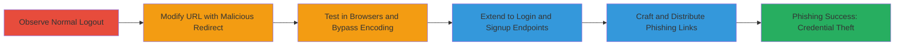

# Open Redirect in Expedia Logout and Login for Phishing Attacks

Multi-stage attack chain demonstrating exploitation of open redirect in Expedia Group's web application to enable phishing attacks by redirecting users to arbitrary malicious URLs.

## Chain Metrics Dashboard

| Metric | Value |
|--------|-------|
| Chain Status | Unverified |
| Total Steps | 5 |
| Execution Time | ~10 minutes |
| Skill Level | Intermediate |
| Complexity | Medium |
| Impact Level | High |

## Attack Flow Visualization



## Prerequisites & Requirements

### Required Tools

- Web browser (Firefox, Chrome)
- [[tools/curl]]

### Target Environment

- Web platform
- Access to Expedia domains (www.expedia.com, www.vrbo.com)
- No specific ports or services required beyond HTTP/HTTPS

### Initial Access Requirements

- Valid Expedia account for testing logout/login
- Ability to craft and send URLs (e.g., via email or messaging for phishing)
- Network access to public internet

## Detailed Attack Procedures

### Step 1: Observe Normal Logout
procedure: [[procedures/Trigger-Open-Redirect-on-Logout]]

**Objective**: Understand the default logout behavior to identify the redirect parameter.

**Instructions**: Log in to an Expedia account and initiate logout to observe the request.

Use [[commands/curl-logout-observe]] to simulate the GET request:

```bash
curl -X GET "https://www.expedia.com/?logout=1" -v
```

**Expected Output**: Redirect to the homepage (e.g., 302 to https://www.expedia.com/).

**Success Indicators**:
- Successful logout and redirect to homepage
- No errors in response

### Step 2: Modify URL for Malicious Redirect
procedure: [[procedures/Modify-Logout-URL-for-Malicious-Redirect]]

**Objective**: Append a malicious URL to the rurl parameter to cause an uncontrolled redirect.

**Instructions**: Craft a modified logout URL with the malicious site after the '?'.

Execute [[commands/curl-malicious-logout]]:

```bash
curl -X GET "https://www.expedia.com/?logout=1&rurl=https://qx4lw1nsec.blogspot.com/" -v
```

**Expected Output**: 302 redirect to the malicious URL.

**Success Indicators**:
- Browser or curl follows redirect to external site
- No validation blocks the arbitrary URL

### Step 3: Test Redirect Across Browsers
procedure: [[procedures/Test-Redirect-Across-Browsers]]

**Objective**: Verify redirect behavior in different browsers, noting encoding differences.

**Instructions**: Test the malicious URL in Firefox and Chrome.

In Firefox, direct access works without encoding. In Chrome, use [[commands/curl-chrome-bypass]] for login flow bypass:

```bash
curl -X GET "https://www.expedia.com/login?rurl=https://qx4lw1nsec.blogspot.com/" -v
```

**Expected Output**: Redirect in Firefox; potential encoding in Chrome, bypassed via login interaction.

**Success Indicators**:
- Immediate redirect in Firefox
- Successful bypass in Chrome login scenarios

### Step 4: Exploit Redirect in Login and Signup
procedure: [[procedures/Exploit-Redirect-in-Login-and-Signup]]

**Objective**: Extend the vulnerability to login, signup, and Google login endpoints using parameters like uurl or partnerAddress.

**Instructions**: Craft URLs for signup or login with encoded malicious redirects.

Use [[commands/curl-signup-redirect]]:

```bash
curl -X GET "https://www.expedia.com/signup?enable_registration=true&uurl=e3id%3Dredr%26rurl=qx4lw1nsec.blogspot.com@qx4lw1nsec.blogspot.com" -v
```

**Expected Output**: Post-registration or login redirect to malicious site.

**Success Indicators**:
- Redirect triggers after user action (e.g., signup completion)
- Works on affected domains like www.vrbo.com

### Step 5: Craft Phishing Links for Social Engineering
procedure: [[procedures/Craft-Phishing-Links-for-Social-Engineering]]

**Objective**: Create shareable links that trick users into interacting, leading to phishing sites.

**Instructions**: Generate full phishing URLs and distribute via email or social media.

Example with [[commands/curl-phishing-test]]:

```bash
curl -X GET "https://www.expedia.com/?logout=1&rurl=https://fake-expedia-phish.com/steal-creds" -v
```

**Expected Output**: User redirected to fake site mimicking Expedia for credential harvest.

**Success Indicators**:
- Victims click and get redirected
- Potential credential compromise or malware delivery

## Attack Chain Summary

### Key Achievements

1. Identified open redirect in logout via rurl parameter
2. Bypassed browser encoding inconsistencies for reliable exploitation
3. Extended to multiple endpoints (login, signup) for broader attack surface
4. Enabled phishing by crafting deceptive links leading to malicious sites

## Technique & Tactic Coverage

### MITRE ATT&CK Techniques

- [[Exploit Public-Facing Application]]
- [[T1566.002]]

### MITRE ATT&CK Tactics

- [[Initial Access]]
- [[Collection]]

---
*Last updated: 2023-10-01T00:00:00Z*
