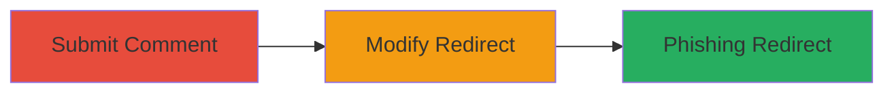

---
tags:
  - open-redirect
  - phishing
  - expressionengine
  - web-vulnerability
type: attack_chain
tools: []
tactics:
  - '[[Initial Access]]'
verified: false
platforms:
  - Web
submitted: true
complexity: low
step_count: 2
techniques:
  - '[[Exploit Public-Facing Application]]'
description: >-
  A low-severity open redirect vulnerability in ExpressionEngine's comment
  submission process allows attackers to redirect users to arbitrary external
  URLs, potentially enabling phishing attacks.
skill_level: beginner
impact_level: low
id: b69f7254-093d-46bd-b967-ab5cd593f431
created_at: '2025-12-14T17:24:26.618Z'
updated_at: '2025-12-14T17:24:26.618Z'
validated: true
mitre_tactics:
  - '[[Initial Access]]'
mitre_techniques:
  - '[[Exploit Public-Facing Application]]'
---
# Open Redirect in ExpressionEngine Comment Submission for Phishing

Multi-stage attack chain demonstrating exploitation of an open redirect in the ExpressionEngine CMS comment functionality to redirect users to malicious sites for phishing.

## Chain Metrics Dashboard

| Metric | Value |
|--------|-------|
| Chain Status | Unverified |
| Total Steps | 2 |
| Execution Time | ~1 minute |
| Skill Level | Beginner |
| Complexity | Low |
| Impact Level | Low |

## Attack Flow Visualization

## Prerequisites & Requirements

### Required Tools

- None required (manual browser interaction)

### Target Environment

- ExpressionEngine CMS running on a web server
- Access to a public-facing comment section
- No specific ports or services beyond standard HTTP/HTTPS (ports 80/443)

### Initial Access Requirements

- Public access to the vulnerable ExpressionEngine site
- No credentials needed
- Ability to interact with the comment form via browser

## Detailed Attack Procedures

### Step 1: Submit Comment to Trigger Redirect
procedure: [[procedures/Submit-ExpressionEngine-Comment]]

**Objective**: Post a comment on the target ExpressionEngine site to initiate the submission process and trigger the post-submission redirect mechanism.

**Instructions**: Navigate to a blog post or page with an active comment section on the ExpressionEngine site. Fill out the comment form with any valid input (e.g., name, email, and comment text) and submit it. This action triggers the site's redirect logic after successful comment posting.

**Expected Output**: The site processes the comment and attempts to redirect the user back to the referring page or a default location.

**Success Indicators**:
- Comment is successfully posted (confirmation message or database entry)
- Browser initiates a redirect to the post-submission URL

### Step 2: Modify Redirect URL for Arbitrary Redirection
procedure: [[procedures/Exploit-Open-Redirect-in-Comment-Submission]]

**Objective**: Alter the redirect parameter or logic during the comment submission to point to an attacker-controlled external URL, enabling phishing or unwanted navigation.

**Instructions**: During the comment submission process, inspect the form submission (e.g., via browser developer tools or proxy like Burp Suite) and identify the modifiable redirect parameter (often a 'return' or 'redirect' URL field). Modify this parameter to an arbitrary external URL, such as 'https://malicious-site.com/phish', then resubmit the form. The server will redirect the user to this URL upon successful comment posting due to insufficient validation.

**Expected Output**: After submission, the browser redirects to the specified external URL instead of the intended internal page.

**Success Indicators**:
- Redirect occurs to the attacker-specified URL
- No server-side errors or blocks on the external redirect

## Attack Chain Summary

### Key Achievements

1. Successful comment submission without authentication
2. Bypass of redirect validation to external domains
3. Potential for phishing by luring users via trusted site redirects

## Technique & Tactic Coverage

### MITRE ATT&CK Techniques

- [[Exploit Public-Facing Application]]

### MITRE ATT&CK Tactics

- [[Initial Access]]

---
*Last updated: 2024-10-01T00:00:00Z*
