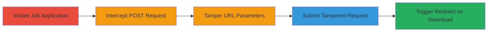

---
tags:
  - open-redirect
  - phishing
  - web-vulnerability
  - greenhouse
type: attack_chain
tools:
  - '[[tools/Burp]]'
tactics:
  - '[[Initial Access]]'
verified: false
platforms:
  - Web
  - AWS
submitted: true
complexity: medium
created_at: '2023-10-01T00:00:00Z'
procedures:
  - '[[procedures/Initiate-Greenhouse-Job-Application]]'
  - '[[procedures/Intercept-Job-Application-POST-Request]]'
  - '[[procedures/Tamper-File-URL-Parameters]]'
  - '[[procedures/Submit-Tampered-Job-Application]]'
  - '[[procedures/Trigger-Open-Redirect-via-Download]]'
step_count: 5
techniques:
  - '[[Exploit Public-Facing Application]]'
  - '[[T1566.002]]'
updated_at: '2025-12-14T17:24:26.792Z'
description: >-
  Multi-stage attack exploiting an open redirect vulnerability in the Greenhouse
  job application process by tampering with resume and cover letter URL
  parameters to redirect hiring managers to malicious sites.
skill_level: intermediate
impact_level: high
id: f1d8c58b-dd90-4933-9f23-c0e3f67fb9c5
validated: true
mitre_tactics:
  - '[[Initial Access]]'
mitre_techniques:
  - '[[Exploit Public-Facing Application]]'
  - '[[T1566.002]]'
---
# Open Redirect in Greenhouse Job Application Leading to Phishing via Unvalidated File URLs

Multi-stage attack chain demonstrating exploitation of an open redirect in the job application submission on scout24.greenhouse.io, where attackers tamper with resume_url and cover_letter_url parameters to redirect hiring managers to arbitrary external URLs, enabling phishing or malware distribution.

## Chain Metrics Dashboard

| Metric | Value |
|--------|-------|
| Chain Status | Unverified |
| Total Steps | 5 |
| Execution Time | ~10 minutes |
| Skill Level | Intermediate |
| Complexity | Medium |
| Impact Level | High |

## Attack Flow Visualization

## Prerequisites & Requirements

### Required Tools

- [[tools/Burp]]

### Target Environment

- Web platform using Greenhouse.io (e.g., https://boards.greenhouse.io/scout24)
- AWS S3 for file storage
- No specific ports required beyond standard HTTPS (443)

### Initial Access Requirements

- Public access to the job board
- No credentials needed for application submission
- Ability to upload files and intercept traffic

## Detailed Attack Procedures

### Step 1: Initiate Job Application
procedure: [[procedures/Initiate-Greenhouse-Job-Application]]

**Objective**: Select a job and complete the application form with legitimate file uploads to generate the POST request containing S3 URLs.

**Instructions**: Navigate to the job board, select a job posting, fill in personal details, and upload PDF files for resume and cover letter, which are stored in AWS S3 and referenced in the form.

**Expected Output**: Form ready for submission with S3 URLs in resume_url and cover_letter_url parameters.

**Success Indicators**:
- Job application form loaded successfully
- Files uploaded and S3 URLs generated

### Step 2: Intercept Job Application POST Request
procedure: [[procedures/Intercept-Job-Application-POST-Request]]

**Objective**: Capture the multipart/form-data POST request using a proxy to inspect and prepare for modification.

**Instructions**: Configure Burp Suite as an HTTP proxy, set the browser to route traffic through it, and trigger the form submission to intercept the request to /scout24/jobs/{job_id}.

**Expected Output**: Intercepted POST request visible in Burp, showing job_application[resume_url] and job_application[cover_letter_url] with S3 links.

**Success Indicators**:
- Request intercepted without errors
- Parameters containing valid S3 URLs confirmed

### Step 3: Tamper File URL Parameters
procedure: [[procedures/Tamper-File-URL-Parameters]]

**Objective**: Replace the S3 URLs with arbitrary external URLs to set up the redirect.

**Instructions**: In the intercepted request, edit job_application[resume_url] to an attacker-controlled URL (e.g., https://google.com), job_application[cover_letter_url] to another (e.g., http://google.com), retain original filenames like neu.pdf, and update Content-Length header.

**Expected Output**: Modified request with tampered URLs while preserving form structure.

**Success Indicators**:
- URLs successfully changed to external sites
- Request remains valid multipart/form-data

### Step 4: Submit Tampered Job Application
procedure: [[procedures/Submit-Tampered-Job-Application]]

**Objective**: Forward the modified request to complete the application submission with malicious URLs.

**Instructions**: Use Burp to forward the tampered POST request to boards.greenhouse.io, allowing the server to process it as a normal application.

**Expected Output**: Application submitted successfully, with tampered URLs stored in the backend.

**Success Indicators**:
- 200 OK response or success message
- No validation errors on submission

### Step 5: Trigger Open Redirect via Download
procedure: [[procedures/Trigger-Open-Redirect-via-Download]]

**Objective**: Demonstrate impact when a hiring manager attempts to download the attachments, resulting in redirection to the malicious site.

**Instructions**: Simulate or wait for a hiring manager to view the application in the Greenhouse dashboard and click 'Download' on resume or cover letter; the link will redirect to the tampered URL.

**Expected Output**: Browser redirects to the external URL (e.g., google.com) instead of serving the S3 file.

**Success Indicators**:
- Redirect observed to arbitrary URL
- Potential for phishing payload delivery confirmed

## Attack Chain Summary

### Key Achievements

1. Successful interception and tampering of job application URLs without server-side validation
2. Completion of malicious application submission
3. Demonstration of open redirect leading to potential phishing or CSRF attacks on hiring managers

## Technique & Tactic Coverage

### MITRE ATT&CK Techniques

- [[Exploit Public-Facing Application]]
- [[T1566.002]]

### MITRE ATT&CK Tactics

- [[Initial Access]]

---
*Last updated: 2023-10-01T00:00:00Z*
