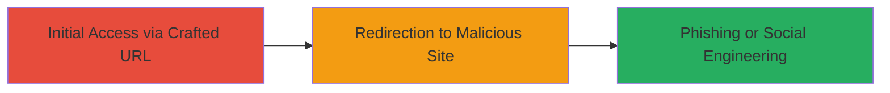

---
tags:
  - open-redirect
  - phishing
  - keycloak
type: attack_chain
tools: []
tactics:
  - '[[Initial Access]]'
commands:
  - '[[commands/curl-open-redirect-test]]'
platforms:
  - Web
complexity: low
procedures:
  - '[[procedures/Exploit-KeyCloak-Open-Redirect]]'
step_count: 1
techniques:
  - '[[Exploit Public-Facing Application]]'
description: >-
  A single-stage attack exploiting an open redirect vulnerability in KeyCloak to
  redirect users to arbitrary external sites, facilitating phishing or social
  engineering.
skill_level: beginner
impact_level: low
id: 367a958f-6f2d-41d2-9928-7b9441767c54
created_at: '2025-12-14T17:24:26.637Z'
updated_at: '2025-12-14T17:24:26.637Z'
verified: false
validated: true
submitted: true
mitre_tactics:
  - '[[Initial Access]]'
mitre_techniques:
  - '[[Exploit Public-Facing Application]]'
---
# Open Redirect in KeyCloak Enabling Phishing Attacks on auth.rbk.money

## Overview

This attack chain demonstrates the exploitation of an open redirect vulnerability in the KeyCloak implementation on auth.rbk.money. Discovered by researcher abartan and reported on December 7, 2017, the flaw allows attackers to craft URLs that redirect authenticated or unauthenticated users to arbitrary external domains. This can be leveraged for phishing attacks by tricking users into visiting malicious sites that mimic legitimate login pages, potentially leading to credential theft or social engineering. The vulnerability was assessed as low severity due to its indirect impact and was resolved by January 26, 2018, through improved URL validation in KeyCloak.

## Chain Metrics Dashboard

| Metric | Value |
|--------|-------|
| Chain Status | Unverified |
| Total Steps | 1 |
| Execution Time | ~1 minute |
| Skill Level | Beginner |
| Complexity | Low |
| Impact Level | Low |

## Attack Flow Visualization



## Prerequisites & Requirements

### Required Tools

- Web browser or [[commands/curl-open-redirect-test]]

### Target Environment

- Web platform
- KeyCloak authentication service on auth.rbk.money
- No specific ports required beyond standard HTTPS (443)

### Initial Access Requirements

- Public access to the authentication endpoint
- No credentials needed for testing the redirect
- Ability to craft and share malicious URLs via email, social media, or links

## Detailed Attack Procedures

### Step 1: Craft and Test Malicious Redirect
procedure: [[procedures/Exploit-KeyCloak-Open-Redirect]]

**Objective**: Validate the open redirect vulnerability and craft a URL that redirects users to an attacker-controlled domain for phishing.

**Instructions**: Identify the vulnerable endpoint in KeyCloak, typically involving a 'redirect_uri' parameter. Use [[commands/curl-open-redirect-test]] to send a request with a malicious redirect target, such as an attacker-owned domain mimicking a login page.

```bash
curl -X GET "https://auth.rbk.money/realms/master/protocol/openid-connect/auth?client_id=security-admin-console&redirect_uri=https://evil.com/phish&response_type=code&scope=openid"
```

Follow up by accessing the crafted URL in a browser to observe the redirect behavior.

**Expected Output**: The server responds with a 302 redirect to the specified external URL (e.g., https://evil.com/phish) instead of validating it against a whitelist.

**Success Indicators**:
- HTTP 302 status code with Location header pointing to the arbitrary external domain
- Browser navigates to the malicious site without error

## Attack Chain Summary

### Key Achievements

1. Successful validation of open redirect in KeyCloak
2. Crafting of phishing URLs to lure users to fake sites
3. Potential for credential harvesting via social engineering

## Technique & Tactic Coverage

### MITRE ATT&CK Techniques

- [[Exploit Public-Facing Application]]

### MITRE ATT&CK Tactics

- [[Initial Access]]

---
*Last updated: 2023-10-01*
