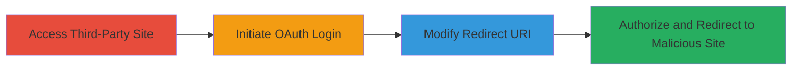

---
tags:
  - open-redirect
  - oauth
  - phishing
  - lichess
type: attack_chain
tools: []
tactics:
  - '[[Initial Access]]'
commands: []
platforms:
  - Web
complexity: low
procedures:
  - '[[procedures/Manipulate-OAuth-Redirect-URI-for-Open-Redirect]]'
step_count: 4
techniques:
  - '[[Drive-by Compromise]]'
description: >-
  Exploits an open redirect vulnerability in the Lichess OAuth authorization
  flow by manipulating the redirect_uri parameter, enabling redirection to
  malicious sites for phishing after authentication.
skill_level: intermediate
impact_level: medium
id: faa0bd35-93ad-4236-bfe3-1d8112f6913b
created_at: '2025-12-14T17:24:38.969Z'
updated_at: '2025-12-14T17:24:38.969Z'
verified: false
validated: true
submitted: true
mitre_tactics:
  - '[[Initial Access]]'
mitre_techniques:
  - '[[Drive-by Compromise]]'
---
# Open Redirect in Lichess OAuth Flow for Phishing Attacks

Multi-stage attack chain demonstrating exploitation of an open redirect in the OAuth flow of Lichess via a third-party site, allowing redirection to arbitrary external domains for potential phishing.

## Chain Metrics Dashboard

| Metric | Value |
|--------|-------|
| Chain Status | Unverified |
| Total Steps | 4 |
| Execution Time | ~5 minutes |
| Skill Level | Intermediate |
| Complexity | Low |
| Impact Level | Medium |

## Attack Flow Visualization

## Prerequisites & Requirements

### Required Tools

- Web browser (e.g., Chrome or Firefox with developer tools)

### Target Environment

- Web platform
- Access to https://www.lichess4545.com (third-party site integrating with Lichess OAuth)
- No specific ports or services required beyond standard HTTPS (443)

### Initial Access Requirements

- Test account on lichess4545.com
- Valid Lichess account for OAuth authorization
- Network access to internet

## Detailed Attack Procedures

### Step 1: Access Third-Party Site and Login
procedure: [[procedures/Manipulate-OAuth-Redirect-URI-for-Open-Redirect]]

**Objective**: Gain initial access to the vulnerable third-party site and initiate login to trigger the OAuth flow.

**Instructions**: Navigate to https://www.lichess4545.com/blitzbattle/ in your web browser and log in using a test account credentials.

**Expected Output**: Successful login, redirecting to Lichess for OAuth completion.

**Success Indicators**:
- User is logged into the third-party site
- Browser redirects to Lichess OAuth URL

### Step 2: Observe OAuth Redirection
procedure: [[procedures/Manipulate-OAuth-Redirect-URI-for-Open-Redirect]]

**Objective**: Confirm the standard OAuth flow redirection to Lichess for authentication.

**Instructions**: After login, allow the site to redirect to https://lichess.com for OAuth process completion. Inspect the URL in the browser's address bar to note the redirect_uri parameter.

**Expected Output**: Authorization page on lichess.com with the original redirect_uri pointing to https://www.lichess4545.com/auth/lichess/.

**Success Indicators**:
- OAuth authorization prompt appears on Lichess
- redirect_uri parameter is visible and set to the legitimate domain

### Step 3: Modify the Redirect URI Parameter
procedure: [[procedures/Manipulate-OAuth-Redirect-URI-for-Open-Redirect]]

**Objective**: Alter the OAuth URL to point to an arbitrary external domain, exploiting the lack of validation.

**Instructions**: In the browser's developer tools (F12), locate the OAuth authorization URL. Edit the redirect_uri parameter from https://www.lichess4545.com/auth/lichess/ to https://example.com/auth/lichess/. Reload or submit the modified URL.

**Expected Output**: Updated authorization URL with the malicious redirect_uri.

**Success Indicators**:
- Parameter successfully changed without error
- Authorization page reloads with new URI

### Step 4: Authorize and Trigger Redirect
procedure: [[procedures/Manipulate-OAuth-Redirect-URI-for-Open-Redirect]]

**Objective**: Complete authorization to force redirection to the malicious site, enabling phishing.

**Instructions**: Click the "Authorize" button on the Lichess page. Observe the post-authorization redirect.

**Expected Output**: Browser redirects to https://example.com/ (or the specified malicious domain) after successful authentication.

**Success Indicators**:
- Successful OAuth completion
- Redirect to arbitrary external site confirmed

## Attack Chain Summary

### Key Achievements

1. Bypassed redirect validation in OAuth flow
2. Demonstrated redirection to external malicious domain
3. Enabled potential phishing by deceiving users into interacting with fake sites post-authentication

## Technique & Tactic Coverage

### MITRE ATT&CK Techniques

- [[Drive-by Compromise]]

### MITRE ATT&CK Tactics

- [[Initial Access]]

---
*Last updated: 2023-10-01*
