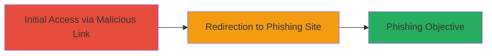

---
tags:
  - open-redirect
  - phishing
  - web-vulnerability
type: attack_chain
tools: []
tactics:
  - '[[Initial Access]]'
verified: false
platforms:
  - Web
submitted: true
complexity: low
created_at: '2023-10-01T00:00:00Z'
procedures:
  - '[[procedures/Exploit-Open-Redirect-in-redirect_uri-Parameter]]'
step_count: 1
techniques:
  - '[[T1566.002]]'
updated_at: '2025-12-14T17:24:30.725Z'
description: >-
  Demonstrates exploitation of an open redirect vulnerability in the
  eb9f.pivcac.prod.login.gov endpoint to redirect users to arbitrary external
  sites, facilitating phishing attacks.
skill_level: beginner
impact_level: medium
id: b4c78e2b-6dda-435b-924f-799badf1e41d
validated: true
mitre_tactics:
  - '[[Initial Access]]'
mitre_techniques:
  - '[[T1566.002]]'
---
# Open Redirect in Login.gov Endpoint Enabling Phishing Attacks

Multi-stage attack chain demonstrating a complete attack workflow.

## Chain Metrics Dashboard

| Metric | Value |
|--------|-------|
| Chain Status | Unverified |
| Total Steps | 1 |
| Execution Time | ~1 minute |
| Skill Level | Beginner |
| Complexity | Low |
| Impact Level | Medium |

## Attack Flow Visualization



## Prerequisites & Requirements

### Required Tools

- Web browser (e.g., Chrome, Firefox)

### Target Environment

- Web platform
- Access to public internet
- No specific services or ports required beyond HTTP/HTTPS

### Initial Access Requirements

- No credentials required
- Public network access
- Ability to craft and share URLs

## Detailed Attack Procedures

### Step 1: Demonstrate Open Redirect
procedure: [[procedures/Exploit-Open-Redirect-in-redirect_uri-Parameter]]

**Objective**: Construct a malicious URL that exploits the open redirect vulnerability to redirect users from the legitimate login.gov endpoint to an attacker-controlled site, enabling phishing.

**Instructions**: Craft a proof-of-concept URL using the vulnerable endpoint, including a nonce and a redirect_uri parameter pointing to an external site like google.com. Visit the URL in a browser to verify the redirect occurs without validation.

Example PoC URL:

```url
https://eb9f.pivcac.prod.login.gov/?nonce=wI0UglN84A06Q4z4JnkZVc3i1V8%3D&redirect_uri=https%3A%2F%2Fgoogle.com%23%40secure.login.gov%2Flogin%2Fpiv_cac
```

In a real attack, replace the redirect_uri with a phishing site mimicking login.gov.

**Expected Output**: The browser redirects from the login.gov domain to the specified external URL (e.g., google.com), confirming the vulnerability.

**Success Indicators**:
- Successful redirection to the external site
- No error or validation blocking the redirect

## Attack Chain Summary

### Key Achievements

1. Identified and exploited insufficient validation of the redirect_uri parameter
2. Demonstrated potential for phishing by redirecting to arbitrary external URLs
3. Highlighted risk to users of the PIV/CAC login flow on login.gov

## Technique & Tactic Coverage

### MITRE ATT&CK Techniques

- [[T1566.002]]

### MITRE ATT&CK Tactics

- [[Initial Access]]

---
*Last updated: 2023-10-01T00:00:00Z*
