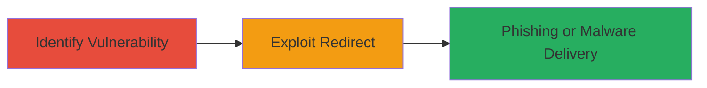

---
tags:
  - open-redirect
  - phishing
  - nordvpn
  - client-side
type: attack_chain
tools: []
tactics:
  - '[[Initial Access]]'
verified: false
platforms:
  - Web
submitted: true
complexity: low
created_at: '2023-10-01T00:00:00Z'
procedures:
  - '[[procedures/Identify-Open-Redirect-in-NordVPN-Support]]'
  - '[[procedures/Exploit-Open-Redirect-for-Phishing]]'
step_count: 2
techniques:
  - '[[Drive-by Compromise]]'
updated_at: '2025-12-14T17:24:34.714Z'
description: >-
  A client-side open redirect vulnerability in the NordVPN support website
  allows attackers to craft malicious links that redirect users to external
  domains, facilitating phishing or malware distribution.
skill_level: beginner
impact_level: medium
id: 98ff8a27-aa03-4f53-96b3-0c927ce6c394
validated: true
mitre_tactics:
  - '[[Initial Access]]'
mitre_techniques:
  - '[[Drive-by Compromise]]'
---
# Open Redirect in NordVPN Support Site for Phishing Attacks

Multi-stage attack chain demonstrating a complete attack workflow exploiting a client-side open redirect in the NordVPN support website.

## Chain Metrics Dashboard

| Metric | Value |
|--------|-------|
| Chain Status | Unverified |
| Total Steps | 2 |
| Execution Time | ~5 minutes |
| Skill Level | Beginner |
| Complexity | Low |
| Impact Level | Medium |

## Attack Flow Visualization

## Prerequisites & Requirements

### Required Tools

- Web browser (e.g., Chrome, Firefox)

### Target Environment

- Web platform
- Access to the NordVPN support site at https://support.nordvpn.com
- No specific services or ports required beyond standard HTTPS (443)

### Initial Access Requirements

- Public access to the support website
- Ability to craft and share URLs (e.g., via email or social engineering)
- No credentials needed

## Detailed Attack Procedures

### Step 1: Identify Vulnerable URL Pattern
procedure: [[procedures/Identify-Open-Redirect-in-NordVPN-Support]]

**Objective**: Analyze the NordVPN support site's JavaScript to identify the open redirect behavior in URL patterns starting with '#/path'.

**Instructions**: Navigate to https://support.nordvpn.com in a web browser and inspect the page source or use developer tools to examine client-side JavaScript handling of hash-based URLs. Look for code that processes paths after '#/path' and sets window.location.href without validation.

**Expected Output**: Confirmation that the JavaScript slices the URL after '#/path' + 6 characters and redirects unconditionally.

**Success Indicators**:
- JavaScript code identified that allows arbitrary redirects
- No domain validation observed in the redirect logic

### Step 2: Exploit Open Redirect for Phishing
procedure: [[procedures/Exploit-Open-Redirect-for-Phishing]]

**Objective**: Construct a malicious URL to redirect users from the legitimate NordVPN support site to an attacker-controlled domain for phishing.

**Instructions**: Craft a URL like https://support.nordvpn.com/#/path///attacker-phishing-site.com. Share this link via email, social media, or other channels, tricking users into clicking it while believing they are accessing NordVPN support.

**Expected Output**: Browser redirects from the NordVPN site to the external malicious domain.

**Success Indicators**:
- User is redirected to the target external site
- No warnings or blocks from the browser or site

## Attack Chain Summary

### Key Achievements

1. Identified client-side open redirect in NordVPN support powered by NanoRep.
2. Demonstrated arbitrary external redirects without validation.
3. Enabled phishing attacks by masquerading malicious links as legitimate support URLs.

## Technique & Tactic Coverage

### MITRE ATT&CK Techniques

- [[Drive-by Compromise]]

### MITRE ATT&CK Tactics

- [[Initial Access]]

---
*Last updated: 2023-10-01T00:00:00Z*
