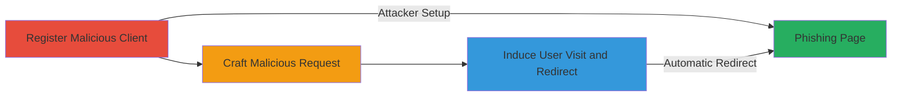

# Open Redirect in OAuth 2.0 via Invalid Scope for Phishing

Multi-stage attack chain demonstrating a complete attack workflow exploiting open redirects in OAuth 2.0 authorization servers that strictly follow RFC6749.

## Chain Metrics Dashboard

| Metric | Value |
|--------|-------|
| Chain Status | Unverified |
| Total Steps | 3 |
| Execution Time | ~5 minutes |
| Skill Level | Intermediate |
| Complexity | Medium |
| Impact Level | High |

## Attack Flow Visualization

## Prerequisites & Requirements

### Required Tools

- None (manual registration and URL crafting)

### Target Environment

- OAuth 2.0 Authorization Server (e.g., web-based provider)
- Required services/ports: HTTPS on port 443
- Network access requirements: Public internet access to register clients and craft URLs

### Initial Access Requirements

- No prior credentials needed for registration if open
- Attacker must control a domain for redirect_uri (e.g., http://attacker.com)
- Ability to host a phishing page

## Detailed Attack Procedures

### Step 1: Register Malicious Client
procedure: [[procedures/Register-Malicious-OAuth-Client]]

**Objective**: Set up an OAuth client with an attacker-controlled redirect URI to prepare for the redirect exploitation.

**Instructions**: Follow the procedure to register a new client on the target OAuth provider, specifying the malicious redirect_uri.

**Expected Output**: Client registration confirmation with client_id.

**Success Indicators**:
- Client registered successfully
- Client_id obtained for use in requests

### Step 2: Craft Authorization Request
procedure: [[procedures/Craft-Authorization-Request-with-Invalid-Scope]]

**Objective**: Create a malicious authorization URL that triggers an error response due to an invalid scope, leading to the open redirect.

**Instructions**: Use the registered client_id to build the /authorize endpoint URL with an invalid scope parameter.

**Expected Output**: A crafted URL ready for distribution.

**Success Indicators**:
- URL constructed with invalid scope and attacker redirect_uri
- URL validates against OAuth endpoint format

### Step 3: Induce User Visit
procedure: [[procedures/Induce-User-to-Visit-Malicious-URL]]

**Objective**: Trick the victim into accessing the crafted URL, resulting in an automatic redirect to the attacker's phishing site without consent.

**Instructions**: Distribute the URL via phishing email or social engineering, observe the redirect behavior.

**Expected Output**: User redirected to http://attacker.com without authorization prompt.

**Success Indicators**:
- Error detected by server (invalid scope)
- Automatic redirect to attacker-controlled URI

## Attack Chain Summary

### Key Achievements

1. Successful client registration with arbitrary redirect_uri
2. Triggering error-based redirect without user interaction
3. Enabling phishing attacks or token hijacking chains

## Technique & Tactic Coverage

### MITRE ATT&CK Techniques

- [[Phishing]] Phishing
- [[Exploit Public-Facing Application]] Exploit Public-Facing Application

### MITRE ATT&CK Tactics

- [[Initial Access]] Initial Access

---

*Last updated: 2023-10-01T00:00:00Z*
