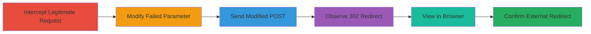

---
tags:
  - open-redirect
  - phishing
  - web-vulnerability
type: attack_chain
tools:
  - '[[tools/Burp-Suite-Community-Edition]]'
tactics:
  - '[[Initial Access]]'
verified: false
platforms:
  - Web
submitted: true
complexity: medium
created_at: '2023-10-01T00:00:00Z'
procedures:
  - '[[procedures/Intercept-Reddit-AMA-Request-with-Burp]]'
  - '[[procedures/Send-Request-to-Burp-Repeater]]'
  - '[[procedures/Modify-Request-with-Failed-Parameter]]'
  - '[[procedures/Send-Modified-POST-Request]]'
  - '[[procedures/Copy-Response-Link-from-Burp]]'
  - '[[procedures/Execute-Redirect-in-Burp-Browser]]'
step_count: 6
techniques:
  - '[[Exploit Public-Facing Application]]'
updated_at: '2025-12-14T17:24:27.017Z'
description: >-
  Demonstrates exploitation of an open redirect vulnerability in Reddit's AMA
  form submission endpoint to redirect users to arbitrary external sites,
  enabling phishing attacks.
skill_level: intermediate
impact_level: medium
id: d2c8536c-5222-43ff-809d-b7394497a4a5
validated: true
mitre_tactics:
  - '[[Initial Access]]'
mitre_techniques:
  - '[[Exploit Public-Facing Application]]'
---
# Open Redirect in Reddit AMA Form via Manipulated POST Request

Multi-stage attack chain demonstrating exploitation of an open redirect in Reddit's AMA form at www.redditinc.com/ama, where the 'failed' parameter in a POST request can be controlled to redirect to external URLs upon form submission failure.

## Chain Metrics Dashboard

| Metric | Value |
|--------|-------|
| Chain Status | Unverified |
| Total Steps | 6 |
| Execution Time | ~5 minutes |
| Skill Level | Intermediate |
| Complexity | Medium |
| Impact Level | Medium |

## Attack Flow Visualization

## Prerequisites & Requirements

### Required Tools

- [[tools/Burp-Suite-Community-Edition]]

### Target Environment

- Web platform
- Access to Reddit's AMA form at www.redditinc.com/ama
- No specific ports or services required beyond standard HTTPS (443)

### Initial Access Requirements

- Valid network access to www.redditinc.com
- Ability to interact with the AMA form (e.g., attempt submission)
- Burp Suite proxy configured in browser

## Detailed Attack Procedures

### Step 1: Intercept the Request
procedure: [[procedures/Intercept-Reddit-AMA-Request-with-Burp]]

**Objective**: Capture a legitimate POST request to the AMA endpoint during form interaction.

**Instructions**: Configure your browser to proxy through Burp Suite and interact with the AMA form to trigger a POST request to /ama.

**Expected Output**: Intercepted HTTP POST request in Burp's Proxy history.

**Success Indicators**:
- Request visible in Burp Intercept tab
- Request includes multipart/form-data to /ama

### Step 2: Send to Repeater
procedure: [[procedures/Send-Request-to-Burp-Repeater]]

**Objective**: Forward the captured request for modification.

**Instructions**: Right-click the intercepted request in Burp Proxy and select "Send to Repeater".

**Expected Output**: Request loaded in Burp Repeater tab.

**Success Indicators**:
- Repeater tab shows the original request details
- Ready for editing

### Step 3: Modify the Failed Parameter
procedure: [[procedures/Modify-Request-with-Failed-Parameter]]

**Objective**: Alter the 'failed' parameter to an external URL like http://google.com.

**Instructions**: In Repeater, edit the POST body to set the 'failed' field in multipart/form-data to http://google.com.

**Expected Output**: Modified request with arbitrary 'failed' URL.

**Success Indicators**:
- Parameter updated without syntax errors
- Request body reflects the change

### Step 4: Send the Modified Request
procedure: [[procedures/Send-Modified-POST-Request]]

**Objective**: Submit the tampered request to trigger the redirect on failure simulation.

**Instructions**: Click "Send" in Repeater to transmit the POST to /ama.

**Expected Output**: 302 response with Location header set to the controlled URL.

**Success Indicators**:
- HTTP 302 status code
- Location: http://google.com in response headers

### Step 5: Copy Response Link
procedure: [[procedures/Copy-Response-Link-from-Burp]]

**Objective**: Generate a browser-viewable link for the response.

**Instructions**: In Repeater, right-click the response and select "Show in browser" to copy the link.

**Expected Output**: A URL that embeds the response for browser rendering.

**Success Indicators**:
- Link copied to clipboard
- Link points to Burp's response viewer

### Step 6: Execute in Burp Browser
procedure: [[procedures/Execute-Redirect-in-Burp-Browser]]

**Objective**: Observe the actual redirect in an embedded browser.

**Instructions**: Paste the link into Burp's built-in browser and navigate to it.

**Expected Output**: Browser redirects to the external site (e.g., google.com).

**Success Indicators**:
- Successful redirect to arbitrary URL
- No blocking or validation errors

## Attack Chain Summary

### Key Achievements

1. Successful interception and modification of AMA POST request
2. Triggered 302 redirect to external domain via 'failed' parameter
3. Demonstrated potential for phishing by leveraging Reddit's trusted domain

## Technique & Tactic Coverage

### MITRE ATT&CK Techniques

- [[Exploit Public-Facing Application]]

### MITRE ATT&CK Tactics

- [[Initial Access]]

---
*Last updated: 2023-10-01T00:00:00Z*
