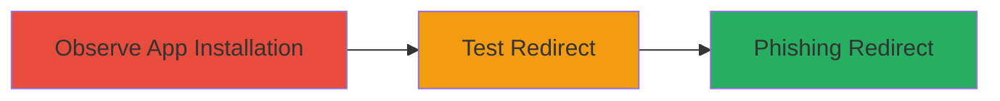

# Open Redirect in Shopify Alexa App Callback via Unvalidated Shop Parameter

Multi-stage attack chain demonstrating a complete attack workflow for exploiting an open redirect in the Shopify Amazon Alexa app installation process.

## Chain Metrics Dashboard

| Metric | Value |
|--------|-------|
| Chain Status | Unverified |
| Total Steps | 2 |
| Execution Time | ~5 minutes |
| Skill Level | Beginner |
| Complexity | Low |
| Impact Level | Low |

## Attack Flow Visualization



## Prerequisites & Requirements

### Required Tools

- Web browser or [[tools/curl]]

### Target Environment

- Web platform
- Access to Shopify store for app installation
- No specific ports required

### Initial Access Requirements

- Valid Shopify account
- Ability to install apps
- Network access to meteorapp.com

## Detailed Attack Procedures

### Step 1: Observe App Installation
procedure: [[procedures/Observe-Shopify-Alexa-App-Installation-Callback]]

**Objective**: Identify the callback URL structure during Amazon Alexa app installation to locate the vulnerable 'shop' parameter.

**Instructions**: Initiate the installation of the Amazon Alexa app in a Shopify store and monitor the network traffic or URL parameters to capture the callback endpoint.

Use a browser developer tools or [[commands/curl-observe-callback]] to inspect the request:

```bash
curl -v "https://assistant-client.meteorapp.com/shopify/callback?code=6aae881ab9c4f12d5b264e6c871a108a&hmac=6109806a12b0439d6a2dce2d547344eb1c2c53e9691259f39eefbb93b9c9c97b&shop=pappuza-2.myshopify.com&timestamp=1494008598"
```

**Expected Output**: HTTP response showing redirect to the legitimate shop domain.

**Success Indicators**:
- Callback URL captured with parameters (code, hmac, shop, timestamp)
- Confirmation of endpoint at https://assistant-client.meteorapp.com/shopify/callback

### Step 2: Test Open Redirect
procedure: [[procedures/Test-Open-Redirect-in-Shop-Parameter]]

**Objective**: Exploit the lack of validation in the 'shop' parameter to force a redirect to an arbitrary malicious domain, enabling phishing.

**Instructions**: Modify the 'shop' parameter in the callback URL to point to a controlled malicious domain and trigger the request to observe the unauthorized redirect.

Use [[commands/curl-test-redirect]] to send the modified request:

```bash
curl -v -L "https://assistant-client.meteorapp.com/shopify/callback?code=6aae881ab9c4f12d5b264e6c871a108a&hmac=6109806a12b0439d6a2dce2d547344eb1c2c53e9691259f39eefbb93b9c9c97b&shop=evil.com&timestamp=1494008598"
```

**Expected Output**: HTTP 302 redirect to https://evil.com or similar arbitrary URL.

**Success Indicators**:
- Redirect occurs to non-Shopify domain
- No validation error; arbitrary domain accepted

## Attack Chain Summary

### Key Achievements

1. Identified vulnerable callback URL in Alexa app installation
2. Demonstrated open redirect by manipulating 'shop' parameter
3. Highlighted potential for phishing during user app installation

## Technique & Tactic Coverage

### MITRE ATT&CK Techniques

- [[Exploit Public-Facing Application]] Exploit Public-Facing Application
- [[Phishing]] Phishing

### MITRE ATT&CK Tactics

- [[Initial Access]] Initial Access

---
*Last updated: 2023-10-01T00:00:00Z*
