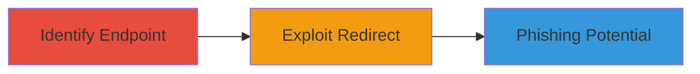

---
tags:
  - open-redirect
  - phishing
  - web-vulnerability
type: attack_chain
tools: []
tactics:
  - '[[Initial Access]]'
verified: false
platforms:
  - Web
submitted: true
complexity: low
created_at: '2023-10-05T00:00:00Z'
procedures:
  - '[[procedures/Exploiting-Open-Redirect-in-redirect_url-Parameter]]'
step_count: 1
techniques:
  - '[[Exploit Public-Facing Application]]'
updated_at: '2025-12-14T17:24:26.113Z'
description: >-
  Demonstrates exploitation of an open redirect vulnerability in the Starbucks
  China tracking hub endpoint, allowing redirection to arbitrary external sites
  for potential phishing.
skill_level: beginner
impact_level: low
id: 230ec7d3-2f8a-4047-85ad-37ccadaf6b57
validated: true
mitre_tactics:
  - '[[Initial Access]]'
mitre_techniques:
  - '[[Exploit Public-Facing Application]]'
---
# Open Redirect in Starbucks China Tracking Hub via redirect_url Parameter

Multi-stage attack chain demonstrating a complete attack workflow.

## Chain Metrics Dashboard

| Metric | Value |
|--------|-------|
| Chain Status | Unverified |
| Total Steps | 1 |
| Execution Time | ~1 minute |
| Skill Level | Beginner |
| Complexity | Low |
| Impact Level | Low |

## Attack Flow Visualization



## Prerequisites & Requirements

### Required Tools

- None (uses standard HTTP client like curl or browser)

### Target Environment

- Web platform
- Accessible public-facing endpoint: https://trackinghub.starbucks.com.cn/track_installation
- No specific services/ports beyond standard HTTPS (443)

### Initial Access Requirements

- Public internet access
- No credentials required
- No prior access needed

## Detailed Attack Procedures

### Step 1: Exploit Open Redirect
procedure: [[procedures/Exploiting-Open-Redirect-in-redirect_url-Parameter]]

**Objective**: Test and confirm the open redirect vulnerability by supplying an arbitrary URL in the redirect_url parameter, leading to uncontrolled redirection.

**Instructions**: Access the endpoint https://trackinghub.starbucks.com.cn/track_installation and append the redirect_url parameter with a test external URL, such as http://example.com. Use [[commands/curl-open-redirect-test]] to send the request:

```bash
curl -X GET "https://trackinghub.starbucks.com.cn/track_installation?redirect_url=http://example.com" -v
```

Observe the response headers for a 3xx redirect status pointing to the supplied URL.

**Expected Output**: HTTP response with Location header set to the arbitrary URL, confirming the redirect.

**Success Indicators**:
- Redirect status code (e.g., 302) in response
- Location header matches the supplied redirect_url
- Browser or client follows to the external site
