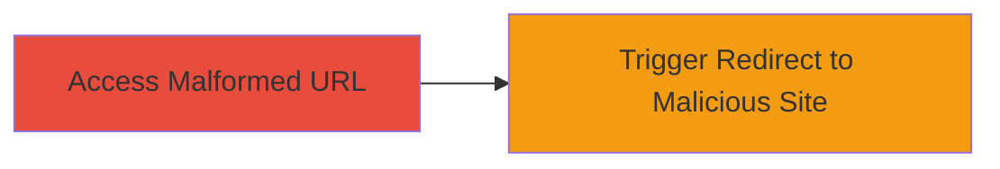

# Open Redirect in Uber m.uber.com via Malformed URL Path Traversal

Multi-stage attack chain demonstrating a complete attack workflow.

## Chain Metrics Dashboard

| Metric | Value |
|--------|-------|
| Chain Status | Unverified |
| Total Steps | 1 |
| Execution Time | ~1 minute |
| Skill Level | Beginner |
| Complexity | Low |
| Impact Level | Medium |

## Attack Flow Visualization

## Prerequisites & Requirements

### Required Tools

- [[tools/Chrome-Browser]]
- [[tools/Firefox-Browser]]
- [[tools/Internet-Explorer-11]]

### Target Environment

- Web platform
- Access to https://m.uber.com/
- No specific services or ports required beyond standard HTTPS (443)

### Initial Access Requirements

- Public internet access
- No credentials needed
- Victim must click or be tricked into accessing the malicious URL

## Detailed Attack Procedures

### Step 1: Trigger Open Redirect
procedure: [[procedures/Trigger-Open-Redirect-in-m-uber-com-via-Path-Traversal]]

**Objective**: Craft and access a malformed URL to exploit the open redirect vulnerability, causing the server to redirect to an arbitrary external domain.

**Instructions**: Open a web browser and navigate to the crafted URL `https://m.uber.com//youtube.com/%2F..`. This exploits the path traversal issue in the outdated serve-static middleware, resulting in a 303 redirect to `//youtube.com/%2F..`, which resolves to an external site like youtube.com.

**Expected Output**: The browser receives an HTTP/1.1 303 See Other response with a Location header pointing to the arbitrary domain, and the user is redirected.

**Success Indicators**:
- 303 status code in network response
- Location header contains the injected external domain
- Browser navigates away from m.uber.com to the target site

## Attack Chain Summary

### Key Achievements

1. Successful exploitation of open redirect without authentication
2. Demonstration of path traversal leading to arbitrary redirects
3. Potential for phishing by tricking users into visiting malicious sites

## Technique & Tactic Coverage

### MITRE ATT&CK Techniques

- [[Exploit Public-Facing Application]]

### MITRE ATT&CK Tactics

- [[Initial Access]]

---
*Last updated: 2023-10-01T00:00:00Z*
