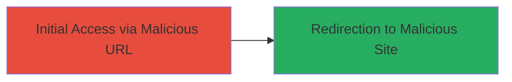

# Open Redirect in Upserve Inventory for Phishing Attacks

Multi-stage attack chain demonstrating a complete attack workflow.

## Chain Metrics Dashboard

| Metric | Value |
|--------|-------|
| Chain Status | Unverified |
| Total Steps | 1 |
| Execution Time | ~1 minute |
| Skill Level | Beginner |
| Complexity | Low |
| Impact Level | Medium |

## Attack Flow Visualization

## Prerequisites & Requirements

### Required Tools

- None (browser or URL crafting tool sufficient)

### Target Environment

- Web platform
- Access to Upserve inventory application at https://inventory.upserve.com/
- No specific services/ports required beyond standard HTTPS (443)

### Initial Access Requirements

- Ability to send URLs to victims (e.g., via email or social engineering)
- No credentials needed for the redirect trigger
- Network access to the internet

## Detailed Attack Procedures

### Step 1: Trigger Open Redirect
procedure: [[procedures/Exploit-Open-Redirect-in-Upserve-Inventory]]

**Objective**: Construct and access a malicious URL that exploits the open redirect to send users to an arbitrary external domain.

**Instructions**: Craft a URL by appending the target malicious domain directly after the Upserve inventory domain, such as https://inventory.upserve.com/http://stanko.sh/. Share this URL with the victim via phishing email or link. When the victim navigates to it, the application treats the path as a redirect target without validation.

**Expected Output**: The browser redirects automatically to the specified external domain (e.g., http://stanko.sh/).

**Success Indicators**:
- Victim is redirected to the malicious site
- No error or validation blocks the redirect

## Attack Chain Summary

### Key Achievements

1. Successful redirection to arbitrary external domain
2. Enablement of phishing or social engineering by tricking users into visiting malicious sites
3. Demonstration of lack of URL path validation in the application

## Technique & Tactic Coverage

### MITRE ATT&CK Techniques

- [[Exploit Public-Facing Application]]

### MITRE ATT&CK Tactics

- [[Initial Access]]

---
*Last updated: 2023-10-01T00:00:00Z*
