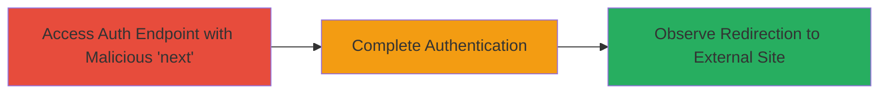

# Open Redirect in Weblate Third-Party Authentication via Malicious 'next' Parameter

Multi-stage attack chain demonstrating exploitation of an open redirect in Weblate's third-party authentication flow, allowing redirection of authenticated users to arbitrary external sites for phishing.

## Chain Metrics Dashboard

| Metric | Value |
|--------|-------|
| Chain Status | Unverified |
| Total Steps | 3 |
| Execution Time | ~2 minutes |
| Skill Level | Intermediate |
| Complexity | Low |
| Impact Level | Medium |

## Attack Flow Visualization

## Prerequisites & Requirements

### Required Tools

- Web browser or [[tools/curl]]

### Target Environment

- Weblate instance with third-party authentication enabled (e.g., GitHub OAuth)
- Access to authentication endpoints like /accounts/login/github/
- No special ports required; standard HTTPS (443)

### Initial Access Requirements

- Public access to the Weblate demo or target site
- No prior credentials needed; targets authenticated users
- Attacker must lure victim to the malicious URL

## Detailed Attack Procedures

### Step 1: Access Auth Endpoint with Malicious 'next'
procedure: [[procedures/Access-Weblate-Auth-Endpoint-with-Malicious-Next]]

**Objective**: Craft and access a login URL with a malicious 'next' parameter using triple slashes to bypass sanitization.

**Instructions**: Construct the URL by appending ?next=/// followed by the target external domain to the authentication endpoint. For example, use a browser or curl to access https://demo.weblate.org/accounts/login/github/?next=///google.com.

**Expected Output**: The authentication page loads, prompting for third-party login, with the malicious 'next' parameter preserved.

**Success Indicators**:
- Authentication prompt appears without error
- 'next' parameter is accepted in the URL

### Step 2: Complete Authentication
procedure: [[procedures/Complete-Third-Party-Authentication]]

**Objective**: Authenticate via the third-party provider to trigger processing of the 'next' parameter.

**Instructions**: Proceed with the OAuth flow by logging in to the provider (e.g., GitHub). After approval, the Weblate application processes the callback and evaluates the 'next' parameter.

**Expected Output**: Successful authentication callback to Weblate, followed by immediate redirection.

**Success Indicators**:
- User is logged in to Weblate
- Redirection initiates without blocking

### Step 3: Observe Redirection to Attacker Site
procedure: [[procedures/Observe-Redirect-to-Attacker-Site]]

**Objective**: Confirm the bypass leads to the external attacker-controlled site, enabling phishing.

**Instructions**: Monitor the browser or network traffic for the redirect to the specified URL (e.g., google.com). In a real attack, replace with a phishing site mimicking Weblate.

**Expected Output**: Browser navigates to the external domain, potentially displaying a fake login or data capture page.

**Success Indicators**:
- Redirect occurs to arbitrary external site
- User believes they are still on the legitimate domain post-auth

## Attack Chain Summary

### Key Achievements

1. Bypassed URL sanitization in Python Social Auth using triple slashes
2. Redirected authenticated users to external phishing sites
3. Enabled post-authentication phishing across all third-party providers in Weblate

## Technique & Tactic Coverage

### MITRE ATT&CK Techniques

- [[Exploit Public-Facing Application]] Exploit Public-Facing Application
- [[Phishing]] Phishing

### MITRE ATT&CK Tactics

- [[Initial Access]] Initial Access

---
*Last updated: 2023-10-01T00:00:00Z*
