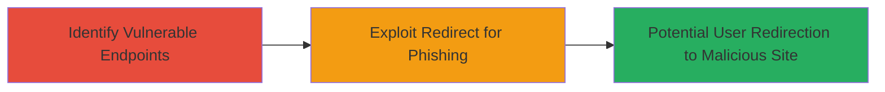

# Open Redirect on Starbucks Greater Asia Domains Enabling Phishing Attacks

Multi-stage attack chain demonstrating the discovery and exploitation of an open redirect vulnerability on Starbucks Greater Asia domains, reported via HackerOne on November 7, 2019, by researcher l00ph0le. This low-severity issue (CVSS 3.8) allows redirection to arbitrary sites, potentially facilitating phishing attacks, though the domains were out of scope for the bug bounty program.

## Chain Metrics Dashboard

| Metric | Value |
|--------|-------|
| Chain Status | Unverified |
| Total Steps | 2 |
| Execution Time | ~5 minutes |
| Skill Level | Beginner |
| Complexity | Low |
| Impact Level | Low |

## Attack Flow Visualization

## Prerequisites & Requirements

### Required Tools

- Web browser (e.g., Chrome or Firefox with developer tools)
- Optional: [[tools/Burp-Suite]] for intercepting requests

### Target Environment

- Web platform
- Starbucks Greater Asia domains (e.g., asia.starbucks.com or regional variants)
- No specific ports or services required beyond standard HTTPS (443)

### Initial Access Requirements

- Public access to the target domains
- No credentials needed
- Basic knowledge of URL manipulation

## Detailed Attack Procedures

### Step 1: Identify Open Redirect Endpoints
procedure: [[procedures/Identify-Open-Redirect-Endpoints]]

**Objective**: Scan and confirm endpoints on Starbucks Greater Asia domains that fail to validate redirect URLs, allowing arbitrary destinations.

**Instructions**: Manually test login or redirect pages by appending a malicious URL parameter (e.g., ?redirect=http://evil.com). Use browser developer tools to inspect the response and verify if the server follows the redirect without validation.

**Expected Output**: The browser or request tool redirects to the specified arbitrary URL instead of a whitelisted domain.

**Success Indicators**:
- Redirect occurs to non-Starbucks domain
- No error or validation blocking the redirect

### Step 2: Exploit Open Redirect for Phishing
procedure: [[procedures/Exploit-Open-Redirect-for-Phishing]]

**Objective**: Craft a phishing link using the vulnerable redirect to lure users to a malicious site, potentially capturing credentials or delivering malware.

**Instructions**: Construct a full phishing URL, such as https://asia.starbucks.com/login?redirect=http://fake-starbucks-phish.com. Distribute this link via email or social engineering. Monitor the fake site for victim interactions.

**Expected Output**: Victims clicking the link are seamlessly redirected to the attacker's controlled phishing page, which mimics the legitimate Starbucks site to harvest data.

**Success Indicators**:
- Successful redirection to phishing site
- Potential capture of user credentials or session data

## Attack Chain Summary

### Key Achievements

1. Discovery of unvalidated redirect parameters on multiple Greater Asia domains
2. Demonstration of low-severity phishing potential without direct exploitation
3. Reporting to Starbucks via HackerOne, highlighting scope issues

## Technique & Tactic Coverage

### MITRE ATT&CK Techniques

- [[Exploit Public-Facing Application]] Exploit Public-Facing Application
- [[T1566.002]] Phishing: Spearphishing Link

### MITRE ATT&CK Tactics

- [[Initial Access]] Initial Access

---
*Last updated: 2023-10-01T00:00:00Z*
