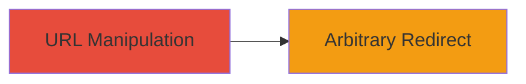

---
tags:
  - open-redirect
  - phishing
  - cwe-601
  - web-vulnerability
type: attack_chain
tools: []
tactics:
  - '[[Initial Access]]'
verified: false
platforms:
  - Web
submitted: true
complexity: low
created_at: '2023-10-01T00:00:00Z'
procedures:
  - '[[procedures/Test-Open-Redirect-via-Double-Slash-Manipulation]]'
step_count: 1
techniques:
  - '[[Exploit Public-Facing Application]]'
updated_at: '2025-12-14T17:24:26.383Z'
description: >-
  Demonstrates exploitation of an open redirect vulnerability in the Skyliner
  web application by manipulating URLs with double slashes to bypass validation
  and redirect to arbitrary domains.
skill_level: beginner
impact_level: medium
id: f7093f0c-be11-41d7-8c94-948073ca1d6c
validated: true
mitre_tactics:
  - '[[Initial Access]]'
mitre_techniques:
  - '[[Exploit Public-Facing Application]]'
---
# Open Redirect via Double Slash Manipulation in Skyliner Web Application

Multi-stage attack chain demonstrating a complete attack workflow.

## Chain Metrics Dashboard

| Metric | Value |
|--------|-------|
| Chain Status | Unverified |
| Total Steps | 1 |
| Execution Time | ~1 minute |
| Skill Level | Beginner |
| Complexity | Low |
| Impact Level | Medium |

## Attack Flow Visualization



## Prerequisites & Requirements

### Required Tools

- Web browser or [[commands/curl-fetch-url-with-redirect]]

### Target Environment

- Web platform
- Access to public-facing Skyliner domains (skyliner.io, qa.skyliner.io)
- No authentication required

### Initial Access Requirements

- Public internet access
- No prior credentials or network position needed

## Detailed Attack Procedures

### Step 1: Test URL Manipulation for Open Redirect
procedure: [[procedures/Test-Open-Redirect-via-Double-Slash-Manipulation]]

**Objective**: Manipulate the target URL to trigger an unvalidated redirect to an arbitrary domain, confirming the vulnerability.

**Instructions**: Access the vulnerable URL using [[commands/curl-fetch-url-with-redirect]] to observe the 301 redirect response:

```bash
curl -I https://skyliner.io//blackfan.ru/
```

Follow up by testing the QA environment:

```bash
curl -I https://qa.skyliner.io//blackfan.ru/
```

**Expected Output**: HTTP/1.1 301 Moved Permanently response with Location header set to //blackfan.ru (protocol-relative redirect).

**Success Indicators**:
- 301 status code received
- Location header points to the arbitrary domain without the original scheme

## Attack Chain Summary

### Key Achievements

1. Confirmed open redirect vulnerability on production and QA domains
2. Demonstrated potential for phishing by redirecting to untrusted sites
3. Highlighted improper URL parsing allowing protocol-relative jumps

## Technique & Tactic Coverage

### MITRE ATT&CK Techniques

- [[Exploit Public-Facing Application]]

### MITRE ATT&CK Tactics

- [[Initial Access]]

---
*Last updated: 2023-10-01T00:00:00Z*
