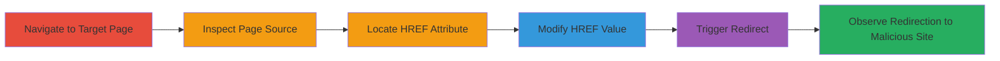

---
tags:
  - open-redirect
  - web-vulnerability
  - phishing
type: attack_chain
tools:
  - '[[tools/Browser-Developer-Tools]]'
  - '[[tools/Web-Browser]]'
tactics:
  - '[[Initial Access]]'
verified: false
platforms:
  - Web
submitted: true
complexity: low
procedures:
  - '[[procedures/Navigate-to-Target-Page]]'
  - '[[procedures/Inspect-Page-Source]]'
  - '[[procedures/Locate-HREF-Attribute]]'
  - '[[procedures/Modify-HREF-for-Redirect]]'
  - '[[procedures/Trigger-Redirect]]'
step_count: 5
techniques:
  - '[[Exploit Public-Facing Application]]'
description: >-
  Demonstrates exploitation of an open redirect vulnerability by modifying the
  HREF attribute in a website link to redirect users to arbitrary external
  malicious sites.
skill_level: beginner
impact_level: medium
id: b4a88a22-e5e2-4e1c-8129-cc57999285fc
created_at: '2025-12-14T17:24:34.825Z'
updated_at: '2025-12-14T17:24:34.825Z'
validated: true
mitre_tactics:
  - '[[Initial Access]]'
mitre_techniques:
  - '[[Exploit Public-Facing Application]]'
---
# Open Redirect via HREF Attribute Manipulation on Website

Multi-stage attack chain demonstrating the exploitation of an open redirect vulnerability on a public-facing website, such as xnxx.com's /todays-selection/1 page, by inspecting and modifying the HREF attribute of a link to point to an external malicious URL. This can lead to user redirection for phishing, credential theft, or malware delivery.

## Chain Metrics Dashboard

| Metric | Value |
|--------|-------|
| Chain Status | Unverified |
| Total Steps | 5 |
| Execution Time | ~2 minutes |
| Skill Level | Beginner |
| Complexity | Low |
| Impact Level | Medium |

## Attack Flow Visualization

## Prerequisites & Requirements

### Required Tools

- [[tools/Web-Browser]]
- [[tools/Browser-Developer-Tools]]

### Target Environment

- Publicly accessible web application (e.g., https://www.xnxx.com)
- No specific ports or services required beyond standard HTTP/HTTPS (ports 80/443)
- Internet access to the target site

### Initial Access Requirements

- No credentials needed; target is public-facing
- Direct network access to the internet
- No prior access required

## Detailed Attack Procedures

### Step 1: Navigate to Target Page
procedure: [[procedures/Navigate-to-Target-Page]]

**Objective**: Access the vulnerable page to begin inspection.

**Instructions**: Open a web browser and directly navigate to the target URL containing the vulnerable link.

**Expected Output**: The page loads, displaying content such as video selections on xnxx.com's /todays-selection/1.

**Success Indicators**:
- Page loads without errors
- Internal links are visible in the page structure

### Step 2: Inspect Page Source
procedure: [[procedures/Inspect-Page-Source]]

**Objective**: Examine the HTML source to identify manipulable elements.

**Instructions**: Use browser developer tools to view the page source and search for link elements.

**Expected Output**: HTML source code is displayed, revealing HREF attributes in anchor tags.

**Success Indicators**:
- Developer tools open successfully
- Page elements are inspectable

### Step 3: Locate HREF Attribute
procedure: [[procedures/Locate-HREF-Attribute]]

**Objective**: Identify the specific HREF pointing to an internal path that can be exploited.

**Instructions**: In the developer tools, search for the HREF attribute like 'href="/todays-selection/2"' within link elements on the page.

**Expected Output**: The exact location of the vulnerable HREF is highlighted in the elements panel.

**Success Indicators**:
- Vulnerable internal HREF is found
- Attribute is confirmed as relative/internal path

### Step 4: Modify HREF for Redirect
procedure: [[procedures/Modify-HREF-for-Redirect]]

**Objective**: Alter the HREF to an external malicious URL to enable redirection.

**Instructions**: Edit the HREF value in the developer tools from an internal path to an arbitrary external URL, such as 'https://google.com' for testing or a phishing site.

**Expected Output**: The link's HREF now points to the external domain.

**Success Indicators**:
- Modification saves without page reload issues
- Updated HREF is visible in the inspector

### Step 5: Trigger Redirect
procedure: [[procedures/Trigger-Redirect]]

**Objective**: Activate the modified link to confirm the open redirect vulnerability.

**Instructions**: Click the modified link or simulate navigation to observe the browser redirecting to the external site.

**Expected Output**: Browser navigates away from the original site to the specified external URL.

**Success Indicators**:
- Successful redirection to external site
- No validation blocks the external URL

## Attack Chain Summary

### Key Achievements

1. Identified and exploited lack of URL validation in HREF attributes
2. Demonstrated potential for phishing by redirecting to malicious domains
3. Confirmed vulnerability without server-side changes, using client-side inspection

## Technique & Tactic Coverage

### MITRE ATT&CK Techniques

- [[Exploit Public-Facing Application]]

### MITRE ATT&CK Tactics

- [[Initial Access]]

---

*Last updated: 2023-10-01T12:00:00Z*
