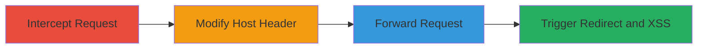

---
tags:
  - open-redirect
  - host-header
  - xss
  - phishing
  - cookie-theft
type: attack_chain
tools:
  - '[[tools/Burp-Suite]]'
tactics:
  - '[[Initial Access]]'
  - '[[Execution]]'
verified: false
platforms:
  - Web
submitted: true
complexity: medium
created_at: '2023-10-01T00:00:00Z'
procedures:
  - '[[procedures/Intercept-HTTP-Request-with-Burp-Suite]]'
  - '[[procedures/Modify-Host-Header-for-Redirect]]'
  - '[[procedures/Forward-Modified-Request-and-Observe-Redirect]]'
  - '[[procedures/Trigger-Chained-XSS-via-Redirect-Response]]'
step_count: 4
techniques:
  - '[[Exploit Public-Facing Application]]'
  - '[[JavaScript]]'
updated_at: '2025-12-14T17:24:31.713Z'
description: >-
  A multi-stage attack exploiting an open redirect vulnerability through Host
  header manipulation on a web application, enabling phishing redirects and a
  chained reflected XSS to steal cookies.
skill_level: intermediate
impact_level: high
id: b45730e0-acc4-4737-97c8-25a38b6e02c6
validated: true
mitre_tactics:
  - '[[Initial Access]]'
  - '[[Execution]]'
mitre_techniques:
  - '[[Exploit Public-Facing Application]]'
  - '[[JavaScript]]'
---
# Open Redirect via Host Header Manipulation Leading to Chained XSS

Multi-stage attack chain demonstrating exploitation of an unvalidated Host header in a web application to trigger an open redirect, facilitating phishing attacks and chaining to a reflected XSS for cookie theft.

## Chain Metrics Dashboard

| Metric | Value |
|--------|-------|
| Chain Status | Unverified |
| Total Steps | 4 |
| Execution Time | ~5 minutes |
| Skill Level | Intermediate |
| Complexity | Medium |
| Impact Level | High |

## Attack Flow Visualization

## Prerequisites & Requirements

### Required Tools

- [[tools/Burp-Suite]]

### Target Environment

- Web application vulnerable to Host header manipulation (e.g., http://www.localizestaging.com/)
- Attacker-controlled domain hosting malicious content (e.g., index.html with JavaScript payload)
- Network access to intercept and modify HTTP traffic

### Initial Access Requirements

- No credentials required; public-facing web application
- Ability to proxy traffic through a tool like Burp Suite
- Browser for viewing responses

## Detailed Attack Procedures

### Step 1: Intercept HTTP Request
procedure: [[procedures/Intercept-HTTP-Request-with-Burp-Suite]]

**Objective**: Capture the incoming request to the target site to prepare for header modification.

**Instructions**: Configure Burp Suite as a proxy and navigate to the target URL to intercept the request.

**Expected Output**: Intercepted HTTP request visible in Burp Suite's Proxy tab.

**Success Indicators**:
- Request intercepted successfully
- Target URL (http://www.localizestaging.com/) loaded in browser but paused in proxy

### Step 2: Modify Host Header
procedure: [[procedures/Modify-Host-Header-for-Redirect]]

**Objective**: Alter the Host header to point to an attacker-controlled domain, tricking the server into redirecting to malicious content.

**Instructions**: In the intercepted request, change the Host header value to the attacker's domain.

**Expected Output**: Modified request ready for forwarding.

**Success Indicators**:
- Host header updated (e.g., from www.localizestaging.com to attacker.com)
- No immediate errors in request syntax

### Step 3: Forward Modified Request and Observe Redirect
procedure: [[procedures/Forward-Modified-Request-and-Observe-Redirect]]

**Objective**: Send the tampered request to trigger the server's redirect response based on the fake Host.

**Instructions**: Forward the request in Burp Suite and inspect the response for a 302 redirect.

**Expected Output**: Server responds with a 302 redirect to the attacker-controlled site.

**Success Indicators**:
- 302 status code received
- Location header points to external malicious URL

### Step 4: Trigger Chained XSS
procedure: [[procedures/Trigger-Chained-XSS-via-Redirect-Response]]

**Objective**: View the redirect response in a browser context to execute embedded JavaScript, stealing cookies from the original domain.

**Instructions**: Copy the raw redirect response from Burp Suite and paste it into the browser address bar or save as HTML to view.

**Expected Output**: Browser redirects to malicious site and executes JavaScript (e.g., alert(document.cookie)).

**Success Indicators**:
- JavaScript payload executes
- Cookies from www.localizestaging.com are accessible and potentially exfiltrated

## Attack Chain Summary

### Key Achievements

1. Successful open redirect to arbitrary external site via Host header
2. Enabled phishing by misleading users to fake trusted sites
3. Chained exploitation to reflected XSS, demonstrating cookie theft in the original domain's context

## Technique & Tactic Coverage

### MITRE ATT&CK Techniques

- [[Exploit Public-Facing Application]]
- [[JavaScript]]

### MITRE ATT&CK Tactics

- [[Initial Access]]
- [[Execution]]

---
*Last updated: 2023-10-01T00:00:00Z*
