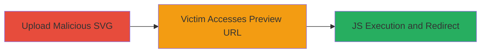

---
tags:
  - open-redirect
  - xss
  - svg-upload
  - javascript
  - phishing
type: attack_chain
tools: []
tactics:
  - '[[Initial Access]]'
commands: []
platforms:
  - Web
complexity: medium
procedures:
  - '[[procedures/Upload-Malicious-SVG-to-Rocket-Chat]]'
  - '[[procedures/Trigger-Open-Redirect-via-SVG-Preview]]'
step_count: 2
techniques:
  - '[[Exploit Public-Facing Application]]'
  - '[[JavaScript]]'
description: >-
  An attack chain exploiting Rocket.Chat's file upload feature to host malicious
  SVG files containing JavaScript, leading to open redirects or arbitrary JS
  execution when victims access the generated preview URL.
skill_level: intermediate
impact_level: high
id: dd321f65-5072-4414-987b-c745e9e23f2b
created_at: '2025-12-14T05:32:10.326Z'
updated_at: '2025-12-14T05:32:10.326Z'
verified: false
validated: true
submitted: true
mitre_tactics:
  - '[[Initial Access]]'
mitre_techniques:
  - '[[Exploit Public-Facing Application]]'
  - '[[JavaScript]]'
---
# Open Redirect via Malicious SVG Upload in Rocket.Chat

## Overview

This attack chain demonstrates how an attacker can upload a specially crafted SVG file containing embedded JavaScript to a Rocket.Chat instance. The platform generates a preview URL under the Rocket.Chat domain that serves the file from Google Cloud Storage (storage.googleapis.com). When a victim clicks the preview link, the browser executes the JavaScript in the context of the Rocket.Chat site, enabling open redirects to phishing sites or other malicious actions like downloading malware. This facilitates social engineering attacks within chats, potentially compromising user sessions or credentials.

## Chain Metrics Dashboard

| Metric | Value |
|--------|-------|
| Chain Status | Unverified |
| Total Steps | 2 |
| Execution Time | ~5 minutes |
| Skill Level | Intermediate |
| Complexity | Medium |
| Impact Level | High |

## Attack Flow Visualization

## Prerequisites & Requirements

### Required Tools

- Web browser for uploading and testing
- Text editor to craft the SVG file

### Target Environment

- Rocket.Chat instance (web-based chat platform)
- File upload feature enabled in chats
- Access to any chat room (authenticated user required for upload)

### Initial Access Requirements

- Valid Rocket.Chat user account
- Ability to upload files to chats
- No special privileges needed beyond basic user access

## Detailed Attack Procedures

### Step 1: Upload Malicious SVG
procedure: [[procedures/Upload-Malicious-SVG-to-Rocket-Chat]]

**Objective**: Craft and upload an SVG file with embedded JavaScript to generate a exploitable preview URL.

**Instructions**: Create an SVG file with JavaScript for redirection, such as `<svg></svg>`. Save as `malicious.svg` and upload it to any Rocket.Chat chat via the file upload interface.

**Expected Output**: Rocket.Chat generates a preview URL like `https://open.rocket.chat/file-upload/ID/malicious.svg`, with the file hosted on `storage.googleapis.com`.

**Success Indicators**:
- File uploads successfully
- Preview URL is generated and shared in the chat

### Step 2: Trigger Open Redirect
procedure: [[procedures/Trigger-Open-Redirect-via-SVG-Preview]]

**Objective**: Trick a victim into accessing the preview URL, executing the JS and performing the redirect or other malicious action.

**Instructions**: Share the preview URL in the chat or via social engineering. When the victim visits it (e.g., `https://open.rocket.chat/file-upload/6ksXL2Mk4MonCcTpx/svgxss.svg`), the browser loads the SVG inline, executes the JS, and redirects to the attacker's site.

**Expected Output**: Victim's browser redirects to the phishing site or executes the JS payload.

**Success Indicators**:
- Victim visits the URL
- JS executes, confirmed by redirect or network requests to malicious domain

## Attack Chain Summary

### Key Achievements

1. Successful upload of unsanitized SVG with JS
2. Generation of domain-trusted preview URL
3. Execution of arbitrary JS leading to phishing or malware delivery

## Technique & Tactic Coverage

### MITRE ATT&CK Techniques

- [[Exploit Public-Facing Application]]
- [[JavaScript]]

### MITRE ATT&CK Tactics

- [[Initial Access]]

---
*Last updated: 2023-10-01*
