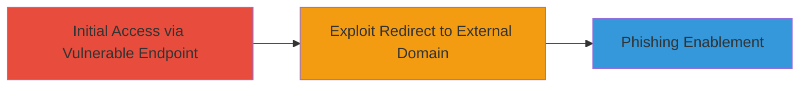

---
tags:
  - open-redirect
  - phishing
  - web-vulnerability
type: attack_chain
tools:
  - '[[tools/curl]]'
tactics:
  - '[[Initial Access]]'
verified: false
platforms:
  - Web
submitted: true
complexity: medium
created_at: '2023-10-01T00:00:00Z'
procedures:
  - '[[procedures/Exploit-Open-Redirect-with-Protocol-Relative-URLs]]'
step_count: 1
techniques:
  - '[[Phishing]]'
  - '[[Exploit Public-Facing Application]]'
updated_at: '2025-12-14T17:24:31.479Z'
description: >-
  Demonstrates exploitation of an open redirect vulnerability using
  protocol-relative URLs to redirect users to arbitrary external domains,
  enabling potential phishing attacks.
skill_level: intermediate
impact_level: medium
id: 186ad250-e344-44b8-bc20-44cadddcdc65
validated: true
mitre_tactics:
  - '[[Initial Access]]'
mitre_techniques:
  - '[[Phishing]]'
  - '[[Exploit Public-Facing Application]]'
---
# Open Redirect via Protocol-Relative URLs on crm.unikrn.com

Multi-stage attack chain demonstrating a complete attack workflow.

## Chain Metrics Dashboard

| Metric | Value |
|--------|-------|
| Chain Status | Unverified |
| Total Steps | 1 |
| Execution Time | ~1 minute |
| Skill Level | Intermediate |
| Complexity | Medium |
| Impact Level | Medium |

## Attack Flow Visualization



## Prerequisites & Requirements

### Required Tools

- [[tools/curl]]

### Target Environment

- Web platform
- Ports: 80 (HTTP), 443 (HTTPS)
- Services: Cloudflare
- Tech stack: PHP/7.0.24, cloudflare-nginx

### Initial Access Requirements

- Network access to crm.unikrn.com
- No credentials required
- Public-facing web application

## Detailed Attack Procedures

### Step 1: Exploit Open Redirect
procedure: [[procedures/Exploit-Open-Redirect-with-Protocol-Relative-URLs]]

**Objective**: Test and demonstrate the open redirect vulnerability by sending a request that triggers a redirect to an arbitrary external domain, validating the lack of URL validation.

**Instructions**: Use [[commands/curl-open-redirect-test]] to send a GET request to the vulnerable path on crm.unikrn.com:

```bash
curl http://crm.unikrn.com//example.com/ -L -v
```

This command follows redirects and provides verbose output to observe the redirect chain.

**Expected Output**: Verbose logs showing a 302 redirect to https://crm.unikrn.com//example.com/, a 301 to //example.com, and a final 200 OK from https://example.com/ with HTML content.

**Success Indicators**:
- Redirect chain observed in verbose output
- Final access to external domain (e.g., example.com)
- No validation blocking the protocol-relative URL

## Attack Chain Summary

### Key Achievements

1. Identified and exploited open redirect on crm.unikrn.com using protocol-relative paths.
2. Demonstrated redirection to arbitrary external sites.
3. Highlighted potential for phishing by tricking users into malicious domains.

## Technique & Tactic Coverage

### MITRE ATT&CK Techniques

- [[Phishing]]
- [[Exploit Public-Facing Application]]

### MITRE ATT&CK Tactics

- [[Initial Access]]

---

*Last updated: 2023-10-01T00:00:00Z*
