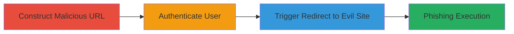

# Open Redirect via Return_To Parameter in Stocky App Login for Phishing

Multi-stage attack chain demonstrating exploitation of an open redirect in the Stocky Shopify app's login page to redirect users to malicious sites post-authentication, facilitating phishing attacks.

## Chain Metrics Dashboard

| Metric | Value |
|--------|-------|
| Chain Status | Unverified |
| Total Steps | 3 |
| Execution Time | ~2 minutes |
| Skill Level | Beginner |
| Complexity | Low |
| Impact Level | Medium |

## Attack Flow Visualization

## Prerequisites & Requirements

### Required Tools

- Web browser (e.g., Chrome, Firefox)

### Target Environment

- Web platform
- Access to https://stocky.shopifyapps.com/users/login
- Valid user credentials for the Stocky app

### Initial Access Requirements

- No prior credentials needed beyond target account login
- Public network access to the login page
- Control over a malicious domain (e.g., evil.com) for redirection

## Detailed Attack Procedures

### Step 1: Construct Malicious Login URL
procedure: [[procedures/Construct-Malicious-Login-URL-for-Open-Redirect]]

**Objective**: Create a login URL with a malicious return_to parameter to set up the open redirect.

**Instructions**: Manually construct the URL by appending the return_to parameter with a protocol-relative malicious domain. Open the URL in a web browser.

**Expected Output**: The Stocky login page loads with the malicious parameter in the URL bar.

**Success Indicators**:
- URL displays ?return_to=//evil.com
- Login form is visible and functional

### Step 2: Authenticate on Login Page
procedure: [[procedures/Authenticate-on-Stocky-Login-Page]]

**Objective**: Log in to the target account to trigger the post-authentication redirect logic.

**Instructions**: Enter valid credentials on the login form and submit. No special commands needed; use the browser's form submission.

**Expected Output**: Successful authentication, followed by an immediate redirect.

**Success Indicators**:
- User is logged in (e.g., dashboard briefly loads or redirect initiates)
- Browser navigates away from the login page

### Step 3: Trigger Post-Login Redirect
procedure: [[procedures/Trigger-Post-Login-Redirect-to-Malicious-Site]]

**Objective**: Observe and confirm the redirect to the malicious site, enabling phishing.

**Instructions**: After login, the application automatically redirects based on the return_to parameter. Monitor the browser's network tab or address bar for the redirect to //evil.com.

**Expected Output**: Browser loads the malicious site (e.g., evil.com), potentially displaying a phishing page mimicking Stocky or capturing session data.

**Success Indicators**:
- Redirect to external malicious domain confirmed
- No validation blocks the arbitrary URL

## Attack Chain Summary

### Key Achievements

1. Successful construction of exploitable login URL without server-side validation.
2. Post-authentication redirect to arbitrary external site.
3. Enablement of phishing attacks to steal user data or sessions.

## Technique & Tactic Coverage

### MITRE ATT&CK Techniques

- [[T1566.002]] Spearphishing Link (via crafted malicious redirect)
- [[Exploit Public-Facing Application]] Exploit Public-Facing Application (open redirect in web app)

### MITRE ATT&CK Tactics

- [[Initial Access]] Initial Access (phishing via redirect)

---
*Last updated: 2023-10-01T00:00:00Z*
