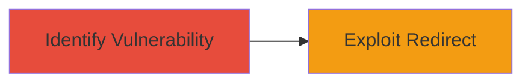

# Open Redirect via State Parameter on Glassdoor Profile Page

Multi-stage attack chain demonstrating a complete attack workflow.

## Chain Metrics Dashboard

| Metric | Value |
|--------|-------|
| Chain Status | Unverified |
| Total Steps | 1 |
| Execution Time | ~1 minutes |
| Skill Level | Beginner |
| Complexity | Low |
| Impact Level | Low |

## Attack Flow Visualization



## Prerequisites & Requirements

### Required Tools

- Web browser or [[commands/curl-open-redirect-test]]

### Target Environment

- Web platform
- Access to https://www.glassdoor.com/profile/siwa.htm
- No specific services/ports required beyond HTTP/HTTPS

### Initial Access Requirements

- Public internet access
- No credentials needed

## Detailed Attack Procedures

### Step 1: Identify and Exploit Open Redirect
procedure: [[procedures/Exploit-Open-Redirect-via-State-Parameter]]

**Objective**: Discover the open redirect vulnerability in the 'state' parameter and test redirection to an arbitrary external site to confirm phishing potential.

**Instructions**: Navigate to the target profile page and manipulate the 'state' parameter to point to an external URL, such as a controlled phishing domain. Use [[commands/curl-open-redirect-test]] to verify the redirect behavior:

```bash
curl -L "https://www.glassdoor.com/profile/siwa.htm?state=https://evil.com" -v
```

Observe the HTTP response headers for the 302 redirect to the malicious site.

**Expected Output**: The request follows a 302 redirect to the specified external URL without validation.

**Success Indicators**:
- HTTP 302 status code with Location header pointing to the arbitrary URL
- No error or blocking of the redirect

## Attack Chain Summary

### Key Achievements

1. Identified improper validation of the 'state' parameter on Glassdoor's profile page.
2. Demonstrated redirection to arbitrary external sites, enabling phishing attacks.
3. Highlighted low-severity impact for social engineering facilitation.

## Technique & Tactic Coverage

### MITRE ATT&CK Techniques

- [[Exploit Public-Facing Application]]

### MITRE ATT&CK Tactics

- [[Initial Access]]

---
*Last updated: 2023-10-01T00:00:00Z*
