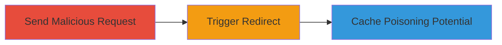

# Open Redirect via Unvalidated Host Header on IRCCloud

Multi-stage attack chain demonstrating exploitation of Host header validation failure on irccloud.com, leading to open redirects that can facilitate phishing or cache poisoning attacks.

## Chain Metrics Dashboard

| Metric | Value |
|--------|-------|
| Chain Status | Unverified |
| Total Steps | 2 |
| Execution Time | ~5 minutes |
| Skill Level | Intermediate |
| Complexity | Medium |
| Impact Level | Low |

## Attack Flow Visualization



## Prerequisites & Requirements

### Required Tools

- [[commands/curl-send-host-header]]

### Target Environment

- Web platform
- Access to irccloud.com over HTTP/HTTPS
- No specific ports required beyond standard 80/443

### Initial Access Requirements

- Public internet access
- No credentials needed
- Ability to craft and send custom HTTP requests

## Detailed Attack Procedures

### Step 1: Send Request with Invalid Host Header
procedure: [[procedures/Send-Request-with-Invalid-Host-Header]]

**Objective**: Manipulate the Host header in an HTTP request to irccloud.com to trigger an unvalidated redirect to an arbitrary domain.

**Instructions**: Use [[commands/curl-send-host-header]] to send a GET request with a custom Host header pointing to a malicious domain:

```bash
curl -H "Host: evil.com" http://irccloud.com/ -v
```

**Expected Output**: The server responds with a 3xx redirect status code pointing to http://evil.com/ or similar, confirming the open redirect.

**Success Indicators**:
- Redirect Location header points to the arbitrary domain
- No validation error from the server

### Step 2: Verify Open Redirect on GET Requests
procedure: [[procedures/Verify-Open-Redirect-on-GET-Requests]]

**Objective**: Confirm the vulnerability persists on standard GET requests without reliance on CSRF tokens or other protections.

**Instructions**: Execute [[commands/curl-verify-get-redirect]] to test a GET request with Host header manipulation:

```bash
curl -H "Host: attacker-controlled.com" -X GET http://irccloud.com/login -v
```

Observe the response for redirect behavior. This step demonstrates independence from POST methods or tokens.

**Expected Output**: A redirect to the specified attacker-controlled domain, visible in the verbose output or via browser simulation.

**Success Indicators**:
- Successful redirect on GET without errors
- No CSRF token interference

## Attack Chain Summary

### Key Achievements

1. Demonstrated Host header injection leading to open redirects
2. Highlighted potential for web-cache poisoning by poisoning shared caches with malicious redirects
3. Verified low-severity impact but real exploitation vectors like phishing links

## Technique & Tactic Coverage

### MITRE ATT&CK Techniques

- [[Exploit Public-Facing Application]] Exploit Public-Facing Application
- [[Drive-by Compromise]] Drive-by Compromise

### MITRE ATT&CK Tactics

- [[Initial Access]] Initial Access

---
*Last updated: 2023-10-01T12:00:00Z*
