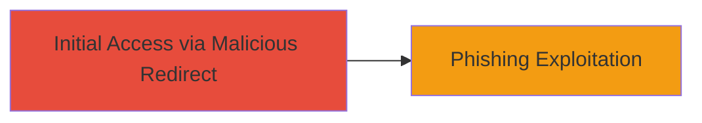

# Open Redirect via return_url Parameter in Adobe Youth Voices Community Endpoint

Multi-stage attack chain demonstrating a complete attack workflow.

## Chain Metrics Dashboard

| Metric | Value |
|--------|-------|
| Chain Status | Unverified |
| Total Steps | 1 |
| Execution Time | ~1 minutes |
| Skill Level | Beginner |
| Complexity | Low |
| Impact Level | Medium |

## Attack Flow Visualization



## Prerequisites & Requirements

### Required Tools

- Web browser or [[tools/curl]]

### Target Environment

- Web platform
- Access to http://youthvoices.adobe.com
- No specific ports or services required beyond HTTP/HTTPS

### Initial Access Requirements

- Public internet access
- No credentials needed for initial testing

## Detailed Attack Procedures

### Step 1: Test Open Redirect in return_url Parameter
procedure: [[procedures/Exploiting-Open-Redirect-in-return_url-Parameter]]

**Objective**: Identify and exploit the lack of validation in the return_url parameter to redirect users to arbitrary external sites, enabling phishing.

**Instructions**: Construct a URL with a malicious payload in the return_url parameter and access it via browser or curl. For example, use a test payload like http://evil.com to check for redirect behavior.

```bash
curl -L "http://youthvoices.adobe.com/community?return_url=http://evil.com" -v
```

Observe the response; a 404 error indicates poor handling, but further testing may reveal actual redirects in production scenarios.

**Expected Output**: HTTP response showing redirect attempt or error page (e.g., 404), confirming inadequate sanitization.

**Success Indicators**:
- 404 error or unexpected redirect to the payload URL
- No validation blocking external domains

## Attack Chain Summary

### Key Achievements

1. Identified open redirect in return_url parameter
2. Demonstrated potential for phishing via unauthorized redirects
3. Highlighted lack of URL validation on /community endpoint

## Technique & Tactic Coverage

### MITRE ATT&CK Techniques

- [[Exploit Public-Facing Application]]

### MITRE ATT&CK Tactics

- [[Initial Access]]

---
*Last updated: 2023-10-01T00:00:00Z*
