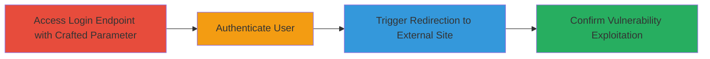

# Open Redirection in Chaturbate Login via Decimal IP Bypass

Multi-stage attack chain demonstrating exploitation of an open redirection vulnerability in Chaturbate's authentication endpoint. The attack bypasses validation by using 'Http:' (capitalized to evade 'http' blocking) followed by a decimal representation of an external IP address, such as 3627732462 for google.com (IP 64.233.183.103 in decimal). This redirects authenticated users to arbitrary external sites, facilitating phishing or reflected file downloads, though CSP partially mitigates impacts.

## Chain Metrics Dashboard

| Metric | Value |
|--------|-------|
| Chain Status | Unverified |
| Total Steps | 4 |
| Execution Time | ~2 minutes |
| Skill Level | Beginner |
| Complexity | Low |
| Impact Level | Low |

## Attack Flow Visualization

## Prerequisites & Requirements

### Required Tools

- Web browser (e.g., Chrome, Firefox)
- Optional: [[tools/Burp-Suite]] for parameter manipulation

### Target Environment

- Web platform
- Access to Chaturbate login endpoint: https://chaturbate.com/auth/login/
- No specific ports or services beyond standard HTTPS (443)

### Initial Access Requirements

- Valid Chaturbate account credentials (for testing post-login redirect)
- Direct network access to chaturbate.com
- No prior access needed beyond public internet

## Detailed Attack Procedures

### Step 1: Craft and Access Login Endpoint
procedure: [[procedures/Bypass-Chaturbate-Open-Redirect-with-Decimal-IP]]

**Objective**: Manipulate the 'next' parameter to bypass validation and set up redirection to an external site.

**Instructions**: Convert the target external domain's IP to decimal (e.g., google.com's 64.233.183.103 becomes 3627732462 using calculator or script: `(64<<24) + (233<<16) + (183<<8) + 103`). Then access the login URL with the crafted parameter:

Open in browser: `https://chaturbate.com/auth/login/?next=Http:3627732462`

**Expected Output**: Login page loads with the manipulated 'next' parameter visible in the URL bar.

**Success Indicators**:
- URL accepts the parameter without immediate block or error
- Page renders normally for login

### Step 2: Authenticate with Valid Credentials
procedure: [[procedures/Bypass-Chaturbate-Open-Redirect-with-Decimal-IP]]

**Objective**: Complete login to trigger the redirection logic after authentication.

**Instructions**: Enter valid Chaturbate username and password on the login form and submit.

**Expected Output**: Successful login attempt processes, but instead of default post-login page, redirects externally.

**Success Indicators**:
- Authentication succeeds (no login errors)
- Browser begins redirect process

### Step 3: Observe External Redirection
procedure: [[procedures/Bypass-Chaturbate-Open-Redirect-with-Decimal-IP]]

**Objective**: Verify the bypass by confirming redirect to the intended external site.

**Instructions**: Monitor the browser's navigation after login submission.

**Expected Output**: Redirects to `https://google.com/` (or equivalent decoded site) instead of Chaturbate's internal pages.

**Success Indicators**:
- External site loads post-login
- No internal Chaturbate dashboard appears

### Step 4: Validate Exploitation
procedure: [[procedures/Bypass-Chaturbate-Open-Redirect-with-Decimal-IP]]

**Objective**: Confirm the vulnerability enables phishing or other attacks.

**Instructions**: Test with a controlled external site (e.g., your own server) to observe full redirect behavior. Note any CSP blocks on file downloads.

**Expected Output**: Consistent redirection confirms open redirect; potential for phishing page load.

**Success Indicators**:
- Redirect occurs reliably across attempts
- Impact assessed (e.g., phishing feasibility despite CSP)

## Attack Chain Summary

### Key Achievements

1. Bypassed weak 'http' blocking using 'Http:' capitalization
2. Encoded external IP in decimal to evade domain checks
3. Enabled post-authentication redirects for phishing simplification
4. Demonstrated low-severity impact due to CSP mitigations

## Technique & Tactic Coverage

### MITRE ATT&CK Techniques

- [[Exploit Public-Facing Application]]

### MITRE ATT&CK Tactics

- [[Initial Access]]

---
*Last updated: 2023-10-01T00:00:00Z*
