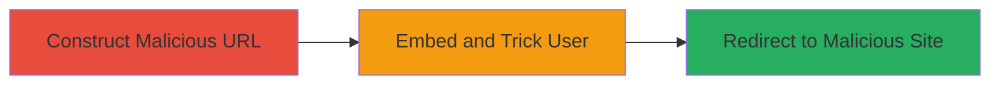

# Open Redirection in Khan Academy SmartHistory Media Player for Phishing Attacks

Multi-stage attack chain demonstrating a complete attack workflow exploiting an open redirection in the SmartHistory Khan Academy media player SWF file.

## Chain Metrics Dashboard

| Metric | Value |
|--------|-------|
| Chain Status | Unverified |
| Total Steps | 2 |
| Execution Time | ~1 minute |
| Skill Level | Beginner |
| Complexity | Low |
| Impact Level | Medium |

## Attack Flow Visualization

## Prerequisites & Requirements

### Required Tools

- Web browser (e.g., Chrome, Firefox)
- Optional: URL encoder for parameter preparation

### Target Environment

- Web platform
- Access to Khan Academy SmartHistory media player endpoint
- No specific services/ports required beyond HTTP/80

### Initial Access Requirements

- No credentials needed
- Public network access to http://smarthistory.khanacademy.org
- Ability to craft and share links (e.g., via email or social media)

## Detailed Attack Procedures

### Step 1: Construct Malicious Redirect URL
procedure: [[procedures/Construct-Malicious-Redirect-URL-in-SWF-Player]]

**Objective**: Create a specially crafted URL for the SWF media player that includes an arbitrary external redirect target in the 'link' parameter.

**Instructions**: Manually construct the URL using the base endpoint http://smarthistory.khanacademy.org/assets/images/media/player.swf. Append parameters: displayclick=link&link=[malicious URL]&file=1.jpg. Replace [malicious URL] with your phishing site, e.g., http://evil.com/phish. Encode if necessary to avoid issues.

**Expected Output**: A valid SWF embed URL that, when loaded, sets the redirect target.

**Success Indicators**:
- URL loads the player without errors
- Inspecting the player shows the custom 'link' parameter value

### Step 2: Trigger Redirection via User Interaction
procedure: [[procedures/Trigger-Redirection-via-User-Interaction]]

**Objective**: Embed the crafted SWF in a page or share the link, then induce the victim to interact with the player to trigger the redirect to the malicious site.

**Instructions**: Embed the SWF URL in an HTML page using <object> or <embed> tags, or share the direct link. Trick the user into viewing the player (e.g., via phishing email claiming educational content). Once loaded, instruct or wait for the user to click on the screen or link within the player.

**Expected Output**: Browser redirects to the specified malicious URL upon click.

**Success Indicators**:
- Victim's browser navigates away to the external domain
- No validation warnings or blocks occur

## Attack Chain Summary

### Key Achievements

1. Successfully crafts arbitrary redirect URLs without validation
2. Bypasses any intended internal linking restrictions in the Flash player
3. Enables phishing by tricking users into malicious sites for credential theft or malware delivery

## Technique & Tactic Coverage

### MITRE ATT&CK Techniques

- [[T1566.002]] Phishing: Spearphishing Link
- [[Drive-by Compromise]] Drive-by Compromise

### MITRE ATT&CK Tactics

- [[Initial Access]] Initial Access

---
*Last updated: 2023-10-01T00:00:00Z*
