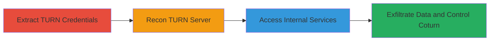

---
tags:
  - turn-relay
  - coturn
  - aws-metadata
  - internal-access
  - socks-proxy
  - xmpp
  - firewall-bypass
type: attack_chain
tools:
  - '[[tools/Chrome-DevTools]]'
  - '[[tools/Stunner]]'
  - '[[tools/Proxychains]]'
  - '[[tools/Telnet]]'
tactics:
  - '[[Initial Access]]'
  - '[[Execution]]'
  - '[[Discovery]]'
  - '[[Collection]]'
verified: false
platforms:
  - Web
  - AWS
  - Linux
submitted: true
complexity: medium
created_at: '2023-10-01T00:00:00Z'
procedures:
  - '[[procedures/Extract-TURN-Credentials-from-XMPP-WebSocket]]'
  - '[[procedures/Reconnaissance-on-TURN-Server-Using-Stunner]]'
  - '[[procedures/Access-Internal-Services-via-TURN-SOCKS-Proxy]]'
step_count: 3
techniques:
  - '[[Exploit Public-Facing Application]]'
  - '[[Protocol Tunneling]]'
  - '[[Exfiltration Over Alternative Protocol]]'
updated_at: '2025-12-14T17:29:44.173Z'
description: >-
  Multi-stage attack exploiting an open TURN relay in coturn servers to bypass
  firewalls, access internal AWS metadata, and control the coturn telnet server
  for potential RCE.
skill_level: intermediate
impact_level: high
id: b743c98a-b8f3-4645-892c-a7fd480133b5
validated: true
mitre_tactics:
  - '[[Initial Access]]'
  - '[[Execution]]'
  - '[[Discovery]]'
  - '[[Collection]]'
mitre_techniques:
  - '[[Exploit Public-Facing Application]]'
  - '[[Protocol Tunneling]]'
  - '[[Exfiltration Over Alternative Protocol]]'
---
---

# Open TURN Relay Exploitation for Internal AWS Metadata Access and Coturn Control

Multi-stage attack chain demonstrating exploitation of an open TURN relay due to lack of peer access control in coturn servers, enabling remote access to internal services like AWS metadata and coturn telnet for configuration manipulation and potential RCE.

## Chain Metrics Dashboard

| Metric | Value |
|--------|-------|
| Chain Status | Unverified |
| Total Steps | 3 |
| Execution Time | ~15 minutes |
| Skill Level | Intermediate |
| Complexity | Medium |
| Impact Level | High |

## Attack Flow Visualization



## Prerequisites & Requirements

### Required Tools

- [[tools/Chrome-DevTools]]
- [[tools/Stunner]]
- [[tools/Proxychains]]
- [[tools/Telnet]]

### Target Environment

- Coturn TURN servers on ports 443 and 5349
- AWS environment with metadata service at 169.254.169.254
- Linux-based servers running coturn with telnet on port 5766
- XMPP service over WebSocket for credential extraction

### Initial Access Requirements

- Network access to the public TURN server (ports 443/TLS)
- Ability to capture WebSocket traffic (e.g., via browser on the target web app)
- No prior credentials needed beyond temporary TURN creds from XMPP

## Detailed Attack Procedures

### Step 1: Extract TURN Credentials
procedure: [[procedures/Extract-TURN-Credentials-from-XMPP-WebSocket]]

**Objective**: Retrieve temporary TURN server credentials from XMPP WebSocket messages to authenticate against the TURN relay.

**Instructions**: Open the target web application that uses XMPP for signaling. Use [[tools/Chrome-DevTools]] to inspect network traffic:

1. Open DevTools (F12), go to the Network tab, and filter for WS (WebSocket) connections.
2. Initiate a connection or action that triggers XMPP WebSocket messages.
3. In the WS frames, filter for messages with type='turn' to extract the TURN hostname, username, and password.

**Expected Output**: JSON-like message containing TURN URI (e.g., tls://turn.example.com:443), username, and credential.

**Success Indicators**:
- TURN credentials (username, password, hostname) obtained
- Valid temporary credentials for authentication

### Step 2: Reconnaissance on TURN Server
procedure: [[procedures/Reconnaissance-on-TURN-Server-Using-Stunner]]

**Objective**: Probe the TURN server to confirm it's an open relay allowing internal IP peers without restrictions.

**Instructions**: With the extracted credentials, use [[tools/Stunner]] for reconnaissance. Execute [[commands/stunner-recon-turn-server]] to scan the server:

```bash
stunner recon tls://turn.example.com:443 -u extracted_username
```

This identifies if the relay allows peers like 127.0.0.1 or 169.254.169.254, and checks TCP/UDP support.

**Expected Output**: Report showing open relay status, allowed peer IPs, and protocol support (e.g., UDP only or both).

**Success Indicators**:
- Confirmation of open relay with no peer IP validation
- Detection of internal peer allowance (e.g., localhost, AWS metadata)

### Step 3: Access Internal Services
procedure: [[procedures/Access-Internal-Services-via-TURN-SOCKS-Proxy]]

**Objective**: Use the TURN relay as a SOCKS proxy to bypass firewalls and connect to internal services like AWS metadata and coturn telnet.

**Instructions**: Configure [[tools/Proxychains]] with the TURN SOCKS proxy from stunner (e.g., socks5://127.0.0.1:someport). Then, scan ports and connect using [[commands/proxychains-telnet-internal-service]]:

```bash
proxychains -f config telnet 127.0.0.1 5766
```

Once connected to coturn telnet, run non-destructive commands like [[commands/coturn-print-config]]:

```bash
> pc
```

And exit with [[commands/coturn-quit]]:

```bash
> q
```

For AWS metadata, similarly proxy curl or other tools to 169.254.169.254:80.

**Expected Output**: Telnet connection to internal port 5766 with coturn config dump; access to AWS metadata endpoints revealing IAM credentials and user-data.

**Success Indicators**:
- Successful connection to internal IPs (127.0.0.1:5766, 169.254.169.254)
- Retrieval of sensitive data (coturn config, AWS IAM tokens)
- Potential for further commands like 'psd' for file writes or server control

## Attack Chain Summary

### Key Achievements

1. Bypassed firewall to access localhost and AWS internal network via public TURN relay
2. Exfiltrated AWS metadata including IAM credentials and instance user-data
3. Gained control over coturn server via telnet, enabling config edits, file writes, and potential RCE

## Technique & Tactic Coverage

### MITRE ATT&CK Techniques

- [[Exploit Public-Facing Application]]
- [[Protocol Tunneling]]
- [[Exfiltration Over Alternative Protocol]]

### MITRE ATT&CK Tactics

- [[Initial Access]]
- [[Execution]]
- [[Discovery]]
- [[Collection]]

---

*Last updated: 2023-10-01T00:00:00Z*
