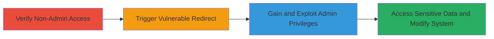

# Oracle APEX Improper Access Control Bypass to Gain Unauthorized Admin Privileges

Multi-stage attack chain demonstrating a complete attack workflow exploiting a vulnerability in an Oracle APEX Express web application hosted by the U.S. Department of Defense.

## Chain Metrics Dashboard

| Metric | Value |
|--------|-------|
| Chain Status | Unverified |
| Total Steps | 3 |
| Execution Time | ~2 minutes |
| Skill Level | Beginner |
| Complexity | Low |
| Impact Level | High |

## Attack Flow Visualization

## Prerequisites & Requirements

### Required Tools

- Web browser (e.g., Chrome, Firefox)

### Target Environment

- Oracle APEX Express web application
- Hosted on a .mil domain (publicly accessible)
- No specific ports required beyond standard HTTPS (443)

### Initial Access Requirements

- Network access to the target URL (https://████.mil/apexcrrel/)
- No credentials needed
- Attacker positioned externally (internet access)

## Detailed Attack Procedures

### Step 1: Verify Insufficient Privileges on Admin Page
procedure: [[procedures/Verify-Insufficient-Privileges-on-Admin-Page]]

**Objective**: Confirm that the attacker lacks admin privileges by attempting direct access to the admin portal, establishing a baseline for the bypass.

**Instructions**: Open a web browser and navigate to the admin page URL. No authentication should be provided.

**Expected Output**: Access denied message due to insufficient privileges, such as an error page indicating lack of authorization.

**Success Indicators**:
- Page loads with a denial message (e.g., "Insufficient Privileges")
- No admin dashboard or user management features visible

### Step 2: Trigger Admin Session via Vulnerable Redirect
procedure: [[procedures/Trigger-Admin-Session-via-Vulnerable-Redirect]]

**Objective**: Exploit the vulnerable page to automatically redirect to the admin portal and establish an admin session without authentication.

**Instructions**: In the same browser session, navigate directly to the vulnerable page URL. The application will handle the redirect internally.

**Expected Output**: Automatic redirect to the admin page (page 45) with a fully functional admin interface loaded.

**Success Indicators**:
- Browser redirects from page 56 to page 45
- Admin session is active without prompting for credentials

### Step 3: Exploit Granted Admin Access
procedure: [[procedures/Exploit-Granted-Admin-Access]]

**Objective**: Utilize the elevated admin privileges to view sensitive data, modify user roles, upload files, and perform other destructive actions.

**Instructions**: Once redirected, interact with the admin dashboard to perform unauthorized operations, such as viewing user lists or uploading files.

**Expected Output**: Full access to admin features, including user management, file uploads, and data viewing.

**Success Indicators**:
- Ability to view user names, emails, and filenames
- Successful modification of user roles or file uploads
- No further authentication required for admin actions

## Attack Chain Summary

### Key Achievements

1. Bypassed authentication controls to gain unauthorized admin access
2. Exposed sensitive user data including names, emails, and file details
3. Enabled integrity violations through role modifications and file operations, with potential for user deletion

## Technique & Tactic Coverage

### MITRE ATT&CK Techniques

- [[Exploit Public-Facing Application]] Exploit Public-Facing Application
- [[Valid Accounts]] Valid Accounts

### MITRE ATT&CK Tactics

- [[Initial Access]] Initial Access
- [[Privilege Escalation]] Privilege Escalation

---
*Last updated: 2023-10-01T00:00:00Z*
