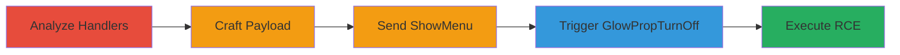

# Out-of-Bounds Read in Source Engine Network Handlers Leading to Client RCE

Multi-stage attack chain demonstrating remote code execution on Source Engine game clients, such as CS:GO, by exploiting out-of-bounds reads in network message handlers. An attacker sets up a malicious server and uses crafted usermessages to place a fake object and ROP chain in client memory, then triggers an OOB read to hijack control flow and execute arbitrary code, like launching calc.exe.

## Chain Metrics Dashboard

| Metric | Value |
|--------|-------|
| Chain Status | Unverified |
| Total Steps | 5 |
| Execution Time | ~10 minutes |
| Skill Level | Advanced |
| Complexity | High |
| Impact Level | Critical |

## Attack Flow Visualization

## Prerequisites & Requirements

### Required Tools

- [[tools/Python]]
- [[tools/pwn]]
- [[tools/SourceMod]]
- [[tools/IDA-Pro]]

### Target Environment

- CS:GO or other Source Engine games on Windows
- Server access to host malicious game server on port 27015
- Client: CS:GO installed, vulnerable version (pre-patch)

### Initial Access Requirements

- Attacker controls a Source Engine server
- Victim joins the server (no credentials needed, public server possible)
- Network access to game server

## Detailed Attack Procedures

### Step 1: Analyze Network Message Handlers
procedure: [[procedures/Analyze-Source-Engine-Network-Handlers-for-OOB-Vulnerabilities]]

**Objective**: Identify vulnerable network message handlers with insufficient bounds checking to enable OOB reads.

**Instructions**: Review protobuf definitions and disassemble handlers using [[tools/IDA-Pro]]. Focus on messages like GlowPropTurnOff in usermessages.proto. Look for entity index checks that only validate lower bound (>=0) without upper bound, allowing large indices to overflow after left shift by 4 bits.

**Expected Output**: Confirmation of vulnerability in assembly, e.g., `mov eax, ent_idx; test eax, eax; js short loc; shl eax, 4; mov ecx, entitylist[eax]`.

**Success Indicators**:
- Identified OOB read pattern in handler
- Verified no upper bound check

### Step 2: Craft Exploit Payload
procedure: [[procedures/Craft-Exploit-Payload-with-Python-and-Pwn]]

**Objective**: Generate a payload placing a fake vtable and ROP chain in controlled memory for control flow hijacking.

**Instructions**: Use a Python script with pwn library to create a UTF-16 encoded string for ShowMenu. Set up fake object in g_szMenuString, including vtable pointers and ROP gadgets (e.g., pop esp, xchg eax esp) to execute shellcode like launching calc.exe. Update BASE_ADDRESS to client_panorama.dll base (e.g., 0x287E0000).

**Expected Output**: Payload string ready for insertion into SourceMod plugin.

**Success Indicators**:
- Payload generated with valid ROP chain
- UTF-16 encoding verified

### Step 3: Send Payload via ShowMenu
procedure: [[procedures/Send-Payload-via-SourceMod-ShowMenu-Message]]

**Objective**: Write the crafted payload into client memory using a legitimate usermessage.

**Instructions**: In SourceMod plugin, hook player_spawn event. Use StartMessageOne('ShowMenu', client); set bits_valid_slots=0xFFFFFFFF, display_time=0, menu_string=payload; EndMessage(). Compile plugin with payload inserted as char payload[].

**Expected Output**: Payload written to g_szMenuString[512] on client spawn.

**Success Indicators**:
- Client receives ShowMenu without errors
- Memory layout controlled

### Step 4: Trigger OOB Read with GlowPropTurnOff
procedure: [[procedures/Trigger-OOB-Read-with-GlowPropTurnOff-Message]]

**Objective**: Hijack control flow by triggering the OOB read to access the fake object and execute ROP.

**Instructions**: Immediately after ShowMenu, send StartMessageOne('GlowPropTurnOff', client); set entidx=0xfe43167 (large value overflowing to fake object address); EndMessage(). This accesses entitylist beyond bounds, calls GetBaseEntity() virtual function via controlled vtable.

**Expected Output**: ROP chain execution, e.g., calc.exe launches on client.

**Success Indicators**:
- OOB read triggered
- Arbitrary code executed

### Step 5: Reproduce on Server
procedure: [[procedures/Reproduce-Exploit-on-CSGO-Server]]

**Objective**: Set up and test the full exploit on a live server-client setup.

**Instructions**: Start CS:GO server, load compiled .smx plugin, enable [[commands/sv_allowuploads-1]] for leak mechanism. Note client_panorama.dll base, generate payload, connect client with [[commands/connect-to-malicious-server]]. On spawn, exploit triggers automatically. If leak fails, delete csgo/_leak.txt and retry.

**Expected Output**: Client joins, calc.exe launches on spawn.

**Success Indicators**:
- Server receives leak file
- RCE confirmed on client

## Attack Chain Summary

### Key Achievements

1. Identified and exploited OOB read in network handlers
2. Achieved controlled memory write via ShowMenu
3. Hijacked vtable for ROP-based RCE
4. Demonstrated full client compromise via malicious server

## Technique & Tactic Coverage

### MITRE ATT&CK Techniques

- [[Exploitation for Client Execution]] Exploitation for Client Execution
- [[Dynamic-link Library Injection]] Dynamic-link Library Injection (for ROP and shellcode)

### MITRE ATT&CK Tactics

- [[Execution]] Execution

---
*Last updated: 2023-10-01T00:00:00Z*
