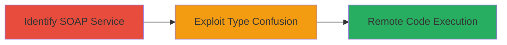

# PHP SOAP Extension Type Confusion Leading to Remote Code Execution

Multi-stage attack chain demonstrating exploitation of a type confusion vulnerability in PHP's SOAP extension to achieve remote code execution on vulnerable web servers.

## Chain Metrics Dashboard

| Metric | Value |
|--------|-------|
| Chain Status | Unverified |
| Total Steps | 2 |
| Execution Time | ~5 minutes |
| Skill Level | Intermediate |
| Complexity | Medium |
| Impact Level | High |

## Attack Flow Visualization



## Prerequisites & Requirements

### Required Tools

- None specific; uses standard HTTP clients like curl.

### Target Environment

- PHP web server with SOAP extension enabled (versions prior to patch).
- Exposed SOAP endpoint (typically over HTTP/HTTPS on port 80/443).
- Network access to the target web application.

### Initial Access Requirements

- No credentials required; assumes public-facing SOAP service.
- Direct network connectivity to the target.
- No prior access needed beyond reachability.

## Detailed Attack Procedures

### Step 1: Identify PHP SOAP Service
procedure: [[procedures/Identify-PHP-SOAP-Service]]

**Objective**: Discover and confirm the presence of a vulnerable PHP SOAP service on the target.

**Instructions**: Use a standard HTTP probe to check for SOAP endpoints, such as sending a basic SOAP request to common paths like /soap or /wsdl.

Execute [[commands/curl-soap-probe]] to verify the service:

```bash
curl -X POST http://target.com/soap -H "Content-Type: text/xml" -d '<?xml version="1.0"?><soap:Envelope xmlns:soap="http://schemas.xmlsoap.org/soap/envelope/"><soap:Body></soap:Body></soap:Envelope>'
```

**Expected Output**: XML response indicating a SOAP service, such as fault or schema details confirming PHP SOAP handling.

**Success Indicators**:
- HTTP 200 response with SOAP XML.
- Presence of PHP-specific error or WSDL reference.

### Step 2: Exploit Type Confusion for RCE
procedure: [[procedures/Exploit-PHP-SOAP-Type-Confusion-RCE]]

**Objective**: Send a crafted SOAP request triggering type confusion in serialize_function_call to execute arbitrary code.

**Instructions**: Craft a malicious SOAP payload exploiting the type confusion by serializing a function call with mismatched types, leading to memory corruption and code execution. Use a payload that forces PHP to interpret user-controlled data as executable code, such as injecting a PHP system call.

Execute [[commands/curl-soap-rce-payload]] to send the exploit:

```bash
curl -X POST http://target.com/soap -H "Content-Type: text/xml" -d '<?xml version="1.0"?><soap:Envelope xmlns:soap="http://schemas.xmlsoap.org/soap/envelope/"><soap:Body><functionCall><name>system</name><args><arg type="string">id</arg></args></functionCall></soap:Body></soap:Envelope>' --data-urlencode
```

Adjust the payload based on the specific type confusion vector (e.g., integer-to-string mismatch in serialization).

**Expected Output**: Server response containing output from executed command, like 'uid=33(www-data)' for 'id' command.

**Success Indicators**:
- Arbitrary command output in response.
- Server behavior change indicating code execution (e.g., file creation or process spawn).

## Attack Chain Summary

### Key Achievements

1. Identification of vulnerable PHP SOAP endpoint.
2. Successful type confusion exploitation leading to RCE.
3. Arbitrary code execution on the server, enabling full compromise.

## Technique & Tactic Coverage

### MITRE ATT&CK Techniques

- [[Exploit Public-Facing Application]] Exploit Public-Facing Application
- [[Python]] PHP

### MITRE ATT&CK Tactics

- [[Initial Access]] Initial Access
- [[Execution]] Execution

---
*Last updated: 2023-10-01T12:00:00Z*
