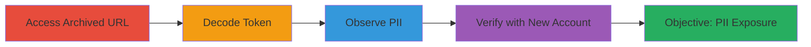

---
tags:
  - pii-exposure
  - information-disclosure
  - base64-decode
  - wayback-machine
  - email-leak
type: attack_chain
tools:
  - '[[tools/Wayback-Machine]]'
  - '[[tools/Python]]'
tactics:
  - '[[Discovery]]'
commands:
  - '[[commands/python-decode-base64-token-extract-email]]'
verified: false
platforms:
  - Web
submitted: true
complexity: low
created_at: '2023-10-01T00:00:00Z'
procedures:
  - '[[procedures/Access-Archived-Confirmation-URL-via-Wayback-Machine]]'
  - '[[procedures/Decode-Base64-Token-to-Extract-Email-PII]]'
  - '[[procedures/Observe-and-Verify-Decoded-PII]]'
  - '[[procedures/Verify-Vulnerability-by-Creating-New-Account]]'
step_count: 4
techniques:
  - '[[Account Discovery]]'
updated_at: '2025-12-14T17:25:18.012Z'
description: >-
  Attack chain demonstrating the discovery and extraction of embedded PII from
  publicly archived email confirmation URLs on Omise's dashboard, leading to
  information disclosure.
skill_level: beginner
impact_level: medium
id: 0ae5e6c3-d1a1-45ab-a3a9-aaa9fbcabb0d
validated: true
mitre_tactics:
  - '[[Discovery]]'
mitre_techniques:
  - '[[Account Discovery]]'
---
# PII Exposure via Base64-Encoded Email Tokens in Archived Omise Confirmation URLs

Multi-stage attack chain demonstrating the discovery of information disclosure through publicly archived confirmation URLs on Omise's dashboard, where user email addresses are embedded in Base64-encoded tokens, enabling potential user enumeration and phishing.

## Chain Metrics Dashboard

| Metric | Value |
|--------|-------|
| Chain Status | Unverified |
| Total Steps | 4 |
| Execution Time | ~5 minutes |
| Skill Level | Beginner |
| Complexity | Low |
| Impact Level | Medium |

## Attack Flow Visualization



## Prerequisites & Requirements

### Required Tools

- [[tools/Wayback-Machine]]
- [[tools/Python]]

### Target Environment

- Web platform (Omise dashboard at dashboard.omise.co)
- No specific services or ports required; relies on public web archives
- Internet access to archive.org and omise.co

### Initial Access Requirements

- No credentials needed for archived content
- Public internet access
- Basic Python environment for decoding

## Detailed Attack Procedures

### Step 1: Access Archived Confirmation URL
procedure: [[procedures/Access-Archived-Confirmation-URL-via-Wayback-Machine]]

**Objective**: Locate and retrieve a historical snapshot of Omise's email confirmation page containing a sensitive URL with an embedded token.

**Instructions**: Navigate to the Wayback Machine and search for archived versions of Omise's dashboard confirmation endpoint. Enter the URL pattern like https://dashboard.omise.co/users/confirm_email and select a snapshot from 2021. Copy the full archived confirmation URL, which includes the Base64-encoded token.

**Expected Output**: Archived page displaying the confirmation URL, e.g., https://dashboard.omise.co/users/confirm_email/BAhbCGkD5+gCVTogQWN0aXZlU3VwcG9ydDo6VGltZVdpdGhab25lWwhJdToJVGltZQ1qVh%2FA51yK3Ak6DW5hbm9fbnVtaQH7Og1uYW5vX2RlbmkGOg1zdWJtaWNybyIHJRA6CXpvbmVJIghVVEMGOgZFRkkiCFVUQwY7C1RJdTsGDWpWH8DnXIrcCTsHaQH7OwhpBjsJIgclEDsKQAlJIiFtYW50dWhhY2tlcm9uZTE3MzhAZ21haWwuY29tBjsLVA==--5d75e1da7fbede4b6285f61f758e5dbed8d62604.

**Success Indicators**:
- Archived URL retrieved successfully
- Token portion visible in the URL

### Step 2: Decode Base64 Token to Extract Email PII
procedure: [[procedures/Decode-Base64-Token-to-Extract-Email-PII]]

**Objective**: Extract and decode the Base64-encoded token from the archived URL to reveal the embedded user email address.

**Instructions**: Identify the Base64 part of the token in the URL (after /confirm_email/). Use the [[commands/python-decode-base64-token-extract-email]] command to unquote, decode, and search for email patterns:

```python
import base64
from urllib.parse import unquote
import re
token = "BAhbCGkD5+gCVTogQWN0aXZlU3VwcG9ydDo6VGltZVdpdGhab25lWwhJdToJVGltZQ1qVh%2FA51yK3Ak6DW5hbm9fbnVtaQH7Og1uYW5vX2RlbmkGOg1zdWJtaWNybyIHJRA6CXpvbmVJIghVVEMGOgZFRkkiCFVUQwY7C1RJdTsGDWpWH8DnXIrcCTsHaQH7OwhpBjsJIgclEDsKQAlJIiFtYW50dWhhY2tlcm9uZTE3MzhAZ21haWwuY29tBjsLVA==--5d75e1da7fbede4b6285f61f758e5dbed8d62604"
decoded_token = base64.b64decode(unquote(token))
print(re.findall(rb"[a-zA-Z0-9.\_%+-]+@[a-zA-Z0-9.-]+\.[a-zA-Z]{2,}", decoded_token))
```

**Expected Output**: Decoded binary data revealing the email, e.g., [b'mantuhackerone1738@gmail.com'].

**Success Indicators**:
- Email address extracted from decoded token
- Regex matches confirm PII presence

### Step 3: Observe and Verify Decoded PII
procedure: [[procedures/Observe-and-Verify-Decoded-PII]]

**Objective**: Analyze the decoded output to confirm the exposure of sensitive user information like email addresses.

**Instructions**: Review the output from the decoding step for clear email patterns. Cross-reference with known formats to ensure validity, such as checking if the domain (e.g., gmail.com) is legitimate.

**Expected Output**: Visible PII in the form of full email addresses, e.g., mantuhackerone1738@gmail.com or big.dogs1979@gmail.com.

**Success Indicators**:
- PII clearly identifiable in output
- No decoding errors or invalid data

### Step 4: Verify Vulnerability by Creating New Account
procedure: [[procedures/Verify-Vulnerability-by-Creating-New-Account]]

**Objective**: Confirm the vulnerability persists or matches the archived behavior by generating a new confirmation URL.

**Instructions**: Register a new account on dashboard.omise.co, trigger the confirmation email, and inspect the received URL for similar Base64-encoded email embedding.

**Expected Output**: Confirmation email URL with token containing the new user's email in Base64, mirroring the archived structure.

**Success Indicators**:
- New URL structure matches archived one
- Decoding new token reveals the test email

## Attack Chain Summary

### Key Achievements

1. Discovered archived sensitive URLs exposing PII
2. Successfully decoded tokens to extract emails
3. Verified ongoing vulnerability through account creation
4. Highlighted risks of archiving without protection

## Technique & Tactic Coverage

### MITRE ATT&CK Techniques

- [[Account Discovery]]

### MITRE ATT&CK Tactics

- [[Discovery]]

---

*Last updated: 2023-10-01T00:00:00Z*
