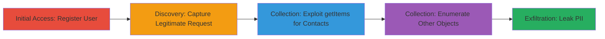

---
tags:
  - salesforce
  - pii-leak
  - access-control-bypass
  - aura-framework
  - dod-portal
type: attack_chain
tools:
  - '[[tools/Burp-Suite]]'
tactics:
  - '[[Initial Access]]'
  - '[[Discovery]]'
  - '[[Collection]]'
verified: false
platforms:
  - Web
  - Salesforce
submitted: true
complexity: medium
created_at: '2024-01-01T00:00:00Z'
procedures:
  - '[[procedures/Register-New-User-in-DoD-Portal]]'
  - '[[procedures/Capture-and-Modify-Salesforce-Aura-Request]]'
  - '[[procedures/Exploit-getItems-Action-for-Contact-Records]]'
  - '[[procedures/Enumerate-Additional-Salesforce-Objects]]'
step_count: 4
techniques:
  - '[[Exploit Public-Facing Application]]'
  - '[[Valid Accounts]]'
  - '[[Account Discovery]]'
updated_at: '2025-12-14T17:25:18.155Z'
description: >-
  Multi-stage attack exploiting misconfigured permissions in a Salesforce-based
  DoD portal to leak sensitive PII of hundreds of thousands of users through
  unauthorized queries to Aura endpoints.
skill_level: intermediate
impact_level: high
id: 3d3c6e99-ff80-4e9c-a00e-0ebb960952c0
validated: true
mitre_tactics:
  - '[[Initial Access]]'
  - '[[Discovery]]'
  - '[[Collection]]'
mitre_techniques:
  - '[[Exploit Public-Facing Application]]'
  - '[[Valid Accounts]]'
  - '[[Account Discovery]]'
---
# PII Leak via Misconfigured Salesforce Record Permissions in DoD Portal

Multi-stage attack chain demonstrating exploitation of misconfigured record permissions in a Salesforce-based U.S. Department of Defense tour visitor portal, allowing any registered user to access sensitive PII such as full names, email addresses, and phone numbers from Contact, Account, and AccountContactRelation objects. The attack involves user registration, request interception with Burp Suite, and modification of POST requests to Salesforce Aura endpoints to query arbitrary records without additional access controls, leading to a critical large-scale data leak.

## Chain Metrics Dashboard

| Metric | Value |
|--------|-------|
| Chain Status | Unverified |
| Total Steps | 4 |
| Execution Time | ~15 minutes |
| Skill Level | Intermediate |
| Complexity | Medium |
| Impact Level | High |

## Attack Flow Visualization

## Prerequisites & Requirements

### Required Tools

- [[tools/Burp-Suite]]

### Target Environment

- Web platform with Salesforce Community App
- Aura Framework endpoints
- No specific ports required (HTTPS/443 implied)
- Network access to the public DoD portal URL

### Initial Access Requirements

- Internet access to register a new user
- Valid email for verification
- No prior credentials needed; any registered user suffices

## Detailed Attack Procedures

### Step 1: Initial Access
procedure: [[procedures/Register-New-User-in-DoD-Portal]]

**Objective**: Gain initial foothold by creating a registered user account in the DoD portal to enable authenticated requests.

**Instructions**: Navigate to the portal's main URL (redacted as █████), append the registration path (redacted as ██████████), fill out the form with basic details, and verify via the sent email link. Then log in using the credentials.

**Expected Output**: Successful login to the portal dashboard.

**Success Indicators**:
- Email verification link received and clicked
- Portal dashboard accessible post-login

### Step 2: Discovery
procedure: [[procedures/Capture-and-Modify-Salesforce-Aura-Request]]

**Objective**: Intercept a legitimate POST request to understand the structure of Salesforce Aura endpoints and prepare for modification.

**Instructions**: With Burp Suite proxy enabled, perform an action in the portal that triggers a POST to the Aura endpoint (e.g., loading a page). Capture the request using [[commands/Capture-Salesforce-Aura-POST-Request]] in Burp's Repeater.

**Expected Output**: Captured request showing aura.token, message with getComponentAttributes action, and response with up to 2000 records.

**Success Indicators**:
- Request intercepted with valid aura.token
- Response includes sequential Salesforce IDs for enumeration

### Step 3: Collection
procedure: [[procedures/Exploit-getItems-Action-for-Contact-Records]]

**Objective**: Bypass access controls by modifying the request to query sensitive Contact records, leaking PII.

**Instructions**: In Burp Repeater, alter the captured request body to use the getItems action with entityNameOrId set to 'Contact', layoutType 'FULL', and pageSize 2000. Replay using [[commands/Exploit-getItems-for-Contact-Records]].

**Expected Output**: 200 OK response containing PII like names, emails, and phone numbers from Contact objects.

**Success Indicators**:
- Unauthorized records returned without errors
- PII fields visible in JSON response

### Step 4: Lateral Movement
procedure: [[procedures/Enumerate-Additional-Salesforce-Objects]]

**Objective**: Extend the leak to other objects like Account and AccountContactRelation by enumerating via sequential IDs and entity changes.

**Instructions**: Modify the entityNameOrId in subsequent requests to 'Account', 'AccountContactRelation', etc., and increment IDs for broader enumeration. Replay modified requests in Burp.

**Expected Output**: Additional datasets with related PII from enumerated objects.

**Success Indicators**:
- Multiple object types queried successfully
- Comprehensive PII dataset compiled

## Attack Chain Summary

### Key Achievements

1. Successful registration and authentication as a low-privilege user
2. Bypassed record permissions to access hundreds of thousands of PII records
3. Demonstrated scalability via object enumeration and sequential ID exploitation

## Technique & Tactic Coverage

### MITRE ATT&CK Techniques

- [[Exploit Public-Facing Application]] Exploit Public-Facing Application
- [[Valid Accounts]] Valid Accounts
- [[Account Discovery]] Account Discovery

### MITRE ATT&CK Tactics

- [[Initial Access]] Initial Access
- [[Discovery]] Discovery
- [[Collection]] Collection

---

*Last updated: 2024-01-01T00:00:00Z*
