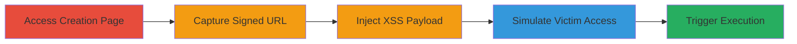

---
tags:
  - xss
  - shopify
  - web
  - javascript-injection
type: attack_chain
tools: []
tactics:
  - '[[Execution]]'
  - '[[Initial Access]]'
verified: false
platforms:
  - Web
submitted: true
complexity: medium
created_at: '2023-10-01T00:00:00Z'
procedures:
  - '[[procedures/Access-Shopify-App-Listing-Creation-Page]]'
  - '[[procedures/Capture-Signed-Preview-URL]]'
  - '[[procedures/Inject-XSS-Payload-into-App-Name]]'
  - '[[procedures/Simulate-Victim-Access-with-Incognito-Tab]]'
  - '[[procedures/Trigger-XSS-Execution-via-Preview]]'
step_count: 5
techniques:
  - '[[JavaScript]]'
  - '[[Drive-by Compromise]]'
updated_at: '2025-12-13T23:52:55.599Z'
description: >-
  A multi-step attack exploiting a POST-based XSS vulnerability in Shopify's app
  store listing creation process, allowing arbitrary JavaScript execution in
  victims' browsers when viewing malicious listings.
skill_level: intermediate
impact_level: high
id: a3cd3add-c17a-40c7-b519-977e96276b45
validated: true
mitre_tactics:
  - '[[Execution]]'
  - '[[Initial Access]]'
mitre_techniques:
  - '[[JavaScript]]'
  - '[[Drive-by Compromise]]'
---
# POST-based XSS in Shopify App Store Listing Creation via Unsanitized App Name

Multi-stage attack chain demonstrating a complete POST-based XSS workflow in Shopify's app store listing creation, where unsanitized user input in the App name field is inserted into a <svg onload=alert()>' in the App name input and submit the form.

**Expected Output**: Form submission without errors, preparing the malicious listing.

**Success Indicators**:
- Payload accepted without sanitization
- No immediate errors on submission

### Step 4: Simulate Victim Access
procedure: [[procedures/Simulate-Victim-Access-with-Incognito-Tab]]

**Objective**: Mimic a victim viewing the listing by loading the signed URL in a clean browser session.

**Instructions**: Open an incognito tab and paste/load the captured URL from Step 2.

**Expected Output**: Preview or listing page loads in incognito mode.

**Success Indicators**:
- Page loads without authentication prompts
- Signed URL validates successfully

### Step 5: Trigger Execution
procedure: [[procedures/Trigger-XSS-Execution-via-Preview]]

**Objective**: Execute the injected JavaScript by previewing the changes, simulating victim interaction.

**Instructions**: Click 'Preview changes' to render the page with the unsanitized App name inserted into a <script> tag.

**Expected Output**: Alert dialog or arbitrary JS execution (e.g., alert() fires).

**Success Indicators**:
- JavaScript payload executes
- Alert or console log confirms XSS

## Attack Chain Summary

### Key Achievements

1. Successful breakout from <script> tag using App name input
2. Arbitrary JS execution in victim browsers (Firefox, IE, Edge)
3. Potential for session cookie theft or client-side attacks via shared listings

## Technique & Tactic Coverage

### MITRE ATT&CK Techniques

- [[JavaScript]]
- [[Drive-by Compromise]]

### MITRE ATT&CK Tactics

- [[Execution]]
- [[Initial Access]]

---
*Last updated: 2023-10-01T00:00:00Z*
