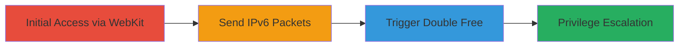

---
tags:
  - ps4
  - freebsd
  - ipv6
  - double-free
  - kernel-exploit
  - privilege-escalation
type: attack_chain
tools:
  - '[[tools/poc.c]]'
  - '[[tools/ps4.c]]'
tactics:
  - '[[Privilege Escalation]]'
  - '[[Execution]]'
commands: []
platforms:
  - PS4
  - FreeBSD
complexity: high
procedures:
  - '[[procedures/Discover-SOCK_RAW-Access-in-WebKit]]'
  - '[[procedures/Send-Fragmented-IPv6-Packets-via-SOCK_RAW]]'
  - '[[procedures/Trigger-Double-Free-for-Privilege-Escalation]]'
step_count: 3
techniques:
  - '[[procedures/Trigger-Double-Free-for-Privilege-Escalation]]'
  - '[[Exploitation for Client Execution]]'
description: >-
  Exploitation of improper privilege management in PS4 WebKit allowing SOCK_RAW
  sockets, combined with a kernel double free in IPv6 handling for privilege
  escalation.
skill_level: advanced
impact_level: high
id: e88c5c22-2294-4e0a-a4dc-60054346de7f
created_at: '2025-12-11T03:47:39.447Z'
updated_at: '2025-12-11T03:47:39.447Z'
verified: false
validated: true
submitted: true
mitre_tactics:
  - '[[TA0004]]'
  - '[[TA0002]]'
mitre_techniques:
  - '[[T1068]]'
  - '[[T1203]]'
---
# PS4 Kernel Privilege Escalation via WebKit SOCK_RAW and IPv6 Double Free

Multi-stage attack chain demonstrating kernel privilege escalation on PS4 by exploiting SOCK_RAW access from WebKit and a double free vulnerability in IPv6 packet handling.

## Chain Metrics Dashboard

| Metric | Value |
|--------|-------|
| Chain Status | Unverified |
| Total Steps | 3 |
| Execution Time | ~5 minutes |
| Skill Level | Advanced |
| Complexity | High |
| Impact Level | High |

## Attack Flow Visualization



## Prerequisites & Requirements

### Required Tools

- [[tools/poc.c]]
- [[tools/ps4.c]]

### Target Environment

- PS4 (FreeBSD-based) or FreeBSD 9
- IPv6 networking and loopback interface enabled
- Access to WebKit process

### Initial Access Requirements

- Ability to run code in WebKit context on PS4
- No root privileges required for SOCK_RAW

## Detailed Attack Procedures

### Step 1: Discover SOCK_RAW Access - [[procedures/Discover-SOCK_RAW-Access-in-WebKit]]

**Procedure**: [[procedures/Discover-SOCK_RAW-Access-in-WebKit]]

**Objective**: Identify and open SOCK_RAW sockets from the WebKit process without root privileges to enable raw IPv6 packet sending.

**Expected Output**: Successful creation of a SOCK_RAW socket in the WebKit process.

**Success Indicators**:
- Socket creation returns a valid file descriptor
- No permission errors occur

### Step 2: Send Fragmented IPv6 Packets - [[procedures/Send-Fragmented-IPv6-Packets-via-SOCK_RAW]]

**Procedure**: [[procedures/Send-Fragmented-IPv6-Packets-via-SOCK_RAW]]

**Objective**: Craft and send fragmented IPv6 packets to the loopback interface using the SOCK_RAW socket to trigger the vulnerable kernel functions.

Use [[tools/poc.c]] or [[tools/ps4.c]] to craft and send the packets. For FreeBSD:

```c
// Compile and run poc.c with root (on FreeBSD)
gcc poc.c -o poc
./poc
```

For PS4:

```c
// Compile ps4.c with PS4 SDK
// Run from WebKit context
```

**Expected Output**: Packets sent successfully, triggering IP6_EXTHDR_CHECK in dest6_input() and frag6_input().

**Success Indicators**:
- Packets are transmitted to loopback without errors
- Kernel logs or crashes indicate mbuf freeing

### Step 3: Trigger Double Free - [[procedures/Trigger-Double-Free-for-Privilege-Escalation]]

**Procedure**: [[procedures/Trigger-Double-Free-for-Privilege-Escalation]]

**Objective**: Exploit the double free to cause memory corruption, leading to kernel privilege escalation.

The double free occurs due to unupdated pointers, behaving as a use-after-free. Reliability is ~80% on FreeBSD and ~20% on PS4.

**Expected Output**: Successful escalation to kernel privileges, allowing arbitrary code execution.

**Success Indicators**:
- Kernel panic or successful shell with elevated privileges
- Ability to run unauthorized code or access restricted data

## Attack Chain Summary

### Key Achievements

1. Bypassed privilege requirements for SOCK_RAW in WebKit
2. Triggered kernel double free via crafted IPv6 packets
3. Achieved kernel privilege escalation for data manipulation or running pirated games

## Technique & Tactic Coverage

### MITRE ATT&CK Techniques

- [[procedures/Trigger-Double-Free-for-Privilege-Escalation]]
- [[Exploitation for Client Execution]]

### MITRE ATT&CK Tactics

- [[Privilege Escalation]]
- [[Execution]]

*Last updated: [TIMESTAMP]*
