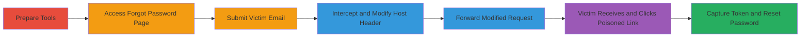

# Password Reset Hijacking via Host Header Poisoning Leading to Account Takeover

Multi-stage attack chain demonstrating a complete attack workflow targeting Host Header Poisoning in password reset to enable account takeover on a U.S. Department of Defense web application.

## Chain Metrics Dashboard

| Metric | Value |
|--------|-------|
| Chain Status | Unverified |
| Total Steps | 7 |
| Execution Time | ~10 minutes |
| Skill Level | Intermediate |
| Complexity | Medium |
| Impact Level | High |

## Attack Flow Visualization

## Prerequisites & Requirements

### Required Tools

- [[tools/Firefox]]
- [[tools/Burp-Suite]]

### Target Environment

- Web application built on PHP
- Exposed forgot password endpoint (e.g., http://target.com/forgot-password)
- Email access to victim's address for testing

### Initial Access Requirements

- Network access to the target web application
- Control over a domain/server to receive leaked tokens (e.g., attacker.com)
- No prior credentials needed; exploits public-facing endpoint

## Detailed Attack Procedures

### Step 1: Prepare Interception Tools

procedure: [[procedures/Exploit-Host-Header-Poisoning-in-Password-Reset]]

**Objective**: Set up tools to monitor and intercept HTTP traffic from the browser to the target application.

**Instructions**: Launch [[tools/Firefox]] configured as a standard browser and [[tools/Burp-Suite]] as a proxy. Configure Firefox to route traffic through Burp Suite's proxy (default: 127.0.0.1:8080) to enable request interception.

**Expected Output**: Burp Suite proxy active, Firefox traffic routable.

**Success Indicators**:
- Burp Suite dashboard shows no errors
- Test request from Firefox appears in Burp

### Step 2: Access Forgot Password Page

procedure: [[procedures/Exploit-Host-Header-Poisoning-in-Password-Reset]]

**Objective**: Navigate to the target's password reset functionality to initiate the process.

**Instructions**: In [[tools/Firefox]], visit the forgot password endpoint, such as `http://██████/█████`. Ensure the page loads correctly without interception yet.

**Expected Output**: Forgot password form visible, ready for email input.

**Success Indicators**:
- Form fields for email address present
- No authentication barriers

### Step 3: Submit Victim's Email Address

procedure: [[procedures/Exploit-Host-Header-Poisoning-in-Password-Reset]]

**Objective**: Trigger the password reset process by submitting the victim's email, preparing for interception.

**Instructions**: Enter the victim's email address into the form and click "SEND RESET LINK". Enable interception in [[tools/Burp-Suite]] before submission to capture the outgoing request.

**Expected Output**: Request captured in Burp Suite's Proxy > Intercept tab.

**Success Indicators**:
- Intercepted POST/GET request to forgot password endpoint
- Request body contains victim's email

### Step 4: Modify Host Header

procedure: [[procedures/Exploit-Host-Header-Poisoning-in-Password-Reset]]

**Objective**: Poison the Host header to redirect the reset link to the attacker's controlled server.

**Instructions**: In the intercepted request in [[tools/Burp-Suite]], locate the Host header (e.g., `Host: ██████.com`) and change it to your attacker-controlled domain, such as `Host: attacker.com`. Ensure the request method and body remain intact.

**Expected Output**: Modified request ready for forwarding, with poisoned Host header.

**Success Indicators**:
- Host header updated without syntax errors
- Request parses correctly in Burp

### Step 5: Forward the Modified Request

procedure: [[procedures/Exploit-Host-Header-Poisoning-in-Password-Reset]]

**Objective**: Send the poisoned request to the server, causing it to generate and email a malicious reset link.

**Instructions**: Click "Forward" in [[tools/Burp-Suite]] to release the modified request. The server will use the fake Host to build the reset URL and send it via email to the victim.

**Expected Output**: Server response (e.g., 200 OK or success message), and email queued/sent.

**Success Indicators**:
- No server errors from modified header
- Confirmation message on the page (e.g., "Reset link sent")

### Step 6: Wait for Victim Interaction

procedure: [[procedures/Exploit-Host-Header-Poisoning-in-Password-Reset]]

**Objective**: Have the victim receive and click the poisoned reset link, leaking the token to the attacker.

**Instructions**: Monitor the victim's email for the reset link. When clicked, the link (e.g., `http://attacker.com/reset?token=abc123`) will send a GET request to your server, including the reset token in the query parameters or referer.

**Expected Output**: Incoming request to attacker server with token.

**Success Indicators**:
- Victim reports receiving email
- Server logs show request from victim's IP

### Step 7: Capture Token and Complete Takeover

procedure: [[procedures/Exploit-Host-Header-Poisoning-in-Password-Reset]]

**Objective**: Use the leaked token to reset the victim's password and gain account control.

**Instructions**: Review server access logs (e.g., Apache/Nginx logs) for the leaked token. Visit the original reset endpoint (e.g., `http://██████/█████/reset?token=abc123`) in [[tools/Firefox]], enter a new password, and submit to complete the reset.

**Expected Output**: Password changed successfully, login with new credentials works.

**Success Indicators**:
- Token extracted from logs
- Account login succeeds with new password

## Attack Chain Summary

### Key Achievements

1. Successful interception and modification of Host header without detection
2. Delivery of poisoned reset link via email
3. Leakage of reset token and full account takeover

## Technique & Tactic Coverage

### MITRE ATT&CK Techniques

- [[Exploit Public-Facing Application]]

### MITRE ATT&CK Tactics

- [[Initial Access]]
- [[Credential Access]]

---
*Last updated: 2023-10-01T00:00:00Z*
