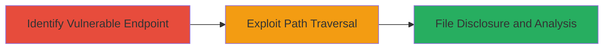

---
tags:
  - path-traversal
  - apache
  - file-disclosure
  - rce
type: attack_chain
tools: []
tactics:
  - '[[Initial Access]]'
  - '[[Collection]]'
verified: false
platforms:
  - Web
submitted: true
complexity: medium
created_at: '2023-10-01T00:00:00Z'
procedures:
  - '[[procedures/Exploit-Apache-Path-Traversal-for-File-Disclosure]]'
step_count: 2
techniques:
  - '[[Exploit Public-Facing Application]]'
  - '[[File and Directory Discovery]]'
updated_at: '2025-12-14T17:26:27.730Z'
description: >-
  A multi-stage exploitation of the path traversal vulnerability in Apache HTTP
  Server 2.4.49, allowing attackers to access and disclose files outside
  configured directories via crafted URLs targeting Alias-like directives.
skill_level: intermediate
impact_level: high
id: ba5005f0-2b87-4c3a-9c00-4d592cb6e5aa
validated: true
mitre_tactics:
  - '[[Initial Access]]'
  - '[[Collection]]'
mitre_techniques:
  - '[[Exploit Public-Facing Application]]'
  - '[[File and Directory Discovery]]'
---
# Path Traversal Exploitation in Apache HTTP Server 2.4.49 for Arbitrary File Disclosure

Multi-stage attack chain demonstrating exploitation of the path traversal vulnerability in Apache 2.4.49 to bypass directory restrictions and disclose sensitive files, potentially leading to security bypass or RCE if CGI is enabled.

## Chain Metrics Dashboard

| Metric | Value |
|--------|-------|
| Chain Status | Unverified |
| Total Steps | 2 |
| Execution Time | ~5 minutes |
| Skill Level | Intermediate |
| Complexity | Medium |
| Impact Level | High |

## Attack Flow Visualization



## Prerequisites & Requirements

### Required Tools

- [[commands/curl-path-traversal-exploit]]

### Target Environment

- Apache HTTP Server 2.4.49
- Web platform with Alias-like directives (e.g., mod_alias) configured without 'require all denied' protection
- Open HTTP/HTTPS port (80/443)

### Initial Access Requirements

- Network access to the target web server
- No authentication required for public-facing endpoints
- Knowledge of the server's Alias configuration (e.g., /icons/ mapping to a directory)

## Detailed Attack Procedures

### Step 1: Identify Vulnerable Alias Endpoint

procedure: [[procedures/Exploit-Apache-Path-Traversal-for-File-Disclosure]]

**Objective**: Locate an Alias-like directive endpoint that can be traversed due to improper path normalization in Apache 2.4.49.

**Instructions**: Review the target server's common endpoints or use reconnaissance to identify Alias paths (e.g., /icons/, /manual/). Test basic access to confirm the endpoint responds without restrictions.

Use [[commands/curl-path-traversal-exploit]] to probe a suspected endpoint:

```bash
curl -v http://target.example.com/icons/
```

**Expected Output**: HTTP response showing directory listing or file access within the aliased path.

**Success Indicators**:
- Endpoint returns content from the configured directory
- No immediate 403/404 errors indicating protection

### Step 2: Exploit Path Traversal for File Disclosure

procedure: [[procedures/Exploit-Apache-Path-Traversal-for-File-Disclosure]]

**Objective**: Craft and send a traversal payload to access files outside the intended directory, such as /etc/passwd, leading to data disclosure or further attacks.

**Instructions**: Construct a URL with '../' sequences to navigate up the directory tree. For an Alias /icons/ mapping to /var/icons/, target /etc/passwd as follows using [[commands/curl-path-traversal-exploit]]:

```bash
curl -v "http://target.example.com/icons/../../../../etc/passwd"
```

If CGI is enabled on the aliased path, this could execute scripts for RCE; otherwise, focus on disclosure. Analyze the response for sensitive data.

**Expected Output**: Raw content of the target file (e.g., user accounts from /etc/passwd).

**Success Indicators**:
- Unauthorized file content returned in HTTP response
- No traversal normalization (e.g., '../' not stripped)
- Potential for chaining to read config files or enable brute-force attacks

## Attack Chain Summary

### Key Achievements

1. Bypassed directory restrictions in Apache Alias directives
2. Disclosed sensitive files like password lists for further exploitation
3. Demonstrated potential RCE vector if CGI scripts are misconfigured

## Technique & Tactic Coverage

### MITRE ATT&CK Techniques

- [[Exploit Public-Facing Application]]
- [[File and Directory Discovery]]

### MITRE ATT&CK Tactics

- [[Initial Access]]
- [[Collection]]

---
*Last updated: 2023-10-01T00:00:00Z*
