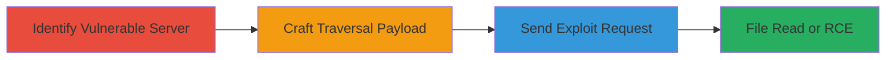

---
tags:
  - path-traversal
  - apache
  - rce
  - file-read
  - cve-2021-42013
type: attack_chain
tools: []
tactics:
  - '[[Initial Access]]'
  - '[[Execution]]'
verified: false
platforms:
  - Web
submitted: true
complexity: medium
created_at: '2023-10-01T00:00:00Z'
procedures:
  - '[[procedures/Identify-Vulnerable-Apache-Version]]'
  - '[[procedures/Craft-Path-Traversal-Payload]]'
  - '[[procedures/Send-Exploitation-Request]]'
step_count: 3
techniques:
  - '[[Exploit Public-Facing Application]]'
  - '[[File and Directory Discovery]]'
  - '[[Python]]'
updated_at: '2025-12-14T17:26:17.788Z'
description: >-
  Multi-stage attack exploiting path traversal in Apache HTTP Server 2.4.49 and
  2.4.50 to read arbitrary files outside configured directories and potentially
  execute code via CGI scripts.
skill_level: intermediate
impact_level: high
id: 8f609fea-6599-4a09-8bdb-8b4d79532e97
validated: true
mitre_tactics:
  - '[[Initial Access]]'
  - '[[Execution]]'
mitre_techniques:
  - '[[Exploit Public-Facing Application]]'
  - '[[File and Directory Discovery]]'
  - '[[Python]]'
---
# Path Traversal in Apache HTTP Server for Arbitrary File Read and RCE via Incomplete CVE-2021-41773 Fix (CVE-2021-42013)

Multi-stage attack chain demonstrating exploitation of the incomplete fix for CVE-2021-41773 in Apache HTTP Server versions 2.4.49 and 2.4.50, enabling path traversal to access files outside Alias-configured directories and potential remote code execution if CGI is enabled.

## Chain Metrics Dashboard

| Metric | Value |
|--------|-------|
| Chain Status | Unverified |
| Total Steps | 3 |
| Execution Time | ~5 minutes |
| Skill Level | Intermediate |
| Complexity | Medium |
| Impact Level | High |

## Attack Flow Visualization



## Prerequisites & Requirements

### Required Tools

- [[curl]]

### Target Environment

- Apache HTTP Server 2.4.49 or 2.4.50
- Web platform with HTTP service on port 80/443
- Alias-like directives configured (e.g., /cgi-bin/)
- Network access to the target server

### Initial Access Requirements

- No credentials required
- Direct network connectivity to the HTTP server
- No prior access needed

## Detailed Attack Procedures

### Step 1: Identify Vulnerable Apache Version
procedure: [[procedures/Identify-Vulnerable-Apache-Version]]

**Objective**: Confirm the target is running Apache 2.4.49 or 2.4.50 with the incomplete CVE-2021-41773 fix.

**Instructions**: Query the server headers to detect the version using [[commands/curl-version-check]]:

```bash
curl -I http://target-server.com
```

Look for Server: Apache/2.4.49 or Apache/2.4.50 in the response.

**Expected Output**: HTTP headers revealing the vulnerable version.

**Success Indicators**:
- Server header matches 2.4.49 or 2.4.50
- No immediate access restrictions

### Step 2: Craft Path Traversal Payload
procedure: [[procedures/Craft-Path-Traversal-Payload]]

**Objective**: Build a URL payload that traverses outside configured directories using sequences like those in CVE-2021-41773.

**Instructions**: Construct a payload targeting files outside Alias directories, e.g., /cgi-bin/.%2e/%2e%2e/%2e%2e/%2e%2e/etc/passwd. Test normalization in a local setup if possible.

**Expected Output**: Valid traversal URL ready for exploitation.

**Success Indicators**:
- Payload evades basic normalization checks
- Targets unprotected files

### Step 3: Send Exploitation Request
procedure: [[procedures/Send-Exploitation-Request]]

**Objective**: Deliver the payload to read arbitrary files or trigger RCE if CGI is enabled on aliased paths.

**Instructions**: Use [[commands/curl-path-traversal-exploit]] to send the request:

```bash
curl "http://target-server.com/cgi-bin/.%2e/%2e%2e/%2e%2e/%2e%2e/etc/passwd"
```

If CGI-enabled, adapt for script execution, e.g., targeting a writable CGI path.

**Expected Output**: Contents of /etc/passwd or executed script output.

**Success Indicators**:
- Arbitrary file contents returned
- Code execution if CGI response is anomalous (e.g., shell output)

## Attack Chain Summary

### Key Achievements

1. Confirmed vulnerable Apache version via header inspection
2. Traversed path restrictions to access sensitive files outside configured directories
3. Achieved file read or RCE depending on CGI configuration

## Technique & Tactic Coverage

### MITRE ATT&CK Techniques

- [[Exploit Public-Facing Application]]
- [[File and Directory Discovery]]
- [[Python]]

### MITRE ATT&CK Tactics

- [[Initial Access]]
- [[Execution]]

---
*Last updated: 2023-10-01T00:00:00Z*
