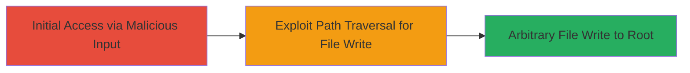

# Path Traversal in Nextcloud Talk Android App Enabling Arbitrary File Writes to Root Directory

Multi-stage attack chain demonstrating exploitation of a path traversal vulnerability in the Nextcloud Talk Android app, reported via HackerOne on May 22, 2023, allowing attackers to trick the app into writing files to its root directory and potentially enabling arbitrary file writes for further compromise.

## Chain Metrics Dashboard

| Metric | Value |
|--------|-------|
| Chain Status | Unverified |
| Total Steps | 1 |
| Execution Time | ~5 minutes |
| Skill Level | Intermediate |
| Complexity | Medium |
| Impact Level | High |

## Attack Flow Visualization

## Prerequisites & Requirements

### Required Tools

- No specialized tools required; exploitation can be performed via app interaction or crafted inputs.

### Target Environment

- Android OS (version compatible with Nextcloud Talk app)
- Nextcloud Talk Android app installed (vulnerable versions prior to patch)
- Access to the app's file handling functionality

### Initial Access Requirements

- Physical or remote access to the target Android device
- Ability to interact with the Nextcloud Talk app (e.g., via social engineering to induce file operations)
- No prior credentials needed, but app must be running

## Detailed Attack Procedures

### Step 1: Exploit Path Traversal for Arbitrary File Write
procedure: [[procedures/Exploit-Path-Traversal-in-Nextcloud-Talk-Android-App]]

**Objective**: Trick the Nextcloud Talk Android app into writing a malicious file to its root directory using path traversal sequences, bypassing intended directory restrictions.

**Instructions**: Interact with the app's file upload or sharing feature in Nextcloud Talk, crafting a filename or path that includes traversal sequences like "../" to navigate to the app's root. For example, use a file path such as "../../../data/user/0/com.nextcloud.talk/files/malicious.txt" to write outside the sandboxed directory. Trigger the write operation by attempting to save or upload a file with this path via the app's interface or an integrated API call if accessible.

**Expected Output**: The file is successfully written to the app's root directory, verifiable by checking the device's file system (e.g., via ADB shell: `adb shell ls /data/data/com.nextcloud.talk/`). A new file appears in the root, containing the injected content.

**Success Indicators**:
- File written to unintended root directory confirmed
- No errors in app logs indicating path validation failure
- Potential for follow-on exploits, such as writing executable scripts if permissions allow

## Attack Chain Summary

### Key Achievements

1. Bypassed path validation in Nextcloud Talk Android app to achieve directory traversal
2. Enabled arbitrary file writes to app root, increasing attack surface for persistence or escalation
3. Demonstrated high-impact vulnerability leading to CVE assignment and advisory

## Technique & Tactic Coverage

### MITRE ATT&CK Techniques

- [[Exploitation for Client Execution]] Exploitation for Client Execution

### MITRE ATT&CK Tactics

- [[Execution]] Execution

---
*Last updated: 2023-10-01T00:00:00Z*
