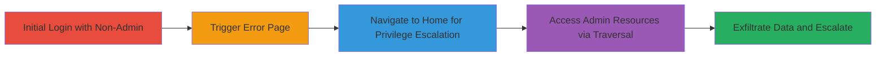

# Path Traversal in Saba LMS Leading to Unauthorized Admin Access

Multi-stage attack chain demonstrating a complete attack workflow exploiting path traversal in a Saba Learning Management System (LMS) web application to bypass authentication and gain administrative privileges, enabling data exfiltration and further compromise.

## Chain Metrics Dashboard

| Metric | Value |
|--------|-------|
| Chain Status | Unverified |
| Total Steps | 3 |
| Execution Time | ~5 minutes |
| Skill Level | Intermediate |
| Complexity | Medium |
| Impact Level | High |

## Attack Flow Visualization

## Prerequisites & Requirements

### Required Tools

- Web browser (e.g., Chrome or Firefox with developer tools for URL manipulation)

### Target Environment

- Saba LMS web application deployed on a web server
- Accessible login endpoint (e.g., https://target.com/)
- No special ports required beyond standard HTTPS (443)

### Initial Access Requirements

- Valid non-admin user credentials (username/password for a standard account)
- Network access to the target web application
- No prior admin access needed

## Detailed Attack Procedures

### Step 1: Initial Access
procedure: [[procedures/Login-with-Non-Admin-Account-to-Trigger-Error]]

**Objective**: Authenticate with a standard user account to reach the error page, setting up the path traversal exploit.

**Instructions**: Open a web browser and navigate to the login page. Enter non-admin credentials to log in, which redirects to an error page due to insufficient privileges.

**Expected Output**: Error message displayed: "There was an error while processing your request. Please try again. If the problem persists, please contact the help desk at [email]."

**Success Indicators**:
- Successful login redirect to error page at /Saba/[custom]/CustomLogin.jsp
- Session established but privileges restricted

### Step 2: Privilege Escalation
procedure: [[procedures/Navigate-to-Home-Endpoint-for-Admin-Privileges]]

**Objective**: Exploit path traversal by navigating to the /home endpoint to incorrectly grant 'Samba administrator' privileges.

**Instructions**: From the error page, manually enter or modify the URL to https://target.com/home. The application fails to validate the path, granting elevated access.

**Expected Output**: Page loads showing account name as 'Samba administrator', confirming unauthorized admin privileges.

**Success Indicators**:
- Display of 'Samba administrator' in the user interface
- Access to features normally restricted to admins

### Step 3: Resource Access and Exfiltration
procedure: [[procedures/Direct-Access-to-Admin-Directories-via-URL-Manipulation]]

**Objective**: Use manipulated URLs to directly access and manipulate admin directories, enabling data exfiltration.

**Instructions**: With an authenticated session, construct URLs to admin paths like https://target.com/Saba/Web_wdk/[context]/platform/system/admin/systemMain.rdf or https://target.com/Saba/Web_wdk/[context]/Platform/system/admin/usersStatistics.rdf. Browse or download contents to extract sensitive data.

**Expected Output**: Access to admin interfaces revealing IPs, configurations, passwords, usernames, emails, and names.

**Success Indicators**:
- Successful loading of admin RDF files or pages
- Visibility of sensitive data without additional authentication

## Attack Chain Summary

### Key Achievements

1. Bypassed authentication to gain admin privileges via path traversal
2. Accessed and exfiltrated sensitive system data including credentials and configurations
3. Enabled potential follow-on attacks like RCE, DoS, defacement, or data deletion

## Technique & Tactic Coverage

### MITRE ATT&CK Techniques

- [[Exploit Public-Facing Application]]
- [[File and Directory Discovery]]

### MITRE ATT&CK Tactics

- [[Initial Access]]
- [[Privilege Escalation]]

---

*Last updated: 2023-10-01T00:00:00Z*
