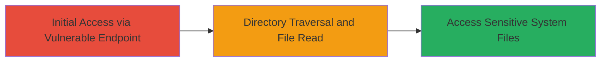

# Path Traversal in Spring Cloud Config Server to Read Sensitive Windows Files

Multi-stage attack chain demonstrating exploitation of a path traversal vulnerability in Spring Cloud Config Server to access unauthorized files on a target Windows server.

## Chain Metrics Dashboard

| Metric | Value |
|--------|-------|
| Chain Status | Unverified |
| Total Steps | 1 |
| Execution Time | ~2 minutes |
| Skill Level | Intermediate |
| Complexity | Medium |
| Impact Level | High |

## Attack Flow Visualization



## Prerequisites & Requirements

### Required Tools

- [[curl]]

### Target Environment

- Web application using Spring Cloud Config Server
- Windows server hosting the application
- Exposed endpoint (e.g., /blaze/)

### Initial Access Requirements

- Network access to the target endpoint (e.g., https://target.com/blaze/)
- No authentication required for the vulnerable endpoint
- Knowledge of CVE-2018-1271

## Detailed Attack Procedures

### Step 1: Exploit Path Traversal
procedure: [[procedures/Exploit-Path-Traversal-via-CVE-2018-1271]]

**Objective**: Traverse directories to read arbitrary files, such as the win.ini system file, on the Windows server.

**Instructions**: Identify the vulnerable Spring Cloud Config Server endpoint, typically under /env. Craft a request using path traversal payloads like '../' to navigate to sensitive directories. Use [[commands/curl-path-traversal]] to send the request:

```bash
curl -X GET "https://target.com/blaze/env?path=../../../windows/win.ini" -v
```

Validate the response for file contents. If successful, the response will include the contents of win.ini.

**Expected Output**: HTTP response containing the file contents, e.g., "; for 16-bit app support" from win.ini.

**Success Indicators**:
- Response includes sensitive file data
- No 404 or access denied errors
- File path traversal confirmed via returned content

## Attack Chain Summary

### Key Achievements

1. Successful exploitation of CVE-2018-1271 to bypass input validation
2. Arbitrary file read from Windows system directories
3. Disclosure of sensitive configuration or system files

## Technique & Tactic Coverage

### MITRE ATT&CK Techniques

- [[Exploit Public-Facing Application]]
- [[File and Directory Discovery]]

### MITRE ATT&CK Tactics

- [[Initial Access]]
- [[Discovery]]

---
*Last updated: 2023-10-01T12:00:00Z*
