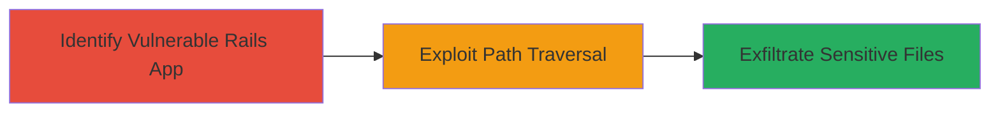

---
tags:
  - path-traversal
  - rails
  - sprockets
  - information-leak
type: attack_chain
tools: []
tactics:
  - '[[Initial Access]]'
  - '[[Discovery]]'
commands:
  - '[[commands/curl-path-traversal-request]]'
platforms:
  - Web
complexity: medium
procedures:
  - '[[procedures/Exploit-Path-Traversal-in-Rails-Sprockets]]'
step_count: 2
techniques:
  - '[[Exploit Public-Facing Application]]'
  - '[[File and Directory Discovery]]'
description: >-
  Exploit path traversal vulnerability in Ruby on Rails Sprockets asset pipeline
  to read arbitrary files outside the application root directory.
skill_level: intermediate
impact_level: high
id: 3a1ed747-d275-42ea-87ff-9ae24d0d2150
created_at: '2025-12-14T17:26:22.599Z'
updated_at: '2025-12-14T17:26:22.599Z'
verified: false
validated: true
submitted: true
mitre_tactics:
  - '[[Initial Access]]'
  - '[[Discovery]]'
mitre_techniques:
  - '[[Exploit Public-Facing Application]]'
  - '[[File and Directory Discovery]]'
---
# Path Traversal in Sprockets Asset Pipeline to Leak Sensitive Files

Multi-stage attack chain demonstrating a complete attack workflow exploiting CVE-2018-3760 in the Sprockets asset pipeline of Ruby on Rails.

## Chain Metrics Dashboard

| Metric | Value |
|--------|-------|
| Chain Status | Unverified |
| Total Steps | 2 |
| Execution Time | ~5 minutes |
| Skill Level | Intermediate |
| Complexity | Medium |
| Impact Level | High |

## Attack Flow Visualization



## Prerequisites & Requirements

### Required Tools

- None (uses standard HTTP client like curl)

### Target Environment

- Ruby on Rails application using Sprockets 4.0.0.beta7 or lower, 3.7.1 or lower, or 2.12.4 or lower
- Sprockets server running in production mode
- Web platform with asset pipeline enabled

### Initial Access Requirements

- Network access to the Rails application (typically port 80/443)
- No credentials required (unauthenticated)
- Prior reconnaissance to confirm Rails/Sprockets usage

## Detailed Attack Procedures

### Step 1: Identify Vulnerable Rails App

procedure: [[procedures/Exploit-Path-Traversal-in-Rails-Sprockets]]

**Objective**: Confirm the target is a vulnerable Ruby on Rails application using Sprockets in production.

**Instructions**: Inspect the application for Rails fingerprints, such as response headers (e.g., X-Runtime) or asset paths like /assets/application.js. Verify version via error pages or known endpoints if available.

**Expected Output**: Confirmation of Rails with Sprockets, version <= affected ranges.

**Success Indicators**:
- Rails-specific headers present
- Asset pipeline endpoints respond

### Step 2: Exploit Path Traversal to Read Files

procedure: [[procedures/Exploit-Path-Traversal-in-Rails-Sprockets]]

**Objective**: Craft and send a path traversal request to access sensitive files like /etc/passwd or application secrets.

**Instructions**: Use [[commands/curl-path-traversal-request]] to send a specially crafted request to the assets endpoint, traversing outside the root directory:

```bash
curl -v "http://target.com/assets/dummy.png?../../../etc/passwd" -H "Accept: */*"
```

Adjust the traversal string (e.g., ../../../../) based on the directory depth. Test with non-sensitive files first, then target config files like database.yml or .env.

**Expected Output**: Raw content of the requested file in the response body.

**Success Indicators**:
- File contents leaked in HTTP response
- No 404 or asset not found error; instead, file data returned

## Attack Chain Summary

### Key Achievements

1. Identification of vulnerable Sprockets instance in production Rails app
2. Successful path traversal to read arbitrary filesystem files
3. Potential exposure of sensitive data like credentials or configs

## Technique & Tactic Coverage

### MITRE ATT&CK Techniques

- [[Exploit Public-Facing Application]]
- [[File and Directory Discovery]]

### MITRE ATT&CK Tactics

- [[Initial Access]]
- [[Discovery]]

---
*Last updated: 2023-10-01*
